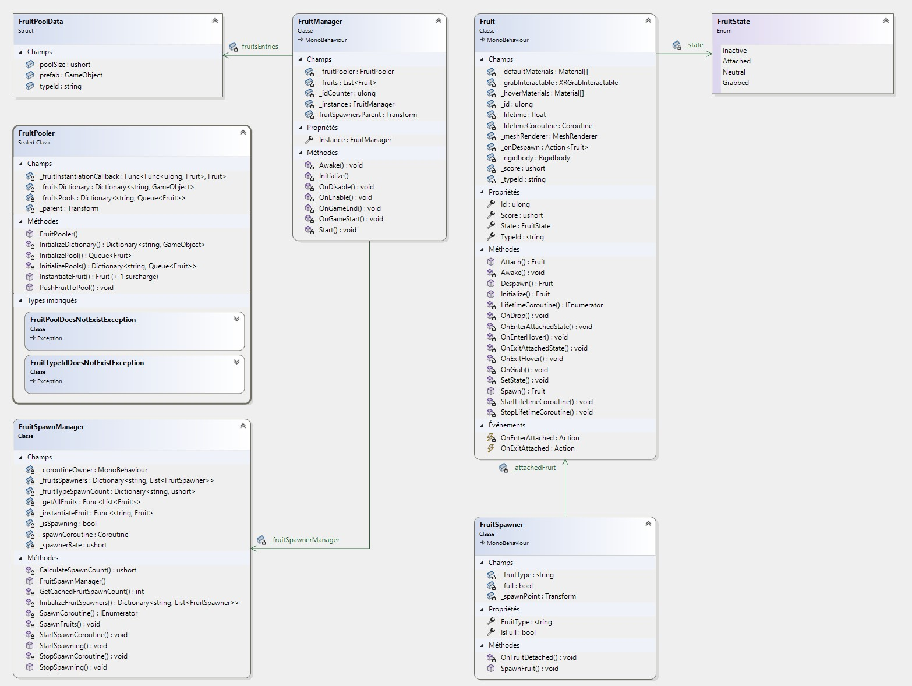

# Documentation Technique - FruitPower

## Table des versions

| Version | Date | Auteur | Changements |
| ------- | ---- | ------ | ----------- |
| 1.0 | 2023-11-09 | Ruben Wihler | ... |

## Table des matières

[TOC]

## Introduction

Ce document est un rapport présentant différents aspects de la conception du projet FruitPower. Ce projet a été réalisé dans le cadre du Travail pratique individuel (TPI) durant la session de mai 2024. Il a pour but de valider mes compétences acquises pendant la formation Informaticien CFC dispensée à l’école d’informatique du CFPT au Petit-Lancy. FruitPower est un jeux vidéo utilisant la réalité virtuelle. Il a été développé en C# avec le moteur de jeu Unity.

## Rappel de l’énoncé

>Les informations sont extraites du cahier des charges du TPI.

### Organisation

| Elève | Maître d’apprentissage | Experts |
| ----- | --------------------- | ------- |
| Ruben Wihler | M. J. Aliprendi | Mickaël Strazzeri, Yvan Poulin |

### Livrables

Pour les experts et le maître d’apprentissage :

- Rapport de projet
- Manuel utilisateur
- Résumé du rapport du TPI
- Journal de travail
- Version compilée et sources du projet Unity C#


### Matériel et logiciels à disposition

- Un PC standard école, 2 écrans
- Windows 10
- Visual studio code
- Visual studio 2022
- Unity 2022.3.12f1
- Suite Office

### Méthodologie

#### Méthode en 6 étapes

##### 1. S’informer

Lors de cette étape, j’ai dû m’informer sur le cahier des charges, l’analyser en profondeur pour bien comprendre toutes les fonctionnalités demandées. C’est également durant cette étape que j’ai demandé des questions/informations à M.Aliprandi pour tout ce qui concerne mes différentes incompréhensions. A chaque fois que je commençais une storie je m’informais en regardant le cahier des charges.

##### 2. Planifier

Dans cette étape, j’ai créé un planning prévisionnel pour pouvoir m’organiser et savoir ce que je dois faire et quand. Pour faire ce planning, j’ai dû découper le travail en plusieurs tâches. Pour ces tâches, j’ai décidé de les mettre sous la forme de user stories. C’est une description simple de ce que l’utilisateur a besoin pour savoir les différentes fonctionnalités à développer. J’ai décidé de mettre aussi en place la méthode MoSCoW qui attribue des priorités sur les tâches afin de pouvoir s’attarder sur ce qui est prioritaire. Les niveaux de priorités sont :

- P1 Must
- P2 Should
- P3 Could

Toutes ces stories sont mises dans un product backlog. J’ai fait un planning effectif pour pouvoir comparer mon avancée avec le planning prévisionnel.

##### 3. Décider

Lors de mon projet, j’ai eu plusieurs décisions importantes à prendre. Toutes les décisions que je trouvais importantes et pertinentes, je les mettais dans le journal de bord et j’expliquais pourquoi j’ai choisi de faire comme ça.

##### 4. Réaliser

Une fois les décisions prises, je pouvais commencer à réaliser, soit l’implémentation dans le code, soit la rédaction dans la documentation.

##### 5. Contrôler

tout de suite plusieurs fois. Quand je rajoutais une fonction, je testais également l’autre pour voir s'il y avait pas de régression. Une fois que je finissais d’implémenter un système, je la testais avec des test unitaires et foncitonnels pour voir si tout fonctionnait correctement. (Unity Test Framework)

##### 6. Evaluer

Cette étape je la fais dans mon bilan dans mon journal de bord. Ici on liste les réussites, les difficultés, les améliorations ainsi que les décisions. J'ai aussi mis le resultats de mes tests.

#### Méthode Agile

Durant l’élaboration de mon projet, je n’ai pas seulement appliqué la méthode en 6 étapes mais également celle de la méthode Agile. Je me suis fixé tous les jours des objectifs dans le journal de bord que je devais atteindre en fin de journée.

Le backlog fait également partie de la méthodologie agile puisque j’ai fait des stories qui correspondent à de petits objectifs à atteindre pour arriver à l’objectif final. Les objectifs sont atteints quand les cas de tests sont fonctionnels et ainsi pouvoir passer au suivant.

### Sauvegardes et versionning

Pour versionner mon projet, j’ai utilisé Git. J’ai créé un dépôt sur GitHub pour pouvoir sauvegarder mon code source et le partager avec mon maître d’apprentissage et les experts.

Concernant mon organisation des sauvegardes, j’ai décidé d'adopter la méthode 3-2-1. Cela signifie que je garde 3 copies de mes données, sur 2 supports différents, dont 1 hors site. J’ai donc sauvegardé mon code source sur GitHub, sur un disque dur externe et sur un google drive.

## Planification

J'ai fais un planning prévisionnel pour pouvoir m’organiser et savoir ce que je dois faire en découpant les user stories en plusieurs tâches. Pour ces tâches, j’ai décidé de les mettre sous la forme de user stories. C’est une description simple de ce que l’utilisateur a besoin pour savoir les différentes fonctionnalités à développer.

### Planning prévisionnel


### Planning effectif


### Product backlog

Les user stories sont des descriptions simples de ce que l'utilisateur a besoin pour savoir les différentes fonctionnalités à développer. Ces dèrnieres sont mises dans un product backlog.

>les niveaux de priorités sont :  
> - P1 Must  
> - P2 Should  
> - P3 Could  

| ID | Nom | Description | Priorité |
|----|-----|-------------|----------|
| 001 | Implémentation VR | En tant qu'utilisateur, je veux pouvoir interagir avec le jeu en utilisant un casque VR et ses contrôleurs. | P1 |
| 002 | Environnement 3D | En tant qu'utilisateur, je veux pouvoir évoluer dans un jardin en 3D de 2x2 mètres. et ne pas pouvoir sortir de la zone de jeu. | P1 |
| 003 | Main du joueur | En tant qu'utilisateur, je veux voir les contrôleurs dans le jeu sous forme de mains. | P1 |
| 004 | Arbres et buissons | En tant qu'utilisateur, je veux que le jardin contienne des arbres et des buissons. (Une dizaine) | P1 |
| 005 | Génération de fruits | En tant qu'utilisateur, je veux que des fruits apparaissent aléatoirement sur des arbres ou des buissons. Les fruits doivent apparaître à une vitesse définie. | P1 |
| 006 | Ramassage de fruits | En tant qu'utilisateur, je veux pouvoir ramasser des fruits en les ramassant avec les contrôleurs. | P1 |
| 007 | Disparition des fruits | En tant qu'utilisateur, je veux que les fruits disparaissent après quelques secondes s'ils ne sont pas ramassés | P1 |
| 008 | Compteur de points | En tant qu'utilisateur, je veux pouvoir ramasser des fruits pour gagner des points. Chaque fruit ramassé donne 1 point. | P1 |
| 009 | Visualisation des points | En tant qu'utilisateur, je veux voir le nombre de fruits que j'ai ramassé. | P1 |
| 010 | Compteur de temps | En tant qu'utilisateur, je veux voir le temps restant pour la partie. | P1 |
| 011 | Fin de partie | En tant qu'utilisateur, je veux que la partie se termine après 30 secondes. | P1 |
| 012 | Score final | En tant qu'utilisateur, je veux voir mon score final à la fin de la partie. | P1 |
| 013 | Rejouer | En tant qu'utilisateur, je veux pouvoir rejouer après avoir vu mon score final. | P1 |
| 014 | Musique et bruitages | En tant qu'utilisateur, je veux entendre de la musique et des bruitages. | P2 |
| 015 | Graphismes | En tant qu'utilisateur, je veux que le jeu soit agréable visuellement. | P2 |
| 016 | Modèles 3D | En tant qu'utilisateur, je veux que les modèles 3D soient de qualité. | P2 |
| 017 | Post-traitement | En tant qu'utilisateur, je veux que le jeu soit agréable visuellement grâce à un post-traitement. | P3 |
| 018 | Interface | En tant qu'utilisateur, je veux que l'interface soit intuitive. | P3 |

### Tâches techniques

Les tâches techniques sont des tâches plus précises qui permettent de réaliser les user stories. Elles sont plus techniques et détaillées et ne sont pas destinées au client. Nous avons décidé de les formuler sous la forme de petites tâches issues des user stories.

#### 000 : Préparation du projet

| ID | Nom | Description | Priorité |
|----|-----|-------------|----------|
| 000.1 | Création du repository Git | Création du repository Git pour versionner le code | P1 |
| 000.2 | Création du journal de bord | Création du journal de bord pour suivre l'avancement du projet | P1 |
| 000.3 | Création de la documentation | Création de la documentation pour expliquer le projet | P1 |
| 000.4 | Planification | Planification du projet | P1 |
| 000.5 | Création du projet Unity | Création du projet Unity | P1 |

#### 001 : Implémentation VR

| ID | Nom | Description | Priorité |
|----|-----|-------------|----------|
| 001.1 | Ajout du package XR | Ajout du package XR (Plugin provider : OpenXR) | P1 |
| 001.2 | Ajout Unity Input System | Ajout du package Unity Input System requis pour le package XR Interaction Toolkit | P1 |
| 001.3 | Ajout du package XR Interaction Toolkit | Ajout du package XR Interaction Toolkit | P1 |
| 001.4 | Ajout du système de déplacement | Ajout du système de déplacement pour pouvoir se déplacer dans le jeu | P1 |

#### 002 : Environnement 3D

| ID | Nom | Description | Priorité |
|----|-----|-------------|----------|
| 002.1 | Création du jardin | Création du jardin en 3D de 2x2 mètres | P1 |
| 002.2 | Ajout des limites | Ajout des limites pour ne pas pouvoir sortir de la zone de jeu | P1 |
| 002.3 | Ajout des arbres et buissons | Ajout des arbres et des buissons dans le jardin (ce qui vont servir à générer les fruits plus tard) | P1 |

#### 003 : Main du joueur

| ID | Nom | Description | Priorité |
|----|-----|-------------|----------|
| 001.1 | Ajout des contrôleurs | Ajout des contrôleurs pour pouvoir interagir avec le jeu | P1 |
| 001.2 | Importation des modèles de mains | Importation des modèles de mains pour les contrôleurs | P1 |
| 001.3 | Ajout du système d'intéraction | Ajout du système d'intéraction pour pouvoir intéragir avec les objets du jeu | P1 |

#### 004 : Arbres et buissons

| ID | Nom | Description | Priorité |
|----|-----|-------------|----------|
| 004.1 | Recherche de modèles 3D | Recherche de modèles 3D d'arbres et de buissons | P1 |
| 004.2 | Importation des modèles 3D | Importation des modèles 3D d'arbres et de buissons dans le projet | P1 |
| 004.3 | Placement des arbres et buissons | Placement des arbres et des buissons dans le jardin | P1 |

#### 005 : Génération de fruits

| ID | Nom | Description | Priorité |
|----|-----|-------------|----------|
| 005.1 | Conception du système de fruits | Conception du système de génération de fruits + UML | P1 |
| 005.2 | Implémentation du système de fruits | Implémentation du système de génération de fruits | P1 |
| 005.3 | Test du système de fruits | Test du système de génération de fruits | P1 |

#### 006 : Ramassage de fruits

| ID | Nom | Description | Priorité |
|----|-----|-------------|----------|
| 006.1 | Utilisation du système d'intéraction et celui des fruits | Utilisation le système d'intéraction pour ramasser les fruits | P1 |
| 006.2 | Test du système de ramassage | Test du système de ramassage des fruits | P1 |

#### 007 : Disparition des fruits

| ID | Nom | Description | Priorité |
|----|-----|-------------|----------|
| 007.1 | Rajout d'un timer sur les fruits | Rajout d'un timer sur les fruits pour les faire disparaître après quelques secondes | P1 |
| 007.2 | Test du système de disparition | Test du système de disparition des fruits | P1 |
| 007.3 | Optimisation du système | Optimisation du système de disparition des fruits en utilisant du pooling | P2 |

#### 008 : Compteur de points

| ID | Nom | Description | Priorité |
|----|-----|-------------|----------|
| 008.1 | Création du système de points | Création du système de points pour compter les points | P1 |
| 008.2 | Test du système de points | Test du système de points | P1 |

#### 009 : Visualisation des points

| ID | Nom | Description | Priorité |
|----|-----|-------------|----------|
| 009.1 | Création de l'interface | Création de l'interface pour afficher les points | P1 |
| 009.2 | Test de l'interface | Test de l'interface pour afficher les points | P1 |

#### 010 : Compteur de temps

| ID | Nom | Description | Priorité |
|----|-----|-------------|----------|
| 010.1 | Création du timer | Création du timer de 30 secondes pour la partie | P1 |
| 010.2 | Test du timer | Test du timer de 30 secondes | P1 |
| 010.3 | Affichage du timer | Rajout de l'affichage du timer à l'interface | P1 |

#### 011 : Fin de partie

| ID | Nom | Description | Priorité |
|----|-----|-------------|----------|
| 011.1 | Fin de partie | Fin de partie après 30 secondes | P1 |
| 011.2 | Test de la fin de partie | Test de la fin de partie après 30 secondes | P1 |

#### 012 : Score final

| ID | Nom | Description | Priorité |
|----|-----|-------------|----------|
| 012.1 | Affichage du score final | Affichage du score final à la fin de la partie | P1 |
| 012.2 | Test de l'affichage du score final | Test de l'affichage du score final à la fin de la partie | P1 |

#### 013 : Rejouer

| ID | Nom | Description | Priorité |
|----|-----|-------------|----------|
| 013.1 | Création du système de chargement de scene | Création du système de chargement de scene pour pouvoir rejouer | P1 |
| 013.2 | Test du système de chargement de scene | Test du système de chargement de scene pour pouvoir rejouer | P1 |
| 013.3 | Implémentation du système dans l'interface | Implémentation du système de chargement de scene dans l'interface (bouton) | P2 |
| 013.3 | Optimisation du système | Optimisation du système de chargement de scene pour qu'il soit asynchrone | P2 |
| 013.4 | Ajout d'un écran de chargement | Ajout d'un écran de chargement pour le chargement de la scene | P3 |
| 013.5 | Test de l'écran de chargement | Test de l'écran de chargement pour le chargement de la scene | P3 |

#### 014 : Musique et bruitages

| ID | Nom | Description | Priorité |
|----|-----|-------------|----------|
| 014.1 | Recherche de musiques et bruitages | Recherche de musiques et bruitages pour le jeu | P2 |
| 014.2 | Importation des musiques et bruitages | Importation des musiques et bruitages dans le projet | P2 |
| 014.3 | Ajout des musiques et bruitages | Ajout des musiques et bruitages dans le jeu | P2 |

#### 015 : Graphismes

| ID | Nom | Description | Priorité |
|----|-----|-------------|----------|
| 015.1 | Recherche d'une identité visuelle | Recherche d'une identité visuelle pour le jeu | P2 |
| 015.2 | Elaboration de la palette de couleurs | Elaboration de la palette de couleurs pour le jeu | P2 |

#### 016 : Modèles 3D

| ID | Nom | Description | Priorité |
|----|-----|-------------|----------|
| 016.1 | Recherche de modèles 3D | Recherche de modèles 3D pour le jeu | P2 |
| 016.2 | Importation des modèles 3D | Importation des modèles 3D dans le projet | P2 |
| 016.3 | Ajout des modèles 3D | Ajout des modèles 3D dans le jeu | P2 |

#### 017 : Post-traitement

| ID | Nom | Description | Priorité |
|----|-----|-------------|----------|
| 017.1 | Ajout d'un post-traitement | Ajout d'un post-traitement pour améliorer les graphismes | P3 |

#### 018 : Interface

| ID | Nom | Description | Priorité |
|----|-----|-------------|----------|
| 018.1 | Conception de l'interface | Conception de l'interface pour qu'elle soit intuitive et en harmonie avec l'idée visuelle | P3 |
| 018.2 | Implémentation de l'interface | Implémentation de l'interface dans le jeu | P3 |

## Analyse organique

Pour faciliter la partie conception ainsi que la partie implémentation, le projet a été divisé en plusieurs systèmes. Chaque système a une responsabilité bien définie et est plus ou moins indépendant des autres systèmes. Cela permet de faciliter la maintenance et l'évolution du projet.

> Remarques :
>
> - Les classes sont regroupées par système.
> - au début de chaque classe, une description de la classe est donnée. Elle contient le nom de la classe, le type de la classe, et une brève description de la classe.
> - Le type de données est donné entre crochets après le nom de la classe.
> - Apres certains champs les annotations **[INSP]** sont utilisées pour indiquer que le champ est une propriété inspectable dans l'éditeur Unity. (Marquée dans le code source par l'attribut `[System.SerializeField]` pour les champs privés)

### Gestions de la réalité virtuelle

#### Vue d'ensemble

La gestion de la réalité virtuelle est un des points clés du projet. Elle permet au joueur d'interagir avec le jeu en utilisant un casque de réalité virtuelle et ses contrôleurs. Pour cela, nous avons utilisé le package XR d'Unity qui permet de gérer la réalité virtuelle de manière simple et efficace. Nous avons également utilisé le package XR Interaction Toolkit qui permet de gérer l'interaction avec les objets du jeu.
Pour gagner du temps, nous avons utiliser le sample de l'XR Interaction Toolkit pour la gestion des contrôleurs. Ce dernier nous a permis d'avoir tout de suite les InputsActions et les interactions de base (grab, select, etc).

#### Mains du joueur

Pour les main du joueur, nous avons utilisé les modèles de mains donnés dans une séries de tutoriels de Unity. Ces modèles sont des modèles de mains de base qui sont deja animés. Nous avons simplement suivi le tutoriel pour les importer dans le projet et les utiliser.

> Référence de la vidéo : [How to Make a VR Game in Unity 2022 - PART 2 - INPUT and HAND PRESENCE](https://www.youtube.com/watch?v=8PCNNro7Rt0)

La seule classe que nous avons dû implémenter est lui aussi donné dans le tutoriel. Il s'agit de la classe `HandController` qui permet de faire le lien entre les contrôleurs et l'animator des mains.

##### Classe

###### HandController

[sealed class : MonoBehaviour]

La classe `HandController` est une classe qui permet de faire le lien entre les contrôleurs et l'animator des mains. Elle est utilisée pour animer les mains du joueur en fonction des boutons de Grip et de pinch des contrôleurs.

###### Champs de HandController

- `private InputActionProperty pinchAction` : **[INSP]** Action de pinch des contrôleurs.
- `private InputActionProperty gripAction` : **[INSP]** Action de grip des contrôleurs.
- `private Animator animator` : **[INSP]** Référence vers l'animator de la main.

###### Méthode de HandController

- `private void Update()` : Récupère les valeurs des actions de grip et de pinch des contrôleurs et les envoie à l'animator pour animer les mains.

#### Deplacement du joueur

Les déplacements du joueur sont très simples étant donné que le joueur ne peut pas se déplacer dans l'environnement avec les contrôleurs. Il ne peut que se déplacer dans un rayon de 2 mètres autour de lui en marchant dans la réalité. Pour cela, nous avons utilisé les composants `LocomotionSystem`, `ContinuousMoveProvider` et `CharacterControllerDriver` du package XR Interaction Toolkit.

#### Utilisation dans Unity

##### XR Plugin Management

Pour utiliser la réalité virtuelle dans Unity, il faut ajouter le package XR dans le projet. Pour cela, il faut aller dans le menu `Window` -> `Package Manager` et chercher le package `XR Plugin Management`. Il faut ensuite l'installer. Une fois le package installé, il faut aller dans `Edit` -> `Project Settings` -> `XR Plugin Management` et activer le plugin `OpenXR`.  

##### XR Interaction Toolkit

Pour utiliser le package XR Interaction Toolkit, il faut ajouter le package dans le projet. Pour cela, il faut aller dans le menu `Window` -> `Package Manager` et cliquer sur le `+` en haut à gauche > `Add package from name` et entrer `com.unity.xr.interaction.toolkit`. Il faut ensuite l'installer. Pour installer le sample `Started Assets`, il faut aller dans Package Manager > XR Interaction Toolkit > Samples > Started Assets > Import.

##### Utilisation dans la scène

L'utilisation de la réalité virtuelle dans la scène est très simple. Voici la hiérarchie du joueur dans la scène :


###### XR Player

C'est le GameObject qui représente le joueur dans la scène.

Voici la vue de l'inspector du XR Player :


Voici la liste des composants du XR Player :

- `XROrigin` : Composant qui permet de définir l'origine du joueur dans la scène.
- `InputActionManager` : Composant qui permet de gérer les actions des contrôleurs.
- `LocomotionSystem` : Composant qui permet de gérer le déplacement du joueur.
- `ContinuousMoveProvider` : Composant qui permet de gérer le déplacement du joueur (aucun référence au Move Action car le joueur ne peut pas se déplacer avec les contrôleurs).
- `CharacterControllerDriver` : Composant qui permet de gérer le déplacement du joueur.

### Environnement 3D

### Gestion des parties

#### Vue d'ensemble

Le système de gestion de partie est un relativement simple. C'est un singleton qui utilise un pattern d'observer pour notifier les autres systèmes de l'état de la partie. Il est responsable de lancé une partie, de la terminer et de gérer le score du joueur.


#### Détails et classes

#### GameManager

[sealed class : MonoBehaviour]

Le `GameManager` est la classe principale du système de gestion de partie. C'est un singleton qui centralise toutes les opérations sur la partie. Utilisant un pattern d'observer, il notifie les autres systèmes de l'état de la partie.

##### Champs de GameManager

- `private static GameManager _instance` : Instance unique du GameManager.
- `public GameOption GameOption` : [INSP] Options de la partie.
- `private GameScore _gameScore` : reference vers le score du jeu. ([GameScore](#gamescore))
- `private GameTimer _gameTimer` : reference vers le timer du jeu. ([GameTimer](#gametimer))
- `private GameStats _gameStats` : reference vers les statistiques du jeu. ([GameStats](#gamestats))
- `private bool _isGameRunning` : Booléen qui indique si la partie est en cours.
  
##### Propriétés de GameManager

- `public static ulong Score` : Propriété en lecture seule qui retourne le score du joueur.
- `public static Dictionary<string, uint> FruitsCaught` : Propriété en lecture seule qui retourne les fruits ramassés par le joueur.
- `public static bool IsGameRunning` : Propriété en lecture seule qui retourne si la partie est en cours.

##### Evènements de GameManager

- `public static event Action<GameOption> OnGameStart` : Event qui est appelé au début de la partie. Donne en paramètre les options de la partie.
- `public static event Action OnGameEnd` : Event qui est appelé à la fin de la partie.
- `public static event Action<ulong> OnScoreChange` : Event qui est appelé quand le score du joueur change. Donne en paramètre le nouveau score.

##### Méthodes de GameManager

- `private void Awake()` : Méthode Awake qui initialise le singleton.
- `public static void StartGame()` : Lance une partie
- `public static void EndGame()` : Termine une partie
- `public static void AddPoints(ulong points, string fruitTypeId = "")` : Ajoute des points au score du joueur (en faisant appelle au [GameScore](#gamescore)). Si un fruitTypeId est donné, ajoute le fruit aux statistiques (en faisant appelle au [GameStats](#gamestats)).
- `public static void ResetPoints()` : Réinitialise le score du joueur.
- `public static void ResetStats()` : Réinitialise les statistiques du joueur.
- `private void StartTimer()` : Lance le timer de la partie (en faisant appelle au [GameTimer](#gametimer)).
- `private void StopTimer()` : Arrête le timer de la partie (en faisant appelle au [GameTimer](#gametimer)).

#### GameOption

[sealed struct]

La structure `GameOption` est une structure qui contient les options de la partie. Elle est utilisée par le `GameManager` pour modifier les options de la partie dans l'éditeur Unity et en cours d'exécution (bien que cela ne soit pas nécessaire car aucun menu d'options n'est implémenté).

##### Champs de GameOption

- `private float gameDuration` : La durée de la partie en secondes.
- `private ushort spawnerRate` : Le nombre d'apparition de chaque type de fruits par seconde.

#### GameScore

[sealed class]

La classe `GameScore` est une classe qui contient le score du joueur. Elle est utilisée par le `GameManager` pour gérer le score du joueur.

##### Champs de GameScore

- `private ulong score` : Le score du joueur.

##### Propriétés de GameScore

- `public ulong Score` : Propriété en lecture seule qui retourne le score du joueur.

##### Constructeurs de GameScore

- `public GameScore(ulong score = 0)` : Constructeur par défaut prenant le score initial en paramètre (0 par défaut).

##### Méthodes de GameScore

- `public ulong AddPoints(ulong points)` : Méthode qui ajoute des points au score du joueur. Retourne le nouveau score.

#### GameTimer

[sealed class]

La classe `GameTimer` est une classe qui contient le timer de la partie. Elle utilise une coroutine pour le timer. Elle contient 3 Action (données en paramètre du constructeur) qui sont appelées à différents moments du timer. (début, 80% du timer, fin). Ces actions permettent d'abstraire le comportement sans avoir de dépendance entre les classes.

##### Champs de GameTimer

- `private readonly float _duration` : La durée du timer en secondes.
- `private readonly MonoBehaviour _coroutineOwner` : Le MonoBehaviour qui va lancer la coroutine du timer.(GameTimer n'héritant pas un MonoBehaviour il ne peut pas lancer de coroutine sur lui-même)
- `private readonly Action _onStart` : Action appelée au début du timer.
- `private readonly Action _onEnd` : Action appelée à la fin du timer.
- `private readonly Action _onEndSoon` : Action appelée à 80% du timer.
- `private Coroutine _timerCoroutine` : La coroutine du timer.

##### Constructeurs de GameTimer

- `public GameTimer(float duration, MonoBehaviour coroutineOwner, Action onStart, Action onEnd, Action onEndSoon)` : Constructeur prenant la durée du timer, le MonoBehaviour qui va lancer la coroutine, et les actions à appeler à différents moments du timer.
  
##### Méthodes de GameTimer

- `public void Start()` : Méthode qui lance le timer.
- `public void Stop()` : Méthode qui arrête le timer.
- `private void StartTimerCoroutine()` : Méthode qui lance la coroutine du timer.
- `private void StopTimerCoroutine()` : Méthode qui arrête la coroutine du timer.
- `private IEnumerator TimerCoroutine()` : Méthode IEnumerator qui est la coroutine dans laquelle le timer est exécuté.

#### GameStats

[sealed class]

La classe `GameStats` est une classe qui s'occupe de stocker les statistiques de la partie (pour le moment, uniquement les fruits ramassés). Elle est utilisée par le `GameManager`.

##### Champs de GameStats

- `private readonly Dictionary<string, uint> _fruitsCaught` : Dictionnaire qui contient le nombre de fruits ramassés par type de fruit.
  
##### Propriétés de GameStats

- `public Dictionary<string, uint> FruitsCaught` : Propriété en lecture seule qui retourne le dictionnaire des fruits ramassés.

##### Constructeurs de GameStats

- `public GameStats()` : Constructeur par défaut.

##### Méthodes de GameStats

- `public void AddFruit(string fruitType)` : Méthode qui ajoute un fruit au dictionnaire des fruits ramassés.

### Gestion des fruits

#### Vue d'ensemble

Le système de gestion des fruits est un des systèmes les plus importants du projet. Il est responsable de la génération des fruits, de leur apparition, de leur disparition, de leur ramassage et de leur comptage. Globalement, le système est composé d'une classe `FruitManager` qui centralise toutes les opérations sur les fruits. Ce dernier utilise un `FruitPooler` et un `FruitSpawnerManager` pour gérer les `Fruit` et les `FruitSpawner`. Le `FruitPooler` est responsable de la gestion des fruits en pool. Il permet de réutiliser les fruits déjà instanciés pour éviter de les instancier à chaque fois et de les détruire ensuite. Le `FruitSpawnerManager` est responsable de la génération des fruits. Il utilise des `FruitSpawner` pour générer les fruits à des positions spécifiques.



#### Détails et classes

#### FruitManager

Le `FruitManager` est la classe principale du système de gestion des fruits. Elle est responsable a haute niveau de la gestion des fruits. Elle utilise un `FruitPooler` et un `FruitSpawnerManager` pour gérer les fruits.


### Interface utilisateur


## Implémentation

### Généralités concernant l'implémentation

- [Unity 2022.3.12f1](https://unity.com/releases/editor/archive)
- [.NET Standard 2.1](https://learn.microsoft.com/en-us/dotnet/standard/net-standard?tabs=net-standard-2-1)
- [C# 9.0](https://learn.microsoft.com/en-us/dotnet/csharp/whats-new/csharp-version-history#c-version-9)
- compilateur C# : [Roslyn](https://github.com/dotnet/roslyn)

#### Librairies et outils externes

- [DoTween](https://assetstore.unity.com/packages/tools/animation/dotween-hotween-v2-27676)
- [Unity Test Framework](https://docs.unity3d.com/2020.3/Documentation/Manual/testing-editortestsrunner.html)
- [Cinemachine](https://assetstore.unity.com/packages/essentials/cinemachine-79898)

### Analyse des fonctionnalités majeures

## Sécurité

Etant donné que le projet est un jeu vidéo solo, nous avons décidé de ne pas mettre la priorité sur la sécurité. Si le joueur veut tricher, il peut le faire. Cependant, nous avons quand même mis en place un obfuscateur pour éviter le reverse engineering (surtout car c# est un langage facile à décompiler).

### Obfuscation

Nous avons utilisé l'obfuscateur [Obfuscator Free](https://assetstore.unity.com/packages/tools/utilities/obfuscator-free-89420) de GuardingPearSoftware pour protéger notre code source.

## Plan de test

### Périmètre

Le plan de test a pour but de valider les fonctionnalités principales du projet. Certains test sont effectués manuellement, d'autres sont automatisés. Les tests manuels sont effectués par le développeur pour vérifier le bon fonctionnement des fonctionnalités. Les tests automatisés sont effectués par le framework de test de Unity pour vérifier le bon fonctionnement des fonctionnalités de manière automatique. UnityTestFramework est un framework de test intégré à Unity qui permet de tester les fonctionnalités de l'application. Il est divisé en deux parties : les tests live et les tests en mode édition. Les tests live sont des tests qui sont exécutés en même temps que l'application. Les tests en mode édition sont des tests qui sont exécutés sans que l'application ne soit en cours d'exécution.

### Cas de test

#### Tests manuels

> L'identifiant (ID) est formé de la lettre M (pour manuel) suivi d'un numéro.

| ID | Description | Préconditions | Actions | Résultat attendu |
| -- | ----------- | ------------- | ------- | ---------------- |
| M1 | Le projet se lance et il fonctionne bien avec le casque de réalité virtuel | Casque connecté et pc fonctionel | Lancer le projet | Le projet se lance et fonctionne bien |
| M2 | Le joueur se trouve dans un jardin virtuel clos de 2x2m | Le projet est lancé | Regarder autour de soi | Le joueur se trouve dans un jardin virtuel clos de 2x2m |
| M3 | Le joueur peut se déplacer dans le monde virtuel | Le projet est lancé | se déplacer dans la vrai vie | Le joueur se déplace dans le monde virtuel |
| M4 | Le joueur ne peut pas sortir du jardin virtuel | Le joueur est dans le jardin virtuel | Essayer de sortir du jardin | Le joueur ne peut pas sortir du jardin virtuel |
| M5 | Un menu s'affiche et suis le joueur | Aucune partie n'est en cours | regarder devant soi | Un menu s'affiche et suis le joueur |
| M6 | Le joueur peut lancer une partie depuis l'interface en utilisant le bouton "Jouer" | Le menu est affiché | Appuyer sur le bouton "Jouer" | Une partie se lance |
| M7 | Un HUD s'affiche en haut de l'écran (dans le casque) | Une partie est en cours | Regarder en haut de l'écran | Un HUD s'affiche en haut de l'écran |
| M8 | Un compteur de 30 secondes s'affiche dans le HUD | Une partie est en cours | Regarder le compteur | Un compteur de 30 secondes s'affiche dans le HUD |
| M9 | Un compteur de score s'affiche dans le HUD | Une partie est en cours | Regarder le compteur | Un compteur de score s'affiche dans le HUD |
| M10 | Des fruits apparaissent aléatoirement dans le jardin virtuel | Une partie est en cours | Regarder autour de soi | Des fruits apparaissent aléatoirement dans le jardin virtuel |
| M11 | Les fruits disparaissent après 5 secondes | Une partie est en cours | Attendre 5 secondes | Les fruits disparaissent après 5 secondes |
| M12 | Le joueur peut interagir avec les fruits en les attrapant | Une partie est en cours | Attraper un fruit | Le joueur attrape un fruit |
| M13 | Le joueur peut mettre un fruit dans un panier pour gagner des points | Une partie est en cours | Mettre un fruit dans un panier | Le joueur gagne des points |
| M14 | Un fruit mis dans un panier disparaît | Une partie est en cours | Mettre un fruit dans un panier | Le fruit disparaît |
| M15 | Une fois le compteur à 0, la partie se termine | Une partie est en cours | Attendre que le compteur soit à 0 | La partie se termine |
| M16 | Une fois une partie terminée, un écran de fin de partie s'affiche | Une partie est terminée | Regarder l'écran de fin de partie | Un écran de fin de partie s'affiche |
| M17 | Le score du joueur s'affiche à la fin de la partie | Une partie est terminée | Regarder le score | Le score du joueur s'affiche à la fin de la partie |
| M18 | Un bouton "Rejouer" s'affiche à la fin de la partie et permet de lancer une nouvelle partie | Une partie est terminée | Appuyer sur le bouton "Rejouer" | Une nouvelle partie se lance |
| M19 | Une musique de fond est jouée pendant la partie | Une partie est en cours | Ecouter la musique | Une musique de fond est jouée pendant la partie |
| M20 | Un son est joué quand le joueur attrape un fruit | Une partie est en cours | Attraper un fruit | Un son est joué quand le joueur attrape un fruit |
| M21 | Un son est joué quand le joueur met un fruit dans un panier | Une partie est en cours | Mettre un fruit dans un panier | Un son est joué quand le joueur met un fruit dans un panier |
| M22 | Un son est joué quand la partie se termine bientôt (80%) | Une partie est en cours | Attendre que la partie se termine bientôt | Un son est joué quand la partie se termine bientôt |
| M23 | Un son est joué quand un fruit entre en collision avec le sol | Une partie est en cours | Laisser un fruit tomber | Un son est joué quand un fruit entre en collision avec le sol |
| M24 | La couleur du fruit s'éclaircit quand le joueur peut l'attraper | Une partie est en cours | Approcher la main du fruit | La couleur du fruit s'éclaircit quand le joueur peut l'attraper |

#### Tests automatisés

Les tests automatisés visent uniquement le système de gestion des fruits. En effet, c'est le système le plus complexe et le plus critique du projet. Les tests automatisés sont effectués par le framework de test de Unity. Voici les cas de test automatisés :

> L'identifiant (ID) est formé de la lettre A (pour automatisé) suivi d'un numéro.

| ID | Description | Résultat attendu | détails | fichier |
| -- | ----------- | ---------------- | ------- | ------- |
| A1 | Un fruit avec un type existant doit être instancié correctement par un FruitPooler | Le fruit est instancié correctement | le fruit est instancié, le type est correct, l'id du fruit est correct, l'attributeur d'id est incrémenté, le fruit est ajouté à la liste des fruits, le fruit est ajouté a la hierrachie en tant qu'enfant du parent definis | FruitTest.cs |
| A2 | Une exception doit être levée si on essaie d'instancier un fruit avec un type inexistant | Une exception est levée | le fruit n'est pas instancié, une exception `FruitTypeIdDoesNotExistException` est levée | FruitTest.cs |
| A3 | Le bon nombre de fruits (poolSize) doit être instanciés, désactivés et disponibles dans le pool lors de l'initialisation du FruitPooler | Le bon nombre de fruits est instancié, désactivé et disponible | La pool des fruits de type validTypeId contient le bon nombre de fruits, Les fruits ne sont pas nuls, Les fruits sont du bon type, Les fruits sont désactivés | FruitTest.cs |
| A4 | Un nouveau fruit doit être instancié si le pool est vide | Un nouveau fruit est instancié | Un nouveau fruit est créé et instancié correctement (meme condition que ID:1) | FruitTest.cs |
| A5 | Un fruit doit être remis dans le pool lorsqu'il est désactivé | Le fruit est remis dans le pool | Le fruit est désactivé, le fruit est remis dans le pool, le fruit est disponible | FruitTest.cs |
| A6 | Les fruits doivent être réutilisés s'ils sont désactivés | Les fruits sont réutilisés | Les fruits désactivés sont réutilisés lors de l'instanciation suivante | FruitTest.cs |

### Journal de test

| ID | J1 | J2 | J3 | J4 | J5 | J6 | J7 | J8 | J9 | J10 | J11 |
| -- | -- | -- | -- | -- | -- | -- | -- | -- | -- | --- | --- |
| M1 | OK | OK | OK | OK | OK | OK | OK | OK | OK | OK | OK |
| M2 | OK | OK | OK | OK | OK | OK | OK | OK | OK | OK | OK |
| M3 | OK | OK | OK | OK | OK | OK | OK | OK | OK | OK | OK |
| M4 |  | OK | OK | OK | OK | OK | OK | OK | OK | OK | OK |
| M5 |  |  | OK | OK | OK | OK | OK | OK | OK | OK | OK |
| M6 |  |  | OK | OK | OK | OK | OK | OK | OK | OK | OK |
| M7 |  |  | OK | OK | OK | OK | OK | OK | OK | OK | OK |
| M8 |  |  | OK | OK | OK | OK | OK | OK | OK | OK | OK |
| M9 |  | OK | OK | OK | OK | OK | OK | OK | OK | OK | OK |
| M10 |  | OK | OK | OK | OK | OK | OK | OK | OK | OK | OK |
| M11 |  | OK | OK | OK | OK | OK | OK | OK | OK | OK | OK |
| M12 |  | OK | OK | OK | OK | OK | OK | OK | OK | OK | OK |
| M13 |  |  | OK | OK | OK | OK | OK | OK | OK | OK | OK |
| M14 |  |  | OK | OK | OK | OK | OK | OK | OK | OK | OK |
| M15 |  |  | OK | OK | OK | OK | OK | OK | OK | OK | OK |
| M16 |  |  | OK | OK | OK | OK | OK | OK | OK | OK | OK |
| M17 |  |  | OK | OK | OK | OK | OK | OK | OK | OK | OK |
| M18 |  |  | OK | OK | OK | OK | OK | OK | OK | OK | OK |
| M19 |  |  |  |  |  |  |  |  |  |  |  |
| M20 |  |  |  |  |  |  |  |  |  |  |  |
| M21 |  |  |  |  |  |  |  |  |  |  |  |
| M22 |  |  |  |  |  |  |  |  |  |  |  |
| M23 |  |  |  |  |  |  |  |  |  |  |  |
| M24 |  | OK |  |  |  |  |  |  |  |  |  |
| A1 |  | OK | OK | OK | OK | OK | OK | OK | OK | OK | OK |
| A2 |  | OK | OK | OK | OK | OK | OK | OK | OK | OK | OK |
| A3 |  | OK | OK | OK | OK | OK | OK | OK | OK | OK | OK |
| A4 |  | OK | OK | OK | OK | OK | OK | OK | OK | OK | OK |
| A5 |  | OK | OK | OK | OK | OK | OK | OK | OK | OK | OK |
| A6 |  | OK | OK | OK | OK | OK | OK | OK | OK | OK | OK |

## Conclusion

### Difficultés rencontrées

Pendant la réalisation de ce projet, plusieurs difficultés ont été rencontrées. Voici quelques exemples de difficultés rencontrées :

### Variantes de solutions et choix

Pour résoudre ces difficultés, plusieurs solutions ont été envisagées. Voici quelques exemples de variantes de solutions et de choix effectués :

- D

### Améliorations possibles

Pour améliorer le projet, voici quelques pistes d'améliorations possibles :


### Bilan personnel

Ce projet m'a permis de mettre en pratique les compétences acquises pendant ma formation. J'ai pu approfondir mes connaissances en C# et en Unity. J'ai également appris à travailler de manière autonome et à gérer mon temps efficacement. Ce projet m'a permis de développer mes compétences en matière de conception et d'implémentation de jeux vidéo en réalité virtuelle.

### Remerciements

Je tiens à remercier M. J. Aliprendi pour son soutien et ses conseils tout au long de ce projet. Je tiens également à remercier Mickaël Strazzeri et Yvan Poulin pour leur expertise et leurs retours constructifs.

## Références

...

## Annexe

### Utilisation de chatGPT

#### Convention doublons documentation

##### prompt

``` text
Dans le cadre d'un projet informatique je dois rédiger une documentation technique.
J'aimerais décrire chaque champ des classes de mon projet en détail.
Pour cela j'utilise un sous-titre #### Champs pour chaque classe.
Le problème c'est que mon extension vs code m'indique un warning :
"no-duplicate-heading: Multiple headings with the same content"

Quelles sont les conventions/les normes sur ces points ? Comment renommer ces sous-titres pour éviter les doublons ? Comment la plupart des documentation technique font ?
```

##### réponse

``` text
L'avertissement que vous recevez indique qu'il y a plusieurs sous-titres avec le même contenu, ce qui peut rendre la structure de votre documentation confuse pour les lecteurs et les outils de traitement de texte. Pour éviter cela, vous pouvez suivre quelques conventions ou normes de dénomination des sous-titres dans votre documentation technique :

Nom unique pour chaque champ : Plutôt que d'utiliser simplement "Champs" pour chaque classe, essayez d'utiliser des noms spécifiques qui décrivent les champs de cette classe en particulier.
Par exemple, si vous avez une classe "Utilisateur", vous pourriez avoir des sous-titres comme "Champs de la classe Utilisateur".
Utilisation des noms de champs : Une autre approche consiste à utiliser les noms réels des champs comme sous-titres. Cela rend la documentation plus spécifique et directement liée à la classe. 
Par exemple, pour la classe "Utilisateur", vous pourriez avoir des sous-titres comme "Nom", "Âge", "Email", etc.
Préciser la classe dans le sous-titre : Si vous avez plusieurs classes avec des champs similaires, vous pouvez spécifier la classe dans le sous-titre pour éviter les doublons. 
Par exemple, pour les sous-titres de la classe "Client" et de la classe "Fournisseur", vous pourriez avoir "Champs de la classe Client" et "Champs de la classe Fournisseur".
Utilisation de la syntaxe du langage : Si votre documentation est destinée à des développeurs ou à des personnes familières avec le langage de programmation que vous utilisez, vous pouvez utiliser la syntaxe du langage pour spécifier les champs. 
Par exemple, si vous utilisez Java, vous pourriez avoir des sous-titres comme "Attributs de la classe Utilisateur".
Groupement des champs par catégorie : Si vous avez de nombreux champs dans une classe, vous pouvez les regrouper par catégorie et utiliser ces catégories comme sous-titres. 
Par exemple, pour une classe "Produit", vous pourriez avoir des sous-titres comme "Informations de base", "Prix et quantité", "Catégorie", etc.
En suivant l'une de ces approches, vous pouvez rendre votre documentation plus claire et éviter les avertissements concernant les sous-titres en double. 
En général, la plupart des documentations techniques suivent ces conventions pour organiser et structurer les informations de manière logique et compréhensible.
```


### Code source

...
