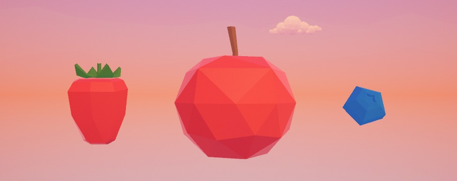
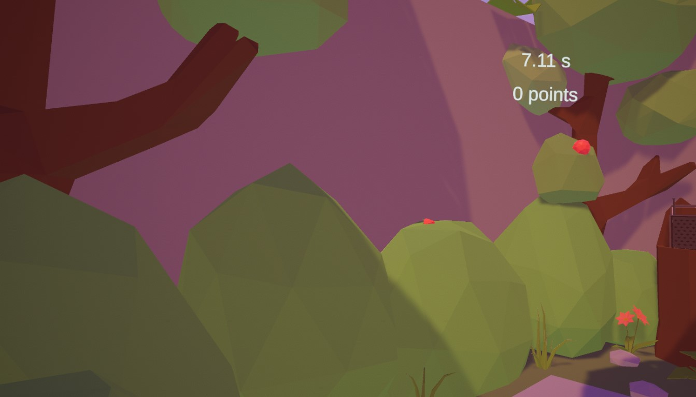

# Manuel Utilisateur - FruitPower

Ce document a pour but de vous expliquer comment utiliser le jeu FruitPower.

[TOC]

## Prérequis

Pour utiliser l'application FruitPower, vous devez disposer d'un casque de réalité virtuelle compatible avec le logiciel SteamVR ou OpenXR ainsi que d'un ordinateur suffisamment puissant pour faire fonctionner l'application.

### Configuration minimale

Une configuration minimale est requise pour utiliser l'application.

- **Système d'exploitation** : Windows 10/11
- **Processeur** : Intel i5-4590, AMD Ryzen 5 1500X ou version supérieure
- **Mémoire vive** : 8 Go de RAM
- **Carte graphique** : NVIDIA GTX 1650 ou AMD Radeon R9 290

### Configuration recommandée

Pour une expérience optimale, nous vous recommandons d'utiliser une configuration plus puissante.

- **Processeur** : Intel i7-9700K, AMD Ryzen 7 2700X ou version supérieure
- **Mémoire vive** : 16 Go de RAM
- **Carte graphique** : Nvidia RTX série 20 / AMD Radeon RX série 6000

### Autres prérequis

- **Casque de réalité virtuelle** : Vous devez disposer d'un casque de réalité virtuelle compatible avec le logiciel SteamVR ou OpenXR. Voici une liste de casques compatibles :
  - Valve Index
  - HTC Vive
  - Oculus Rift
  - Windows Mixed Reality
  - Pico Neo 2
  - Varjo VR-2
  - HP Reverb G2
  - etc.
- **SteamVR** : Pour utiliser l'application, vous devez disposer du logiciel SteamVR installé sur votre ordinateur. Vous pouvez le télécharger sur le site officiel de Steam.
- **Manettes de réalité virtuelle** : Vous devez disposer de manettes de réalité virtuelle compatibles avec le logiciel SteamVR ou OpenXR.
- **Espace de jeu** : Vous devez disposer d'un espace de jeu suffisamment grand pour pouvoir vous déplacer librement en réalité virtuelle. Nous recommandons un espace de jeu d'au moins 2 mètres sur 2 mètres.

## Lancement de l'application

### Depuis Steam

Pour lancer l'application FruitPower depuis Steam, suivez les étapes suivantes :

1. Ouvrez le logiciel Steam sur votre ordinateur.
2. Connectez-vous à votre compte Steam.
3. Dans la barre de recherche, saisissez "FruitPower" et appuyez sur Entrée.
4. Cliquez sur le bouton "Jouer" pour lancer l'application.
5. Mettez votre casque de réalité virtuelle et suivez les instructions à l'écran pour commencer à jouer.

### Depuis le bureau

Vous pouvez également lancer l'application FruitPower directement depuis le bureau de votre ordinateur en suivant les étapes suivantes :

1. Ouvrez le dossier contenant l'application FruitPower.
2. Double-cliquez sur l'icône de l'application pour la lancer.
3. Mettez votre casque de réalité virtuelle et suivez les instructions à l'écran pour commencer à jouer.

### Depuis MetaQuest

Si vous utilisez un casque Oculus Quest, vous pouvez lancer l'application FruitPower directement depuis l'application MetaQuest en suivant les étapes suivantes :

1. Ouvrez l'application MetaQuest sur votre casque Oculus Quest.
2. Recherchez "FruitPower" dans la barre de recherche.
3. Cliquez sur l'application pour la lancer.
4. Mettez votre casque de réalité virtuelle et suivez les instructions à l'écran pour commencer à jouer.

## Utilisation de l'application

Après avoir mis votre casque de réalité virtuelle et lancé le jeu FruitPower, vous vous retrouverez dans un environnement virtuel où vous pourrez interagir avec différents éléments. Voici quelques conseils pour bien utiliser l'application :

### Déplacement

Pour vous déplacer dans l'environnement virtuel, vous devez vous déplacer physiquement dans la pièce où vous vous trouvez. Cela fonctionne aussi si vous vous baissez ou si vous sautez.

### Interaction

Les manettes de réalité virtuelle sont représentées dans l'environnement virtuel par vos mains. Pour interagir avec les éléments de l'environnement, utilisez ces dernières. Voici la listes des action disponibles :

- **Saisie** : Pour attraper un objet, maintenez la gâchette de grip enfoncée. Relâchez la gâchette pour lâcher l'objet.
- **Lancer** : Pour lancer un objet, effectuez un mouvement de lancer avec votre bras et relâchez la gâchette de grip au bon moment.
- **Appuyer** : Pour appuyer sur un bouton ou un interrupteur, pointez le contrôleur vers l'objet et appuyez sur la gâchette de déclenchement.
- **Interactions avec l'interface utilisateur** : Pour naviguer dans les menus ou les interfaces utilisateur, pointez le contrôleur vers les éléments interactifs et appuyez sur la gâchette de déclenchement.

### Objectif

L'objectif du jeux est de collecter un maximum de fruits en un temps limité. Pour cela, vous devez vous déplacer dans l'environnement virtuel, attraper les fruits qui apparaissent et les mettre dans le panier. Vous pouvez également lancer les fruits dans le panier pour les collecter plus rapidement. Attention, les fruits disparaissent après un certain temps, alors soyez rapide !

Une partie dure 30 secondes. A la fin de la partie, un menu apparaît pour vous permettre de rejouer, quitter l'application ou afficher les crédits.

### fruits

Il existe 3 types de fruits différents :

- **Fraise** : les fraises sont les fruits les plus courants. Elles rapportent 1 point. Elle sont placées sur des buissons a gauche et a droite de la zone de jeu et disparaissent après 3 secondes.
- **Pomme** : les pommes sont moins courantes que les fraises. Elles rapportent 2 points. Elles sont placées sur des arbres dans les coins de la zone de jeu et disparaissent après 3 secondes.
- **Myrtille** : les myrtilles sont les fruits les plus rares. Elles rapportent 3 points. Elles sont placées sur rangées de buissons au fond de la zone de jeu et disparaissent après 2 secondes.

### Interface utilisateur

L'interface utilisateur est simple et intuitive. Elle est séparée en 2 parties :

- **En jeu** : En haut de l'écran, vous trouverez un affichage tête haute (HUD) qui indique votre score actuel, le temps restant et le nombre de fruits collectés. Uniquement visible pendant la partie.
- **Menu** : Quand une partie est terminée, un menu apparaît pour vous permettre de rejouer, quitter l'application ou afficher les crédits. Vous pouvez naviguer dans le menu en pointant le contrôleur vers les boutons et en appuyant sur la gâchette de déclenchement.

#### En jeu

Au cours de la partie, un affichage tête haute (HUD) est affiché en haut de l'écran. Il indique les informations suivantes :

- **Score** : Le score actuel de la partie, calculé en fonction des fruits collectés.
- **Temps restant** : Le temps restant avant la fin de la partie, affiché sous forme d'un compte à rebours.
  

#### Menu

Dans le menu, une liste des fruits collectés est affichée, elle présente le type de fruit et la quantité collectée. Un texte indique le score final de la partie.

Un bouton "Rejouer" permet de relancer une partie, un bouton "Quitter" permet de quitter l'application et un bouton "Crédits" permet d'afficher les crédits de l'application.

Pour quittez les crédits, appuyez sur le bouton "Retour" en bas de l'écran.

### Musique

A coté du panier, une radio diffuse de la musique. Vous pouvez changer de musique en appuyant sur le bouton bleu de la radio. Il y a 4 musique disponibles. Pour stopper la musique, appuyez sur le bouton rouge de la radio.

### Aide

Si vous avez des questions ou des problèmes lors de l'utilisation de l'application, n'hésitez pas à contactez le support technique à l'adresse suivante :  
<ruben.whlr@eduge.ch>
