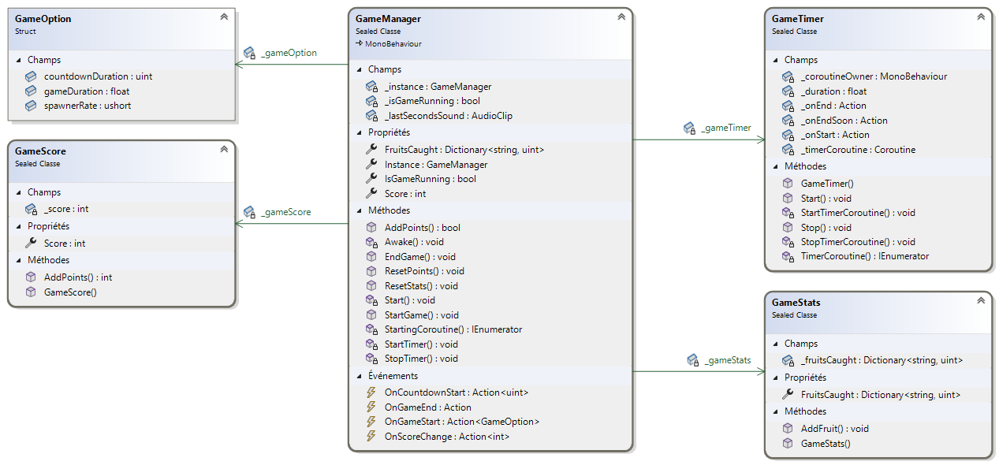
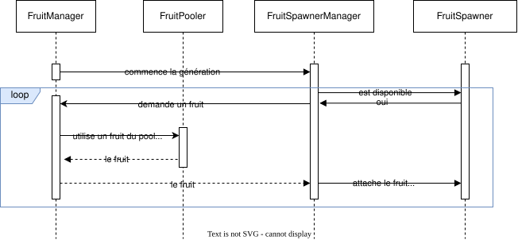
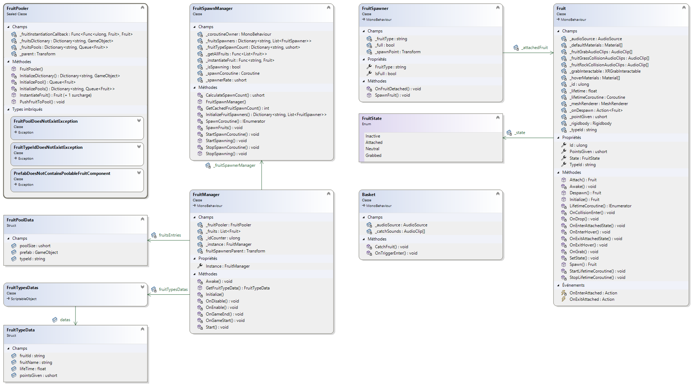
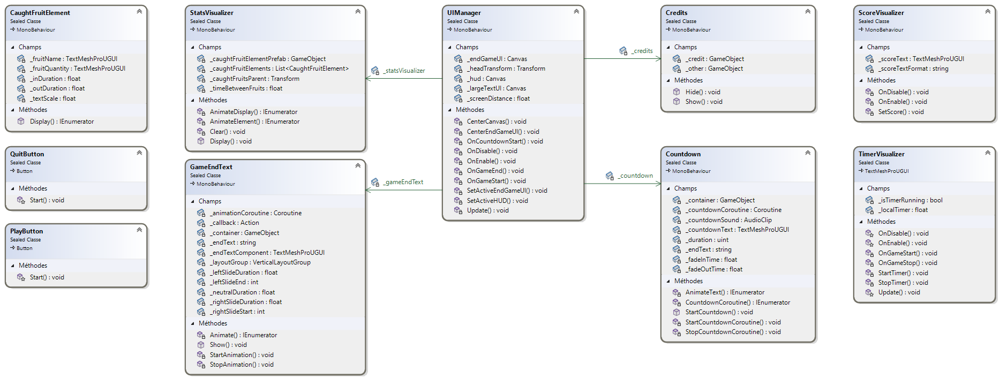
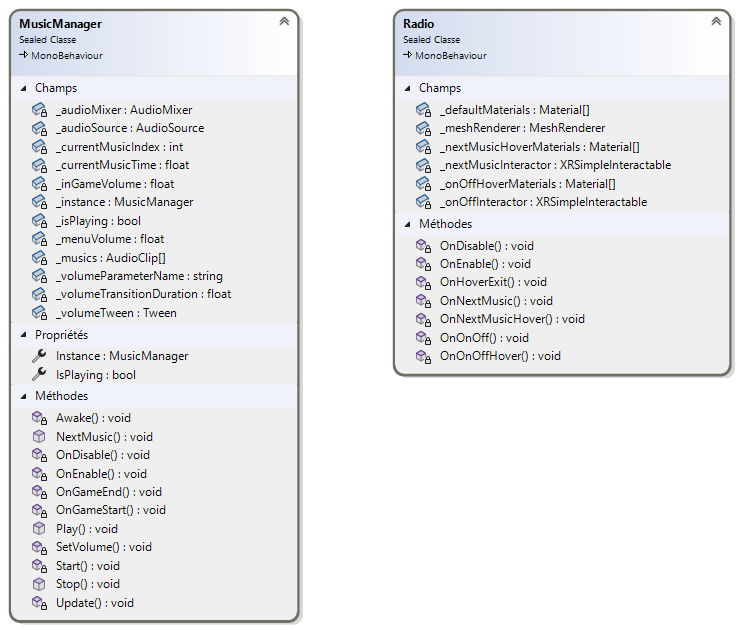

# Rapport de projet - FruitPower

## Table des versions

| Version | Date | Auteur | Changements |
| ------- | ---- | ------ | ----------- |
| 1.0 | 2023-11-09 | Ruben Wihler | version finale |

## Table des matières

[TOC]

## Introduction

Ce document est un rapport présentant différents aspects de la conception du projet FruitPower. Ce projet a été réalisé dans le cadre du Travail pratique individuel (TPI) durant la session de mai 2024. Il a pour but de valider mes compétences acquises pendant la formation Informaticien CFC dispensée à l’école d’informatique du CFPT au Petit-Lancy. FruitPower est un jeux vidéo utilisant la réalité virtuelle. Il a été développé en C# avec le moteur de jeu Unity.

## Rappel de l’énoncé

>Les informations sont extraites du cahier des charges du TPI.

### Organisation

| Elève | Maître d’apprentissage | Experts |
| ----- | --------------------- | ------- |
| Ruben Wihler | Julien Aliprendi | Mickaël Strazzeri, Yvan Poulin |

### Livrables

Pour les experts et le maître d’apprentissage :

- Rapport de projet
- Manuel utilisateur
- Résumé du rapport du TPI
- Journal de travail
- Version compilée et sources du projet Unity C#

### Matériel et logiciels à disposition

- Un PC standard école, 2 écrans
- Windows 10
- Visual studio code
- Visual studio 2022
- Unity 2022.3.12f1
- Suite Office

### Méthodologie

#### Méthode en 6 étapes

##### 1. S’informer

Lors de cette étape, j’ai dû m’informer sur le cahier des charges, l’analyser en profondeur pour bien comprendre toutes les fonctionnalités demandées. C’est également durant cette étape que j’ai demandé des questions/informations à M.Aliprandi pour tout ce qui concerne mes différentes incompréhensions. A chaque fois que je commençais une storie je m’informais en regardant le cahier des charges.

##### 2. Planifier

Dans cette étape, j’ai créé un planning prévisionnel pour pouvoir m’organiser et savoir ce que je dois faire et quand. Pour faire ce planning, j’ai dû découper le travail en plusieurs tâches. Pour ces tâches, j’ai décidé de les mettre sous la forme de user stories. C’est une description simple de ce que l’utilisateur a besoin pour savoir les différentes fonctionnalités à développer.

J’ai décidé de mettre aussi en place la méthode MoSCoW qui attribue des priorités sur les tâches afin de pouvoir s’attarder sur ce qui est prioritaire. Les niveaux de priorités sont :

- P1 Must
- P2 Should
- P3 Could

Toutes ces stories sont mises dans un product backlog. J’ai fait un planning effectif pour pouvoir comparer mon avancée avec le planning prévisionnel.

##### 3. Décider

Lors de mon projet, j’ai eu plusieurs décisions importantes à prendre. Toutes les décisions que je trouvais importantes et pertinentes, je les mettais dans le journal de bord et j’expliquais pourquoi j’ai choisi de faire comme ça.

##### 4. Réaliser

Une fois les décisions prises, je pouvais commencer à réaliser, soit l’implémentation dans le code, soit la rédaction dans la documentation.

##### 5. Contrôler

tout de suite plusieurs fois. Quand je rajoutais une fonction, je testais également l’autre pour voir s'il y avait pas de régression. Une fois que je finissais d’implémenter un système, je la testais avec des test unitaires et foncitonnels pour voir si tout fonctionnait correctement. (Unity Test Framework)

##### 6. Evaluer

Cette étape je la fais dans mon bilan dans mon journal de bord. Ici on liste les réussites, les difficultés, les améliorations ainsi que les décisions. J'ai aussi mis le resultats de mes tests.

#### Méthode Agile

Durant l’élaboration de mon projet, je n’ai pas seulement appliqué la méthode en 6 étapes mais également celle de la méthode Agile. Je me suis fixé tous les jours des objectifs dans le journal de bord que je devais atteindre en fin de journée.

Le backlog fait également partie de la méthodologie agile puisque j’ai fait des stories qui correspondent à de petits objectifs à atteindre pour arriver à l’objectif final. Les objectifs sont atteints quand les cas de tests sont fonctionnels et ainsi pouvoir passer au suivant.

### Sauvegardes et versionning

Pour versionner mon projet, j’ai utilisé Git. J’ai créé un [dépôt sur GitHub](https://github.com/RubenWihler/FruitPower) pour pouvoir sauvegarder mon code source et le partager avec mon maître d’apprentissage et les experts.

Concernant mon organisation des sauvegardes, j’ai décidé d'adopter la méthode 3-2-1. Cela signifie que je garde 3 copies de mes données, sur 2 supports différents, dont 1 hors site. J’ai donc sauvegardé mon code source sur GitHub, sur un disque dur externe et sur un google drive.

La nomenclature des backups est la suivante : `YYYYMMDDFruitPower.7zip` où `YYYYMMDD` est la date du backup et `FruitPower` est le nom du projet.

Les backups contiennent le code source du projet, la documentation, le journal de bord, les rapports, les manuels, les versions compilées, les assets, etc.

## Planification

J'ai fais un planning prévisionnel pour pouvoir m’organiser et savoir ce que je dois faire en découpant les user stories en plusieurs tâches. Pour ces tâches, j’ai décidé de les mettre sous la forme de user stories. C’est une description simple de ce que l’utilisateur a besoin pour savoir les différentes fonctionnalités à développer.

### Planning prévisionnel et effectif

Le planning si dessous contient la planification prévisionnelle et effectif du projet.


### Product backlog

Les user stories sont des descriptions simples de ce que l'utilisateur a besoin pour savoir les différentes fonctionnalités à développer. Ces dernières sont mises dans un product backlog.

>Pour rappelle, les niveaux de priorités sont :  
> - P1 Must  
> - P2 Should  
> - P3 Could  

| ID | Nom | Description | Priorité |
|----|-----|-------------|----------|
| 001 | Implémentation VR | En tant qu'utilisateur, je veux pouvoir interagir avec le jeu en utilisant un casque VR et ses contrôleurs. | P1 |
| 002 | Environnement 3D | En tant qu'utilisateur, je veux pouvoir évoluer dans un jardin en 3D de 2x2 mètres. et ne pas pouvoir sortir de la zone de jeu. | P1 |
| 003 | Main du joueur | En tant qu'utilisateur, je veux voir les contrôleurs dans le jeu sous forme de mains. | P1 |
| 004 | Arbres et buissons | En tant qu'utilisateur, je veux que le jardin contienne des arbres et des buissons. (Une dizaine) | P1 |
| 005 | Génération de fruits | En tant qu'utilisateur, je veux que des fruits apparaissent aléatoirement sur des arbres ou des buissons. Les fruits doivent apparaître à une vitesse définie. | P1 |
| 006 | Ramassage de fruits | En tant qu'utilisateur, je veux pouvoir ramasser des fruits en les ramassant avec les contrôleurs. | P1 |
| 007 | Disparition des fruits | En tant qu'utilisateur, je veux que les fruits disparaissent après quelques secondes s'ils ne sont pas ramassés | P1 |
| 008 | Compteur de points | En tant qu'utilisateur, je veux pouvoir ramasser des fruits pour gagner des points. Chaque fruit ramassé donne 1 point. | P1 |
| 009 | Visualisation des points | En tant qu'utilisateur, je veux voir le nombre de fruits que j'ai ramassé. | P1 |
| 010 | Compteur de temps | En tant qu'utilisateur, je veux voir le temps restant pour la partie. | P1 |
| 011 | Fin de partie | En tant qu'utilisateur, je veux que la partie se termine après 30 secondes. | P1 |
| 012 | Score final | En tant qu'utilisateur, je veux voir mon score final à la fin de la partie. | P1 |
| 013 | Rejouer | En tant qu'utilisateur, je veux pouvoir rejouer après avoir vu mon score final. | P1 |
| 014 | Musique et bruitages | En tant qu'utilisateur, je veux entendre de la musique et des bruitages. | P2 |
| 015 | Graphismes | En tant qu'utilisateur, je veux que le jeu soit agréable visuellement. | P2 |
| 016 | Modèles 3D | En tant qu'utilisateur, je veux que les modèles 3D soient de qualité. | P2 |
| 017 | Post-traitement | En tant qu'utilisateur, je veux que le jeu soit agréable visuellement grâce à un post-traitement. | P3 |
| 018 | Interface | En tant qu'utilisateur, je veux que l'interface soit intuitive. | P3 |

### Tâches techniques

Les tâches techniques sont des tâches plus précises qui permettent de réaliser les user stories. Elles sont plus techniques et détaillées et ne sont pas destinées au client. Nous avons décidé de les formuler sous la forme de petites tâches issues des user stories.

#### 000 : Préparation du projet

| ID | Nom | Description | Priorité |
|----|-----|-------------|----------|
| 000.1 | Création du repository Git | Création du repository Git pour versionner le code | P1 |
| 000.2 | Création du journal de bord | Création du journal de bord pour suivre l'avancement du projet | P1 |
| 000.3 | Création de la documentation | Création de la documentation pour expliquer le projet | P1 |
| 000.4 | Planification | Planification du projet | P1 |
| 000.5 | Création du projet Unity | Création du projet Unity | P1 |

#### 001 : Implémentation VR

| ID | Nom | Description | Priorité |
|----|-----|-------------|----------|
| 001.1 | Ajout du package XR | Ajout du package XR (Plugin provider : OpenXR) | P1 |
| 001.2 | Ajout Unity Input System | Ajout du package Unity Input System requis pour le package XR Interaction Toolkit | P1 |
| 001.3 | Ajout du package XR Interaction Toolkit | Ajout du package XR Interaction Toolkit | P1 |
| 001.4 | Ajout du système de déplacement | Ajout du système de déplacement pour pouvoir se déplacer dans le jeu | P1 |

#### 002 : Environnement 3D

| ID | Nom | Description | Priorité |
|----|-----|-------------|----------|
| 002.1 | Création du jardin | Création du jardin en 3D de 2x2 mètres | P1 |
| 002.2 | Ajout des limites | Ajout des limites pour ne pas pouvoir sortir de la zone de jeu | P1 |
| 002.3 | Ajout des arbres et buissons | Ajout des arbres et des buissons dans le jardin (ce qui vont servir à générer les fruits plus tard) | P1 |

#### 003 : Main du joueur

| ID | Nom | Description | Priorité |
|----|-----|-------------|----------|
| 001.1 | Ajout des contrôleurs | Ajout des contrôleurs pour pouvoir interagir avec le jeu | P1 |
| 001.2 | Importation des modèles de mains | Importation des modèles de mains pour les contrôleurs | P1 |
| 001.3 | Ajout du système d'intéraction | Ajout du système d'intéraction pour pouvoir intéragir avec les objets du jeu | P1 |

#### 004 : Arbres et buissons

| ID | Nom | Description | Priorité |
|----|-----|-------------|----------|
| 004.1 | Recherche de modèles 3D | Recherche de modèles 3D d'arbres et de buissons | P1 |
| 004.2 | Importation des modèles 3D | Importation des modèles 3D d'arbres et de buissons dans le projet | P1 |
| 004.3 | Placement des arbres et buissons | Placement des arbres et des buissons dans le jardin | P1 |

#### 005 : Génération de fruits

| ID | Nom | Description | Priorité |
|----|-----|-------------|----------|
| 005.1 | Conception du système de fruits | Conception du système de génération de fruits + UML | P1 |
| 005.2 | Implémentation du système de fruits | Implémentation du système de génération de fruits | P1 |
| 005.3 | Test du système de fruits | Test du système de génération de fruits | P1 |

#### 006 : Ramassage de fruits

| ID | Nom | Description | Priorité |
|----|-----|-------------|----------|
| 006.1 | Utilisation du système d'intéraction et celui des fruits | Utilisation le système d'intéraction pour ramasser les fruits | P1 |
| 006.2 | Test du système de ramassage | Test du système de ramassage des fruits | P1 |

#### 007 : Disparition des fruits

| ID | Nom | Description | Priorité |
|----|-----|-------------|----------|
| 007.1 | Rajout d'un timer sur les fruits | Rajout d'un timer sur les fruits pour les faire disparaître après quelques secondes | P1 |
| 007.2 | Test du système de disparition | Test du système de disparition des fruits | P1 |
| 007.3 | Optimisation du système | Optimisation du système de disparition des fruits en utilisant du pooling | P2 |

#### 008 : Compteur de points

| ID | Nom | Description | Priorité |
|----|-----|-------------|----------|
| 008.1 | Création du système de points | Création du système de points pour compter les points | P1 |
| 008.2 | Test du système de points | Test du système de points | P1 |

#### 009 : Visualisation des points

| ID | Nom | Description | Priorité |
|----|-----|-------------|----------|
| 009.1 | Création de l'interface | Création de l'interface pour afficher les points | P1 |
| 009.2 | Test de l'interface | Test de l'interface pour afficher les points | P1 |

#### 010 : Compteur de temps

| ID | Nom | Description | Priorité |
|----|-----|-------------|----------|
| 010.1 | Création du timer | Création du timer de 30 secondes pour la partie | P1 |
| 010.2 | Test du timer | Test du timer de 30 secondes | P1 |
| 010.3 | Affichage du timer | Rajout de l'affichage du timer à l'interface | P1 |

#### 011 : Fin de partie

| ID | Nom | Description | Priorité |
|----|-----|-------------|----------|
| 011.1 | Fin de partie | Fin de partie après 30 secondes | P1 |
| 011.2 | Test de la fin de partie | Test de la fin de partie après 30 secondes | P1 |

#### 012 : Score final

| ID | Nom | Description | Priorité |
|----|-----|-------------|----------|
| 012.1 | Affichage du score final | Affichage du score final à la fin de la partie | P1 |
| 012.2 | Test de l'affichage du score final | Test de l'affichage du score final à la fin de la partie | P1 |

#### 013 : Rejouer

| ID | Nom | Description | Priorité |
|----|-----|-------------|----------|
| 013.1 | Création du système de chargement de scene | Création du système de chargement de scene pour pouvoir rejouer | P1 |
| 013.2 | Test du système de chargement de scene | Test du système de chargement de scene pour pouvoir rejouer | P1 |
| 013.3 | Implémentation du système dans l'interface | Implémentation du système de chargement de scene dans l'interface (bouton) | P2 |
| 013.3 | Optimisation du système | Optimisation du système de chargement de scene pour qu'il soit asynchrone | P2 |
| 013.4 | Ajout d'un écran de chargement | Ajout d'un écran de chargement pour le chargement de la scene | P3 |
| 013.5 | Test de l'écran de chargement | Test de l'écran de chargement pour le chargement de la scene | P3 |

#### 014 : Musique et bruitages

| ID | Nom | Description | Priorité |
|----|-----|-------------|----------|
| 014.1 | Recherche de musiques et bruitages | Recherche de musiques et bruitages pour le jeu | P2 |
| 014.2 | Importation des musiques et bruitages | Importation des musiques et bruitages dans le projet | P2 |
| 014.3 | Ajout des musiques et bruitages | Ajout des musiques et bruitages dans le jeu | P2 |

#### 015 : Graphismes

| ID | Nom | Description | Priorité |
|----|-----|-------------|----------|
| 015.1 | Recherche d'une identité visuelle | Recherche d'une identité visuelle pour le jeu | P2 |
| 015.2 | Elaboration de la palette de couleurs | Elaboration de la palette de couleurs pour le jeu | P2 |

#### 016 : Modèles 3D

| ID | Nom | Description | Priorité |
|----|-----|-------------|----------|
| 016.1 | Recherche de modèles 3D | Recherche de modèles 3D pour le jeu | P2 |
| 016.2 | Importation des modèles 3D | Importation des modèles 3D dans le projet | P2 |
| 016.3 | Ajout des modèles 3D | Ajout des modèles 3D dans le jeu | P2 |

#### 017 : Post-traitement

| ID | Nom | Description | Priorité |
|----|-----|-------------|----------|
| 017.1 | Ajout d'un post-traitement | Ajout d'un post-traitement pour améliorer les graphismes | P3 |

#### 018 : Interface

| ID | Nom | Description | Priorité |
|----|-----|-------------|----------|
| 018.1 | Conception de l'interface | Conception de l'interface pour qu'elle soit intuitive et en harmonie avec l'idée visuelle | P3 |
| 018.2 | Implémentation de l'interface | Implémentation de l'interface dans le jeu | P3 |

---

## Analyse des fonctionnalités majeures

Les fonctionnalités majeures du projet sont tirées du cahier des charges.

- **Une partie dure 30 secondes**
- **Le score est affiché à la fin de la partie**
- **Un bouton est présent pour recommencer après la fin de la partie**
- **Un fruit ramassé avec la télécommande donne 1 point** : etendu à plusieurs types de fruits (en accord avec le maitre d'apprentissage)
- **Le jardin contient des arbres et buissons (par exemple une dizaine)** : 13 buissons et 4 arbres
- **La génération des fruits est aléatoire dans un temps défini** : fruits générés aléatoirement sur les buissons et les arbres, temps équivalent pour chaque partie par soucis d'équité entre les joueurs (différent pour chaque type de fruit)
- **Les fruits disparaissent après quelques secondes s'ils ne sont pas ramassés (par exemple 3 secondes)** : Différent pour chaque type de fruit (entre 2 et 3 secondes).
- **Le jardin est clôturé ou a des limites visuelles** : murs autour du jardin.
- **Fruits ramassés avec la télécommande et mis dans un panier** : fruits ramassés avec les contrôleurs et mis dans un panier statique pour gagner des points.
- **Musique et bruitages** : musique et bruitages présents dans le projet. (details dans la partie son) Les musique et leurs auteurs sont crédités dans [la partie crédits du jeu](#credits).
- **Eléments 2D/3D gratuits** : tous les assets utilisés sont gratuits et leurs auteurs sont crédités dans [la partie crédits du jeu](#credits).

---

## Analyse organique

Pour faciliter la partie conception ainsi que la partie implémentation, le projet a été divisé en plusieurs systèmes. Chaque système a une responsabilité bien définie et est plus ou moins indépendant des autres systèmes. Cela permet de faciliter la maintenance et l'évolution du projet.

### Informations générales

#### Assemblies et namespaces

Pour faciliter l'organisation du code, chaque système possède une définition d'assebly.

| Nom | Description | Chemin (racine du projet unity) |
|-----|-------------|--------|
| Scripts | Scripts généraux | Assets/Scripts/Scripts.asmdef |
| FruitSystem | Système de gestion des fruits | Assets/Scripts/FruitSystem/FruitSystem.asmdef |
| Inputs | Système de gestion des inputs | Assets/Scripts/Inputs/Inputs.asmdef |
| UISystem | Système de gestion de l'interface utilisateur | Assets/Scripts/UI/UISystem.asmdef |
| Audio | Système de gestion de l'audio | Assets/Scripts/Audio/Audio.asmdef |
| GameManagement | Système de gestion de la partie | Assets/Scripts/GameManagement/GameManagement.asmdef |

Dans la même optique, l'utilisation de namespaces a été privilégiée pour une meilleure organisation du code.

#### Conventions de nommage

Pour faciliter la lecture du code, des conventions de nommage ont été mises en place. Voici les conventions de nommage utilisées dans le projet (dans l'ordre)

- Namespace : PascalCase
- Enum : PascalCase
- Classes : PascalCase
- Interfaces : IPascalCase
- champs public : camelCase
- champs privé : _camelCase
- Propriétés : PascalCase
- Events : camelCase
- Méthodes : PascalCase

#### Héritage et composition

Pour faciliter la maintenance du projet la composition a été privilégiée à l'héritage. Cela permet de réduire les dépendances entre les classes et de faciliter la maintenance du code. L'héritage est utilisé uniquement pour les classes qui ont une relation de parenté (ex : MonoBehaviour).

Dans cette optique de minimiser les dépendances, l'abstraction de comportement a été réalisée à l'aide de delegates passés en constructeur. Nous aurions pu utiliser des interfaces mais cela aurait augmenté la complexité du code pour un gain de flexibilité minime (surtout vu la nature simpliste du projet).

#### Design patterns

Une combinaison de plusieurs design patterns a été utilisée pour réaliser un code propre et maintenable. Nous avons par exemple utilisé le pattern Observer pour la gestion de la partie et le pattern Pool pour la gestion des fruits.

Le pattern Singleton a aussi beaucoup été utilisé pour les classes qui ne doivent être instanciés qu'une seule fois dans le jeu et qui doivent être accessibles de partout (GameManager, FruitManager, etc). Nous ne pouvons pas utiliser de classes statiques car ces dernières ne peuvent pas être un component Unity(doit hériter de MonoBehaviour).

#### Commentaires de code

Pour faciliter la lecture du code, des commentaires ont été ajoutés dans le code. Ces commentaires permettent de comprendre le code plus facilement et de savoir ce que fait chaque partie du code. Les commentaires sont écrits en français et utilisent les summary de C#.

#### Inspecteur Unity

Pour faciliter l'utilisation des scripts dans Unity, des attributs ont été ajoutés aux champs des classes pour les rendre visibles dans l'inspecteur Unity. Cela permet de modifier les valeurs des champs directement dans l'inspecteur sans avoir à modifier le code.

Nous n'avons pas eu besoin de créer des éditeurs personnalisés pour les scripts car ils sont simples et ne nécessitent pas de modifications particulières dans l'inspecteur. Nous avons simplement utilisé les attributs `Header` et `Tooltip` pour rendre l'inspecteur plus lisible.

> Il est important de noter que les attributs `Tooltip` sont affichés dans Visual Studio comme pour les summary de C#.

Etant donné que les variables sont en anglais, nous avons mis les `Header` en anglais pour que l'inspecteur soit plus lisible. En revanche, comme pour les commentaires de code, les `Header` sont en français.

Pour garder une ogranisation harmonieuse dans l'inspecteur, nous avons utilisé les mêmes `Header` pour séparer les différentes sections dans toutes les classes :

- `Settings` : Pour les paramètres du script.
- `References` : Pour les références aux autres composants.

> D'autres `Header` plus spécifiques ont été utilisés en fonction des besoins du script.

### Gestions de la réalité virtuelle

La gestion de la réalité virtuelle est un des points clés du projet. Elle permet au joueur d'interagir avec le jeu en utilisant un casque de réalité virtuelle et ses contrôleurs. Pour cela, nous avons utilisé le package XR d'Unity qui permet de gérer la réalité virtuelle de manière simple et efficace. Nous avons également utilisé le package XR Interaction Toolkit qui permet de gérer l'interaction avec les objets du jeu.
Pour gagner du temps, nous avons utiliser le sample de l'XR Interaction Toolkit pour la gestion des contrôleurs. Ce dernier nous a permis d'avoir tout de suite les InputsActions et les interactions de base (grab, select, etc).

#### Mains du joueur

Pour les main du joueur, nous avons utilisé les modèles de mains donnés dans une séries de tutoriels de Unity. Ces modèles sont des modèles de mains de base qui sont deja animés. Nous avons simplement suivi le tutoriel pour les importer dans le projet et les utiliser.

> Référence de la vidéo : [How to Make a VR Game in Unity 2022 - PART 2 - INPUT and HAND PRESENCE](https://www.youtube.com/watch?v=8PCNNro7Rt0)

La seule classe que nous avons dû implémenter est lui aussi donné dans le tutoriel. Il s'agit de la classe `HandController` qui permet de faire le lien entre les contrôleurs et l'animator des mains.

#### Déplacement du joueur

Les déplacements du joueur sont très simples étant donné que le joueur ne peut pas se déplacer dans l'environnement avec les contrôleurs. Il ne peut que se déplacer dans un rayon de 2 mètres autour de lui en marchant dans la réalité. Pour cela, nous avons utilisé les composants `LocomotionSystem`, `ContinuousMoveProvider` et `CharacterControllerDriver` du package XR Interaction Toolkit.

#### Utilisation dans Unity

##### XR Plugin Management

Pour utiliser la réalité virtuelle dans Unity, il faut ajouter le package XR dans le projet. Pour cela, il faut aller dans le menu `Window` -> `Package Manager` et chercher le package `XR Plugin Management`. Il faut ensuite l'installer. Une fois le package installé, il faut aller dans `Edit` -> `Project Settings` -> `XR Plugin Management` et activer le plugin `OpenXR`.  

##### XR Interaction Toolkit

Pour utiliser le package XR Interaction Toolkit, il faut ajouter le package dans le projet. Pour cela, il faut aller dans le menu `Window` -> `Package Manager` et cliquer sur le `+` en haut à gauche > `Add package from name` et entrer `com.unity.xr.interaction.toolkit`. Il faut ensuite l'installer. Pour installer le sample `Started Assets`, il faut aller dans Package Manager > XR Interaction Toolkit > Samples > Started Assets > Import.

##### Utilisation dans la scène

L'utilisation de la réalité virtuelle dans la scène est très simple. Voici la hiérarchie du joueur dans la scène :


###### XR Player

C'est le GameObject qui représente le joueur dans la scène.

Voici la vue de l'inspector du XR Player :


Voici la liste des composants du XR Player :

- `XROrigin` : Composant qui permet de définir l'origine du joueur dans la scène.
- `InputActionManager` : Composant qui permet de gérer les actions des contrôleurs.
- `LocomotionSystem` : Composant qui permet de gérer le déplacement du joueur.
- `ContinuousMoveProvider` : Composant qui permet de gérer le déplacement du joueur (aucun référence au Move Action car le joueur ne peut pas se déplacer avec les contrôleurs).
- `CharacterControllerDriver` : Composant qui permet de gérer le déplacement du joueur.
- `CharacterController` : Composant qui permet de gérer le déplacement du joueur (n'est pas propre à la VR).

###### LeftHand et RightHand

Les mains du joueur sont des GameObjects enfants du XR Player. Voici la vue de l'inspector d'une main :


Voici la liste des composants d'une main :

- `XRController` : Composant qui permet de gérer le contrôleur.
- `XRDirectInteractor` : Composant qui permet de gérer l'intéraction avec les objets (les atrapper, les lancer, etc).
- `SphereCollider` : Composant qui permet de gérer la zone de détection des objets. (mis en mode trigger pour ne pas bloquer les objets).

En plus de ces composants, il y a un GameObject enfant de la main qui contient le modèle de la main. Ce GameObject est animé par l'animator de la main.
Il possède également un `HandController` ([HandController](#handcontroller)) qui permet de faire le lien entre les contrôleurs et l'animator de la main.

### Environnement 3D

L'environnement 3D est un jardin clos de 2m x 2m. Il contient des arbres et des buissons qui servent à générer les fruits, des murs pour délimiter la zone de jeu et un sol pour marcher. La scène est composée de plusieurs GameObjects qui sont organisés de manière à ce que le joueur puisse se déplacer librement dans la zone de jeu.


> zone de jeu de 2m x 2m

Un panier est également présent dans la scène pour que le joueur puisse y mettre les fruits qu'il a ramassé pour gagner des points. Ce dernier est en hauteur pour que le joueur puisse y mettre les fruits facilement qu'il mesure 60cm ou 1m90. Il est lègèrement éclairé pour le mettre en valeur et soit perçu comme un élément important.

Une radio est également présente dans la scène pour que le joueur puisse entendre de la musique. Elle est placée a coté du panier et est également éclairée (moins que le panier pour ne pas trop attirer l'attention).

Etant donné que ce projet va être utilisé dans le cadre des portes ouvertes du CFPT, les joueurs devront comprendre rapidement comment jouer. Pour cela, un texte est affiché sur un mur pour expliquer qu'il faut ramasser les fruits et les mettre dans le panier pour gagner des points.

Des élements de décorations sont également présents dans la scène pour rendre le jardin plus vivant. Il y a des fleurs, des cailloux, des champignons, des fougères, etc.


> Environnement 3D avec les éléments de décorations

L'ambiance de la scène est très importante pour que le joueur se sente bien dans le jeu. Une ambiance de coucher de soleil faisant contraster ses couleurs chaudes avec les couleurs vives des éléments du jardin permet de donner une ambiance chaleureuse ainsi que de mettre en valeur les fruits et autres éléments clés du jeu.


> Ciel de la scène

---

### Gestion des parties

Le système de gestion de partie est relativement simple. C'est un singleton qui utilise un pattern d'observer pour notifier les autres systèmes des différents évènements de la partie. Ce système est composé de plusieurs classes qui gèrent les différents aspects de la partie (score, timer, statistiques, etc).

Le déroulement d'une partie est le suivant :

1. Le joueur appuie sur le bouton de démarrage de la partie.
2. Un compte à rebours de 3 secondes est lancé pour laisser le temps au joueur de se préparer.
3. La partie commence et les fruits commencent à apparaître.
4. Le joueur doit ramasser les fruits et les mettre dans le panier pour gagner des points.
5. Après 30 secondes, la partie se termine et le score final est affiché.
6. Le joueur peut rejouer en appuyant sur un bouton.

#### Classes du système de gestion de partie


> Le dragramme UML du système de gestion de partie

##### GameManager

Le `GameManager` est la classe principale du système de gestion de partie. C'est un singleton qui centralise toutes les opérations sur la partie. Utilisant un pattern d'observer, il notifie les autres systèmes de l'état de la partie.

##### GameOption

La structure `GameOption` est une structure qui contient les options de la partie. Elle est utilisée par le `GameManager` pour modifier les options de la partie dans l'éditeur Unity et en cours d'exécution (bien que cela ne soit pas nécessaire car aucun menu d'options n'est implémenté).

Elle contient les champs suivants :

- `public float gameDuration` : La durée de la partie en secondes.
- `public ushort spawnerRate` : Le nombre d'apparition de chaque type de fruits par seconde.
- `public uint countdownDuration` : La durée du compte à rebours du début de partie en secondes.

##### GameScore

La classe `GameScore` est une classe qui contient le score du joueur. Elle est utilisée par le `GameManager` pour gérer le score du joueur.

##### GameTimer

La classe `GameTimer` contient le timer de la partie. Elle utilise une coroutine pour le timer. Elle contient 3 Action (données en paramètre du constructeur) qui sont appelées à différents moments du timer. (début, 80% du timer, fin). Ces actions permettent d'abstraire le comportement sans avoir de dépendances entre les classes.

##### GameStats

La classe `GameStats` est une classe qui s'occupe de stocker les statistiques de la partie (pour le moment, uniquement les fruits ramassés). Elle est utilisée par le `GameManager`.

---

### Gestion des fruits

Le système de gestion des fruits est un des systèmes les plus importants du projet. Il est responsable de la génération des fruits, de leur apparition, de leur disparition, de leur ramassage et de leur comptage.

Avant d'aborder les détails du système, il est important de comprendre comment les fruits sont générés. Premièrement, il existe plusieur type de fruits (pommes, fraises, myrtilles). Chaque type de fruit a des caractéristiques différentes (points donnés, vitesse d'apparition, etc). Deuxièmement, les fruits apparaissent sur des arbres ou des buissons. Les pommes apparaissent sur les arbres, les fraises et les myrtilles apparaissent sur les buissons.

Chaque fruits ont un temps de vie configurable. Si le joueur ne les ramasse pas avant la fin de leur temps de vie, ils disparaissent. Quand le joueur ramasse un fruit, sa durée de vie est stoppé et ne disparaît pas. C'est seulement quand le joueur lache le fruit qu'il reprend sa durée de vie (qui est remise à zéro). Une fois que le fruit est mis dans le panier des points sont ajoutés au score du joueur.


> Attention, ce diagramme de séquence est simplifié pour des raisons de lisibilité. Il sert a montrer le déroulement général de la génération des fruits.

Globalement, le système est composé d'une classe [FruitManager](#fruitmanager) qui centralise toutes les opérations sur les fruits. Ce dernier utilise un [FruitPooler](#fruitpooler) pour gérer les fruits en pool. Il permet de réutiliser les fruits déjà instanciés pour éviter de les créer et de les détruire à chaque fois, cela permet un gain de performance non négligeable.


La classe [Fruit](#fruit) représente un fruit dans le jeu. Il contient les informations sur le fruit (type, points, etc) et les méthodes pour le ramasser et le détruire.

Dans l'éditeur Unity, un fruit est représenté par un prefab qui contient un rigidbody, un composant XR Grab Interactable, une source audio et la classe Fruit.


Pour regrouper et donner un accès facile aux données de chaque fruit, une strucure [FruitTypeData](#fruittypedata) est utilisée. Elle contient les informations sur le fruit (type, points, etc). Cette dernière est utilisée dans [FruitTypesDatas](#fruittypesdatas) une classe héritant de ScriptableObject qui permet de stocker les données des fruits dans l'éditeur Unity.


Un [FruitSpawnManager](#fruitspawnmanager) est utilisé pour gérer les [FruitSpawner](#fruitspawner). C'est sur ces derniers que la position des fruits est définie. Ils sont placés sur les arbres et les buissons pour que les fruits apparaissent à ces endroits.


> les points rouge représentent les spawners de pommes, les verts les fraises et les bleus les myrtilles.

#### Classes du système de fruit



> Ce diagramme UML ne contient pas toutes le association entre les classes car l'outil de Visual Studio ne permet pas de visualiser les association de type générique. (par exemple, la classe FruitPooler contient un dictionnaire de FruitPoolData qui n'est pas sous forme de flèche dans le diagramme).

##### FruitManager

Le `FruitManager` est la classe principale du système de gestion des fruits. Elle est responsable a haut niveau de toutes les opérations sur les fruits. Elle implémente un pattern singleton pour donner un accès facile aux autres classes du système ainsi qu'aux autres systèmes.

Cette classe utilise un [FruitPooler](#fruitpooler) pour gérer les fruits en pool. Un [FruitSpawnManager](#fruitspawnmanager) est également utilisé pour gérer les [FruitSpawner](#fruitspawner).

Elle contient une référence au [FruitTypesDatas](#fruittypesdatas) qui contient les données des fruits.
Grâce à la methode `public static GetFruitTypeData(string fruitId)` il est possible de récupérer les données d'un fruit en donnant son id. Cela permet de facilement accéder a ces données depuis d'autres systèmes (par exemple, pour afficher le nom des fruits ramassés dans l'interface de fin de partie).

##### FruitPooler

Le `FruitPooler` est une classe qui gère les fruits en pool. Elle permet de réutiliser les fruits déjà instanciés pour éviter de les créer et de les détruire à chaque fois, cela permet un gain de performance non négligeable.

Son fonctionnement est simple. Au démarrage de la partie, elle instancie un nombre de fruits défini dans l'éditeur Unity. Ces fruits sont ensuite désactivés et organisés dans un dictionaire qui contient l'id du type de fruit et une queue de fruits. Quand un fruit est ramassé, il est désactivé et remis dans la queue. Quand un fruit doit apparaître, il est récupéré de la queue et activé. Si la queue est vide, un nouveau fruit est instancié.

Afin de minimiser un maximum les dépendances entre les classes, l'opération d'attribution de l'identifiant du fruit est passée en paramètre du constructeur de la classe sous la forme d'une `Func<Func<ulong, Fruit>, Fruit>`.

La liste des données nécessaires pour le pooling des fruits est passée en paramètre du constructeur de la classe sous la forme d'un `FruitPoolData[]`.

##### FruitPoolData

La structure `FruitPoolData` est une structure qui contient les données nécessaires pour le pooling des fruits. Elle est utilisée par le [FruitPooler](#fruitpooler) pour instancier les fruits.

Elle contient les champs suivants :

- `string typeId` : l'identifiant du type de fruit.
- `GameObject prefab` : le prefab du fruit.
- `ushort poolSize` : la taille du pool.

##### Fruit

Un `Fruit` représente un fruit dans le jeu. Cette classe hérite de `MonoBehaviour`. Ce composant permet de gérer les interactions du joueur avec le fruit (ramassage), gérer sa durée de vie, jouer les différents sons du fruit (apparition, ramassage, collision).

Un fruit peut se trouver dans 3 états différents, représentés par l'énumération [FruitState](#fruitstate).

Quand un fruit apparaît, il est attaché à un [FruitSpawner](#fruitspawner) - sa position est définie par le spawner et la gravité du fruit est désactivée(état `Grabbed`). Si le joueur ne le ramasse pas avant la fin de sa durée de vie, il disparaît et est mis dans l'état `Innactive`.
Quand le joueur le ramasse, la gravité est activée et le fruit suit le contrôleur du joueur. Si le joueur le lâche, le fruit est remis dans l'état `Neutral`.

##### FruitState

L'énumération `FruitState` représente l'état d'un fruit. Un fruit peut se trouver dans 3 états différents :

- `Innactive` : Le fruit est désactivé.
- `Attached` : Le fruit est attaché à un [FruitSpawner](#fruitspawner).
- `Neutral` : Le fruit est actif et peut être ramassé par le joueur. (la gravité est activée).
- `Grabbed` : Le fruit est ramassé par le joueur et suit le contrôleur.

##### FruitTypeData

La structure `FruitTypeData` est une structure qui contient les données d'un type de fruit. Elle est dans un [FruitTypesDatas](#fruittypesdatas) qui contient les données de tous les types de fruits.

Elle contient les champs suivants :

- `fruitId` : l'identifiant du fruit.
- `fruitName` : le nom du fruit.
- `points` : le nombre de points donné par le fruit.
- `lifeTime` : la durée de vie du fruit.

##### FruitTypesDatas

La classe `FruitTypesDatas` est une classe héritant de ScriptableObject qui permet de stocker les données des fruits dans l'éditeur Unity (dans un fichier .asset). Elle contient une liste de [FruitTypeData](#fruittypedata) qui contient les données de chaque type de fruit.

##### FruitSpawner

Un `FruitSpawner` est une classe qui hérite de `MonoBehaviour` et est attachée à un GameObject.
Les `FruitSpawner` permettent de définir la position et la rotation sur laquelle les fruits apparaissent. Ils sont placés sur les arbres et les buissons pour que les fruits apparaissent à ces endroits.


##### FruitSpawnManager

Le `FruitSpawnManager` est une classe qui gère les [FruitSpawner](#fruitspawner).Elle gère le spawn des fruits en utilisant des coroutine récursive.

Une liste de [FruitSpawner](#fruitspawner) est passée en paramètre du constructeur de la classe. Cette liste est utilisée pour gérer les spawners.

Encore une fois dans le but de minimiser les dépendances entre les classes, l'opération d'instantiation des fruits est passée en paramètre du constructeur de la classe sous la forme d'une `Func<string, Fruit>`. Pour récupérer tous les fruits une fonction de type `Func<List<Fruit>>` est passée aussi en paramètre du constructeur.

##### Basket

La classe `Basket` est une classe qui gère le panier. Elle hérite de `MonoBehaviour` et est attachée à un GameObject dans la scène. Ce composant est responsable de gérer les fruits qui sont mis dans le panier et de notifier le [GameManager](#gamemanager) des points gagnés.

Cela est réalisé en utilisant un box collider qui est un trigger. Quand un fruit entre en collision avec ce collider, la méthode `OnTriggerEnter` est appelée. Cette méthode vérifie si le fruit est un fruit et si oui, elle joue le son de ramassage, ajoute les points au score et désactive le fruit.

---

### Interface utilisateur

L'interface utilisateur est un élément important du projet. Elle permet au joueur de voir les informations de la partie (score, timer, etc) et d'interagir avec le jeu (bouton rejouer, bouton de credits, etc).

L'interface est divisée en plusieurs parties :

- Le menu de fin de partie : affiche le score final du joueur, les fruits ramassés, le bouton rejouer, le bouton de crédits et le bouton quitter. (afficher uniquement à la fin de la partie).
- Un HUD : affiche le score du joueur et le temps restant (afficher uniquement pendant la partie).
- Texts d'informations : affiche le compte a rebours du début de partie, et un text quand la partie est finie.
  
#### Menu de fin de partie

Le menu de fin de partie est affiché à la fin de la partie. Il affiche les informations suivantes :

- Le score final du joueur.
- Le nombre de fruits ramassés.
- Un bouton pour rejouer.
- Un bouton pour afficher les crédits.
- Un bouton pour quitter le jeu.


Le canvas est un canvas de type `World Space` qui suit le regard du joueur ainsi que sa position. Contrairement au HUD, il ne suit pas la rotation en Y du joueur pour rester toujours face à lui. (si le joueur regarde en haut ou en bas, le menu reste à la même hauteur).

Les fruits ramassés sont affichés dans une liste avec le nom du fruit et la quantité ramassée. Une animation grossit les fruits quand ils apparaissent pour attirer l'attention du joueur.

En cliquant sur le bouton de crédits, une nouvelle fenêtre s'ouvre avec les crédits du jeu. Pour fermer cette fenêtre, il suffit de cliquer sur le bouton `Retour`.


#### HUD

Le HUD est affiché pendant la partie. Il affiche les informations suivantes :

- Le score du joueur.
- Le temps restant.
  


Le canvas est un canvas de type `World Space` qui suit totalement le regard du joueur. Il est placé en haut de l'écran pour ne pas gêner la vue.

#### Texts d'informations

Cette partie de l'interface regroupe différents textes qui s'affichent à différents moments de la partie :

- Un texte qui affiche le compte à rebours du début de partie.
- Un texte qui affiche la fin de la partie.


Une animation de fade in/out est utilisée pour afficher le compte à rebours. Chaques chiffres apparaissent un par un pour donner un effet de compte à rebours.


Le texte de fin de partie apparaît par la gauche et disparaît par la droite. Cela donne un effet jolie et fluide.

#### Classes du système d'interface utilisateur



> Ce diagramme UML ne contient pas toutes le association entre les classes car l'outil de Visual Studio ne permet pas de visualiser les association de type générique. (par exemple, la classe StatsVisualizer contient une liste de CaughtFruitElement qui n'est pas sous forme de flèche dans le diagramme).

##### UIManager

Le `UIManager` est la classe principale du système d'interface utilisateur. Elle possède une référence à toutes les canvas de l'interface (HUD, menu de fin de partie, etc) et gère leur affichage.

Il utilise les évènements du [GameManager](#gamemanager) pour afficher les canvas au bon moment.

Ce composant s'occupe également de centrer correctement les canvas par rapport à la caméra du joueur.


##### StatsVisualizer

`StatsVisualizer` hérite de `MonoBehaviour` et est attaché à un GameObject dans la scène. Il est responsable de visualiser les statistiques de la partie (fruits ramassés) dans le menu de fin de partie.

Il est appelé par le [UIManager](#uimanager) pour afficher les fruits ramassés lors de la fin de la partie.

Il utilise un prefab contenant un [CaughtFruitElement](#caughtfruitelement) pour afficher les fruits ramassés. Ces éléments sont instanciés dynamiquement à partir des données de la partie et sont affichés un par un avec une animation.


##### CaughtFruitElement

La classe `CaughtFruitElement` est une classe qui hérite de `MonoBehaviour`. Elle est responsable d'afficher le nom du fruit et la quantité ramassée par le joueur.

Ce composant est attaché à un GameObject mis en prefab dans l'éditeur Unity. Il est instancié dynamiquement par le [StatsVisualizer](#statsvisualizer) pour afficher les fruits ramassés.

Une animation de grossissement est utilisée pour afficher les fruits ramassés. Cela permet de donner un effet visuel et d'attirer l'attention du joueur.


##### PlayButton

La classe `PlayButton` est une classe qui hérite de `UnityEngine.UI.Button`. Elle est responsable de lancer une partie quand le joueur appuie sur ce dernier.

Lors de la prèmière frame (methode `Start`), elle ajoute un listener sur l'évènement `Button.onClick` pour lancer une partie via le [GameManager](#gamemanager).

> aucun champs exposé dans l'inspector. (seulement les paramètres de base de Button)

##### QuitButton

La classe `QuitButton` hérite de `UnityEngine.UI.Button`. Elle est responsable de quitter le jeu quand le joueur appuie sur ce dernier.

Elle ajoute un listener sur l'évènement `Button.onClick` pour quitter le jeu via la méthode `UnityEngine.Application.Quit()`.

> aucun champs exposé dans l'inspector. (seulement les paramètres de base de Button)

##### Credits

La classe `Credits` hérite de `MonoBehaviour`. Elle est responsable d'afficher ou de cacher le GameObject contenant les crédits via ses deux méthodes exposées `Show` et `Hide`.


##### TimerVisualizer

`TimerVisualizer` hérite de `TMPro.TextMeshProUGUI` et est attaché à un GameObject dans la scène. Il est responsable de visualiser le temps restant de la partie dans le HUD.

Pour éviter d'appeler un event à chaque mise à jour du timer, il utilise sont propre timer pour mettre à jour le texte. Il s'abonne aux évènements `OnGameStart` et `OnGameStop` du [GameManager](#gamemanager) pour commencer et arrêter le timer.

> aucun champs exposé dans l'inspector. (seulement les paramètres de base de TextMeshProUGUI)

##### ScoreVisualizer

`ScoreVisualizer` hérite de `MonoBehaviour`. Il est responsable de visualiser le score du joueur dans le HUD et dans le menu de fin de partie.

Il s'abonne aux évènements `OnScoreChanged` du [GameManager](#gamemanager) pour mettre à jour le score du joueur.

Etant donné que ce composant est utilisé dans plusieurs contextes dans le lesquels le texte du score n'est pas le même, il utilise un champ exposé dans l'éditeur Unity pour définir le texte du score (en remplaçant le `$` par le score du joueur).


> Remarque : l'image montre le composant utilisé dans le HUD. Il est également utilisé dans le menu de fin de partie ou le champ `scoreTextFormat` est "Score : $".

##### Countdown

`Countdown` est une classe qui hérite de `MonoBehaviour`. Elle est appelée par le [UIManager](#uimanager) pour afficher le compte à rebours au début de la partie.

Elle utilise une coroutine pour afficher les chiffres un par un avec une animation de fade in/out (en utilisant DoTween).

Un son est joué au début du compte à rebours.


##### GameEndText

La classe `GameEndText` hérite de `MonoBehaviour`. Elle est appelée par le [UIManager](#uimanager) pour afficher un texte à la fin de la partie : **Partie terminée**.

Elle apparaît par la gauche et disparaît par la droite (animation avec DoTween).


---

### Gestion du son

Le son est important dans un jeu vidéo. Il permet d'immerger le joueur dans l'univers du jeu et de lui donner des informations sur ce qui se passe. Dans ce projet, le son est utilisé pour plusieurs choses :

- Jouer de la musique pour donner une ambiance au jeu.
- Son d'ambiance.
- Sons pour les interactions du joueur avec le jeu (ramassage de fruits, collision, etc).

Nous avons fait le choix de jouer la musique depuis une radio dans le jardin. Cela permet d'augmenter l'immersion du joueur. De plus, mélangé avec les sons d'ambiance, cela donne une ambiance chaleureuse et agréable.

#### Musique

La musique est jouée depuis une radio dans le jardin. 4 musiques différentes sont jouées en boucle.
Le joueur peut changer de musique en appuyant sur le bouton bleu de la radio ou la couper en appuyant sur le bouton rouge.

Les 4 musiques sont dans des styles différents pour varier les ambiances :

- Une musique calme et relaxante.
- Une musique jazz bien bougeante.
- Une track plus rock
- Une musique hip-hop.

Toutes les musique sont des musiques libres de droits et sont créditées dans la partie crédits du jeu.

#### Sons d'ambiance

Il y a un seul son d'ambiance dans le jeu. Il s'agit d'un son de fond de forêt. Il est joué en boucle pour donner une ambiance naturelle au jardin.

#### Sons d'interactions

Il y a plusieurs sons d'interactions dans le jeu :

- Un son de ramassage de fruit.
- Son de collision de fruit. (2 type de matières différentes pour les fruits : bois et pierre).
- Son quand le joueur met un fruit dans le panier.
- Un son est joué quand la partie se termine dans 10 secondes.
- Pedant le compte à rebours du début de partie.
- Quand la partie se termine.

Comme pour les musiques, tous les sons sont des sons libres de droits et sont crédités dans la partie crédits du jeu.

#### Classes du système de son



#### MusicManager

Le `MusicManager` est une classe qui gère la musique du jeu, elle hérite de `MonoBehaviour`. Elle est responsable de jouer les musiques depuis la radio et de gérer les différents évènements de la musique (changement de musique, arrêt, volume, etc).


#### Radio

La classe `Radio` est une classe qui hérite de `MonoBehaviour`. Elle est responsable de gérer la radio dans le jardin et ses interactions avec le joueur. Elle s'occupe également de changer les matériaux des boutons de la radio pour donner un feedback visuel au joueur.

Pour jouer les musiques, elle fait appel au [MusicManager](#musicmanager).


---

## Sécurité

Etant donné que le projet est un jeu vidéo solo, nous avons décidé de ne pas mettre la priorité sur la sécurité. Si le joueur veut tricher, il peut le faire. Cependant, nous avons quand même mis en place un obfuscateur pour éviter le reverse engineering (surtout car c# est un langage facile à décompiler).

### Obfuscation

Nous avons utilisé l'obfuscateur [Obfuscator Free](https://assetstore.unity.com/packages/tools/utilities/obfuscator-free-89420) de GuardingPearSoftware pour protéger notre code source.

---

## Généralités concernant l'implémentation

- [Unity 2022.3.12f1](https://unity.com/releases/editor/archive)
- [.NET Standard 2.1](https://learn.microsoft.com/en-us/dotnet/standard/net-standard?tabs=net-standard-2-1)
- [C# 9.0](https://learn.microsoft.com/en-us/dotnet/csharp/whats-new/csharp-version-history#c-version-9)
- compilateur C# : [Roslyn](https://github.com/dotnet/roslyn)

## Librairies et outils externes

- [DoTween](https://assetstore.unity.com/packages/tools/animation/dotween-hotween-v2-27676)
- [Unity Test Framework](https://docs.unity3d.com/2020.3/Documentation/Manual/testing-editortestsrunner.html)
- [XR Plugin Management](https://docs.unity3d.com/2022.3/Documentation/Manual/XR.html)
- [XR Interaction Toolkit](https://docs.unity3d.com/Packages/com.unity.xr.interaction.toolkit@3.0/manual/index.html)
- [Obfuscator Free](https://assetstore.unity.com/packages/tools/utilities/obfuscator-free-89420)

## Logiciels utilisés

- [Visual Studio 2022](https://visualstudio.microsoft.com/fr/vs/)
- [Visual Studio Code](https://code.visualstudio.com/)
- [Unity 2022.3.12f1](https://unity.com/releases/editor/archive)
- [Blender 4.1](https://www.blender.org/download/)
- [MetaQuestLink](https://www.oculus.com/setup/)

---

## Plan de test

Le plan de test a pour but de valider les fonctionnalités principales du projet. Certains test sont effectués manuellement, d'autres sont automatisés. Les tests manuels sont effectués par le développeur pour vérifier le bon fonctionnement des fonctionnalités. Les tests automatisés sont effectués par le framework de test de Unity pour vérifier le bon fonctionnement des fonctionnalités de manière automatique.

UnityTestFramework est un framework de test intégré à Unity qui permet de tester les fonctionnalités de l'application. Il est divisé en deux parties : les tests live et les tests en mode édition. Les tests live sont des tests qui sont exécutés en même temps que l'application. Les tests en mode édition sont des tests qui sont exécutés sans que l'application ne soit en cours d'exécution. Nous avons choisi d'utiliser les tests live pour tester les fonctionnalités du projet.

### Périmètre

J’ai choisi d'effectuer des protocoles de test en fonction des actions qu’un utilisateur lambda pourrait effectuer sur cette application. Certains tests sont ciblés sur des fonctionnalités spécifiques, d'autres sont plus généraux.

### Environnement de test

Les tests sont effectués sur cette configuration :

- Windows 10 Education
- carte graphique Nvidia RTX 3060
- processeur Intel(R) Core(TM) i7-2600K CPU @ 3.40GHz
- Casque de réalité virtuelle Oculus Quest 2
- Contrôleurs Oculus Touch
- Unity 2022.3.12f1

### Cas de test

Les cas de test sont divisés en deux catégories : les tests manuels et les tests automatisés.

#### Tests manuels

> L'identifiant (ID) est formé de la lettre M (pour manuel) suivi d'un numéro.

| ID | Description | Préconditions | Actions | Résultat attendu |
| -- | ----------- | ------------- | ------- | ---------------- |
| M1 | Le projet se lance et il fonctionne bien avec le casque de réalité virtuel | Casque connecté et pc fonctionel | Lancer le projet | Le projet se lance et fonctionne bien |
| M2 | Le joueur se trouve dans un jardin virtuel clos de 2x2m | Le projet est lancé | Regarder autour de soi | Le joueur se trouve dans un jardin virtuel clos de 2x2m |
| M3 | Le joueur peut se déplacer dans le monde virtuel | Le projet est lancé | se déplacer dans la vrai vie | Le joueur se déplace dans le monde virtuel |
| M4 | Le joueur ne peut pas sortir du jardin virtuel | Le joueur est dans le jardin virtuel | Essayer de sortir du jardin | Le joueur ne peut pas sortir du jardin virtuel |
| M5 | Un menu s'affiche et suis le joueur | Aucune partie n'est en cours | regarder devant soi | Un menu s'affiche et suis le joueur |
| M6 | Le joueur peut lancer une partie depuis l'interface en utilisant le bouton "Jouer" | Le menu est affiché | Appuyer sur le bouton "Jouer" | Une partie se lance |
| M7 | Un HUD s'affiche en haut de l'écran (dans le casque) | Une partie est en cours | Regarder en haut de l'écran | Un HUD s'affiche en haut de l'écran |
| M8 | Un compteur de 30 secondes s'affiche dans le HUD | Une partie est en cours | Regarder le compteur | Un compteur de 30 secondes s'affiche dans le HUD |
| M9 | Un compteur de score s'affiche dans le HUD | Une partie est en cours | Regarder le compteur | Un compteur de score s'affiche dans le HUD |
| M10 | Des fruits apparaissent aléatoirement dans le jardin virtuel | Une partie est en cours | Regarder autour de soi | Des fruits apparaissent aléatoirement dans le jardin virtuel |
| M11 | Les fruits disparaissent après 5 secondes | Une partie est en cours | Attendre 5 secondes | Les fruits disparaissent après 5 secondes |
| M12 | Le joueur peut interagir avec les fruits en les attrapant | Une partie est en cours | Attraper un fruit | Le joueur attrape un fruit |
| M13 | Le joueur peut mettre un fruit dans un panier pour gagner des points | Une partie est en cours | Mettre un fruit dans un panier | Le joueur gagne des points |
| M14 | Un fruit mis dans un panier disparaît | Une partie est en cours | Mettre un fruit dans un panier | Le fruit disparaît |
| M15 | Une fois le compteur à 0, la partie se termine | Une partie est en cours | Attendre que le compteur soit à 0 | La partie se termine |
| M16 | Une fois une partie terminée, un écran de fin de partie s'affiche | Une partie est terminée | Regarder l'écran de fin de partie | Un écran de fin de partie s'affiche |
| M17 | Le score du joueur s'affiche à la fin de la partie | Une partie est terminée | Regarder le score | Le score du joueur s'affiche à la fin de la partie |
| M18 | Un bouton "Rejouer" s'affiche à la fin de la partie et permet de lancer une nouvelle partie | Une partie est terminée | Appuyer sur le bouton "Rejouer" | Une nouvelle partie se lance |
| M19 | Une musique de fond est jouée pendant la partie | Une partie est en cours | Ecouter la musique | Une musique de fond est jouée pendant la partie |
| M20 | Un son est joué quand le joueur attrape un fruit | Une partie est en cours | Attraper un fruit | Un son est joué quand le joueur attrape un fruit |
| M21 | Un son est joué quand le joueur met un fruit dans un panier | Une partie est en cours | Mettre un fruit dans un panier | Un son est joué quand le joueur met un fruit dans un panier |
| M22 | Un son est joué quand la partie se termine bientôt (80%) | Une partie est en cours | Attendre que la partie se termine bientôt | Un son est joué quand la partie se termine bientôt |
| M23 | Un son est joué quand un fruit entre en collision avec le sol | Une partie est en cours | Laisser un fruit tomber | Un son est joué quand un fruit entre en collision avec le sol |
| M24 | La couleur du fruit s'éclaircit quand le joueur peut l'attraper | Une partie est en cours | Approcher la main du fruit | La couleur du fruit s'éclaircit quand le joueur peut l'attraper |

#### Tests automatisés

Les tests automatisés visent uniquement le système de gestion des fruits. En effet, c'est le système le plus complexe et le plus critique du projet. Les tests automatisés sont effectués par le framework de test de Unity. Voici les cas de test automatisés :

> L'identifiant (ID) est formé de la lettre A (pour automatisé) suivi d'un numéro.

| ID | Description | Résultat attendu | détails | fichier |
| -- | ----------- | ---------------- | ------- | ------- |
| A1 | Un fruit avec un type existant doit être instancié correctement par un FruitPooler | Le fruit est instancié correctement | le fruit est instancié, le type est correct, l'id du fruit est correct, l'attributeur d'id est incrémenté, le fruit est ajouté à la liste des fruits, le fruit est ajouté a la hierrachie en tant qu'enfant du parent definis | FruitTest.cs |
| A2 | Une exception doit être levée si on essaie d'instancier un fruit avec un type inexistant | Une exception est levée | le fruit n'est pas instancié, une exception `FruitTypeIdDoesNotExistException` est levée | FruitTest.cs |
| A3 | Le bon nombre de fruits (poolSize) doit être instanciés, désactivés et disponibles dans le pool lors de l'initialisation du FruitPooler | Le bon nombre de fruits est instancié, désactivé et disponible | La pool des fruits de type validTypeId contient le bon nombre de fruits, Les fruits ne sont pas nuls, Les fruits sont du bon type, Les fruits sont désactivés | FruitTest.cs |
| A4 | Un nouveau fruit doit être instancié si le pool est vide | Un nouveau fruit est instancié | Un nouveau fruit est créé et instancié correctement (meme condition que ID:1) | FruitTest.cs |
| A5 | Un fruit doit être remis dans le pool lorsqu'il est désactivé | Le fruit est remis dans le pool | Le fruit est désactivé, le fruit est remis dans le pool, le fruit est disponible | FruitTest.cs |
| A6 | Les fruits doivent être réutilisés s'ils sont désactivés | Les fruits sont réutilisés | Les fruits désactivés sont réutilisés lors de l'instanciation suivante | FruitTest.cs |

### Journal de test

| ID | J1 | J2 | J3 | J4 | J5 | J6 | J7 | J8 | J9 | J10 | J11 |
| -- | -- | -- | -- | -- | -- | -- | -- | -- | -- | --- | --- |
| M1 | OK | OK | OK | OK | OK | OK | OK | OK | OK | OK | OK |
| M2 | OK | OK | OK | OK | OK | OK | OK | OK | OK | OK | OK |
| M3 | OK | OK | OK | OK | OK | OK | OK | OK | OK | OK | OK |
| M4 |  | OK | OK | OK | OK | OK | OK | OK | OK | OK | OK |
| M5 |  |  | OK | OK | OK | OK | OK | OK | OK | OK | OK |
| M6 |  |  | OK | OK | OK | OK | OK | OK | OK | OK | OK |
| M7 |  |  | OK | OK | OK | OK | OK | OK | OK | OK | OK |
| M8 |  |  | OK | OK | OK | OK | OK | OK | OK | OK | OK |
| M9 |  | OK | OK | OK | OK | OK | OK | OK | OK | OK | OK |
| M10 |  | OK | OK | OK | OK | OK | OK | OK | OK | OK | OK |
| M11 |  | OK | OK | OK | OK | OK | OK | OK | OK | OK | OK |
| M12 |  | OK | OK | OK | OK | OK | OK | OK | OK | OK | OK |
| M13 |  |  | OK | OK | OK | OK | OK | OK | OK | OK | OK |
| M14 |  |  | OK | OK | OK | OK | OK | OK | OK | OK | OK |
| M15 |  |  | OK | OK | OK | OK | OK | OK | OK | OK | OK |
| M16 |  |  | OK | OK | OK | OK | OK | OK | OK | OK | OK |
| M17 |  |  | OK | OK | OK | OK | OK | OK | OK | OK | OK |
| M18 |  |  | OK | OK | OK | OK | OK | OK | OK | OK | OK |
| M19 |  |  |  |  |  |  | OK | OK | OK | OK | OK |
| M20 |  |  |  |  |  | OK | OK | OK | OK | OK | OK |
| M21 |  |  |  |  |  | OK | OK | OK | OK | OK | OK |
| M22 |  |  |  |  |  | OK | OK | OK | OK | OK | OK |
| M23 |  |  |  |  |  | OK | OK | OK | OK | OK | OK |
| M24 |  | OK | OK | OK | OK | OK | OK | OK | OK | OK | OK |
| A1 |  | OK | OK | OK | OK | OK | OK | OK | OK | OK | OK |
| A2 |  | OK | OK | OK | OK | OK | OK | OK | OK | OK | OK |
| A3 |  | OK | OK | OK | OK | OK | OK | OK | OK | OK | OK |
| A4 |  | OK | OK | OK | OK | OK | OK | OK | OK | OK | OK |
| A5 |  | OK | OK | OK | OK | OK | OK | OK | OK | OK | OK |
| A6 |  | OK | OK | OK | OK | OK | OK | OK | OK | OK | OK |

> Remarque : Aucune regression n'a été détectée lors des tests.

---

## Conclusion

### Difficultés rencontrées

Pendant la réalisation de ce projet, plusieurs difficultés ont été rencontrées. Voici quelques exemples de difficultés rencontrées :

- Difficulté à pendant la conception du système de fruits.
- Difficulté à gérer les interactions entre les différents composants du jeu.
- Trouver un équilibre pour le taux d'apparition des fruits.
- Problème de performance lors de l'instanciation des fruits.

### Variantes de solutions et choix

Pour résoudre ces difficultés, plusieurs solutions ont été envisagées. Voici quelques exemples de variantes de solutions et de choix effectués :

#### Conception du système de fruits

Pendant la conceptions du système de fruits, plusieurs choix s'offraient à nous concernant l'architecture du système. Au départ nous avions envisagé d'utiliser une Factory et un Builder pour gérer les fruits.  

Cette solution était intéressante car elle permettait de simplement regrouper toutes les données des fruits dans un seul endroit (dans un scriptable object). Cela aurait permis de ne pas avoir de prefabs de fruits, mais de les générer dynamiquement à partir des données.  

Cependant, après réflexion, cette solution était trop complexe pour les besoins du projet. Donc nous avons opté pour une solution plus simple en faisant un système hybride avec des prefabs et un scriptable object. Une variante beacoup plus adaptée à notre projet.

#### Gestion des interactions entre les composants

Pour gérer les interactions entre les différents composants du jeu, beacoup de choix s'offraient à nous. La plus simple étant de faire des références directes entre les composants. Cependable, cette solution n'était pas la plus adaptée car elle créait énormément de dépendances entre les composants.

Pour éviter cela, nous avons majoritairement opté pour des Singleton. Cela simplifie le code ainsi que l'utilisation dans l'éditeur Unity.

Dans certains cas, un pattern d'observateur s'est avéré être la meilleure option. C'est le cas pour `GameManager` qui notifie plusieurs composants de l'application.

#### Equilibre du taux d'apparition des fruits

Pour trouver un équilibre pour le taux d'apparition des fruits, nous avons testé plusieurs valeurs pour le taux d'apparition. Nous avons également testé différentes méthodes pour calculer le taux d'apparition des fruits.

Après plusieurs tests, les valeurs actuelles ont été choisies pour donner une expérience de jeu équilibrée et agréable.

#### Problème de performance lors de l'instanciation des fruits

Ayant deja un petit peu d'experience avec Unity, nous savions que l'instanciation de GameObjects en masse allait poser des problèmes de performance. Pour éviter cela, nous avions deja en tête d'utiliser un pool. Le problème était qu'aucun problème de performance n'était visible lors des premiers tests.

Nous avons pris la décision de quand même implémenter un pool pour éviter tout problème de performance futur. Surtout que nous savions que le pc de développement offrait des performances bien supérieures à un pc moyen.

### Améliorations possibles

Pour améliorer le projet, voici quelques pistes d'améliorations possibles :

- Faire clignoter les fruits quand ils sont sur le point de disparaître.
- Améliorer les texts d'informations pour les rendre plus jolis.
- Ajouter des options pour personnaliser le jeu (couleurs, musique, etc).
- Sauvegarder les scores des joueurs pour les comparer (leaderboard).
- Ajouter des effets visuels pour les interactions avec les fruits (particules, etc).
- Ajouter des niveaux de difficulté pour augmenter la durée de vie du jeu.
- Ajouter des power-ups pour rendre le jeu plus intéressant.
- Ajout d'autres types de fruits et de paniers pour varier les parties.
- Ajout des outils débloquables qui facilitent la récolte des fruits (filet, gants, etc).
- Plusieurs jardins avec des thèmes différents (jardin japonais, jardin anglais, etc).

### Bilan personnel

Ce projet m'a permis de mettre en pratique les compétences acquises pendant ma formation. J'ai pu approfondir mes connaissances en C# et en Unity. J'ai également appris à travailler de manière autonome et à gérer mon temps efficacement. Ce projet m'a permis de développer mes compétences en matière de conception et d'implémentation de jeux vidéo en réalité virtuelle.

J'ai bien aimé travailler sur ce projet car il était très ouvert et m'a permis d'exprimer ma créativité. J'ai pu explorer de nouvelles idées et tester de nouvelles fonctionnalités. Toutes la partie visuelle et sonore du projet était libre ce qui m'a beacoup plu.

La partie documentation était également très intéressante. Non je rigole, c'était bien ennuyant. Mais bon, c'est une partie importante du projet donc il fallait la faire.

J'ai aussi eu beaucoup de mal avec le journal de bord. J'ai eu du mal à le tenir à jour et à le remplir correctement. C'est la première fois que je faisais un journal de bord et je n'ai pas l'habitude de noter tout ce que je fais. C'est quelque chose que je dois améliorer pour les prochains projets.

### Remerciements

Je tiens à remercier M. J. Aliprendi pour son soutien et ses conseils tout au long de ce projet. Je tiens également à remercier Yvan Poulin pour son expertise et son retours constructifs.

---

### Glossaire

- **VR** : Réalité Virtuelle.
- **HUD** : Head-Up Display, interface utilisateur affichée à l'écran.
- **UI** : User Interface, interface utilisateur.
- **Prefab** : Préfabriqué, objet prédéfini dans Unity.
- **Coroutine** : Une coroutine est une fonction qui peut être interrompue et reprise plus tard. Même elle est exécutée sur le même thread, elle remplace dans beaucoup de cas l'utilisation de l'async traditionnel car elle est sync sur les frames. (async est quand même utilisé pour les opérations longues).
- **Singleton** : Un singleton est un design pattern qui permet de s'assurer qu'une classe n'a qu'une seule instance et fournit un point d'accès global à cette instance.
- **Pool** : Un pool est un design pattern qui permet de réutiliser des objets au lieu de les détruire et de les recréer.
- **Inspector** : Fenêtre dans l'éditeur Unity qui permet de visualiser et de modifier les propriétés d'un GameObject.
- **GameObject** : Objet dans la scène Unity.
- **ScriptableObject** : Un ScriptableObject est une classe Unity qui peut contenir des données et être utilisée dans des scripts.
- **Component/Composant** : Composant d'un GameObject dans Unity.

---

## Bibliographie

- [Unity Documentation](https://docs.unity3d.com/2022.3/Documentation/Manual/index.html) - Documentation officielle de Unity.
- [How to Make a VR Game in Unity - PART 1](https://youtu.be/HhtTtvBF5bI?si=AeYBfnjUX8jWkSUc) - Tutoriel sur la création d'un jeu VR en Unity.
- [How to Make a VR Game in Unity - PART 7](https://youtu.be/yhB921bDLYA?si=mdiTW4-eF60TvFj1) - Suite du tutoriel, faire en sorte que l'UI suive le joueur.
- [Documentation XR Interaction Toolkit](https://docs.unity3d.com/Packages/com.unity.xr.interaction.toolkit@3.0/manual/index.html) - Documentation officielle de l'XR Interaction Toolkit.
- [Documentation DoTween](http://dotween.demigiant.com/documentation.php) - Documentation officielle de DoTween.
- [Exeption c#](https://learn.microsoft.com/en-us/dotnet/standard/exceptions/how-to-create-user-defined-exceptions) - Documentation sur les exceptions en C#.
- [Optimisation transform](https://gamedev.stackexchange.com/questions/101522/what-are-the-differences-between-using-getcomponenttransform-and-this-transf) - Optimisation de l'utilisation de `transform` dans Unity.
- [Documentation Unity.Random](https://docs.unity3d.com/ScriptReference/Random.Range.html) - Documentation sur l'utilisation de `Random.Range` dans Unity.
- [Bonne pratique tests unitaires](https://learn.microsoft.com/en-us/dotnet/core/testing/unit-testing-best-practices) - Bonnes pratiques pour les tests unitaires.
- [Design pattern](https://refactoring.guru/design-patterns/behavioral-patterns) - Documentation sur les design patterns.
- [Pool design pattern](https://sourcemaking.com/design_patterns/object_pool) - Documentation sur le design pattern de pool.

---

## Annexe

### Utilisation de chatGPT

#### Convention doublons documentation

##### prompt

``` text
Dans le cadre d'un projet informatique je dois rédiger une documentation technique.
J'aimerais décrire chaque champ des classes de mon projet en détail.
Pour cela j'utilise un sous-titre #### Champs pour chaque classe.
Le problème c'est que mon extension vs code m'indique un warning :
"no-duplicate-heading: Multiple headings with the same content"

Quelles sont les conventions/les normes sur ces points ? Comment renommer ces sous-titres pour éviter les doublons ? Comment la plupart des documentation technique font ?
```

##### réponse

``` text
L'avertissement que vous recevez indique qu'il y a plusieurs sous-titres avec le même contenu, ce qui peut rendre la structure de votre documentation confuse pour les lecteurs et les outils de traitement de texte. Pour éviter cela, vous pouvez suivre quelques conventions ou normes de dénomination des sous-titres dans votre documentation technique :

Nom unique pour chaque champ : Plutôt que d'utiliser simplement "Champs" pour chaque classe, essayez d'utiliser des noms spécifiques qui décrivent les champs de cette classe en particulier.
Par exemple, si vous avez une classe "Utilisateur", vous pourriez avoir des sous-titres comme "Champs de la classe Utilisateur".
Utilisation des noms de champs : Une autre approche consiste à utiliser les noms réels des champs comme sous-titres. Cela rend la documentation plus spécifique et directement liée à la classe. 
Par exemple, pour la classe "Utilisateur", vous pourriez avoir des sous-titres comme "Nom", "Âge", "Email", etc.
Préciser la classe dans le sous-titre : Si vous avez plusieurs classes avec des champs similaires, vous pouvez spécifier la classe dans le sous-titre pour éviter les doublons. 
Par exemple, pour les sous-titres de la classe "Client" et de la classe "Fournisseur", vous pourriez avoir "Champs de la classe Client" et "Champs de la classe Fournisseur".
Utilisation de la syntaxe du langage : Si votre documentation est destinée à des développeurs ou à des personnes familières avec le langage de programmation que vous utilisez, vous pouvez utiliser la syntaxe du langage pour spécifier les champs. 
Par exemple, si vous utilisez Java, vous pourriez avoir des sous-titres comme "Attributs de la classe Utilisateur".
Groupement des champs par catégorie : Si vous avez de nombreux champs dans une classe, vous pouvez les regrouper par catégorie et utiliser ces catégories comme sous-titres. 
Par exemple, pour une classe "Produit", vous pourriez avoir des sous-titres comme "Informations de base", "Prix et quantité", "Catégorie", etc.
En suivant l'une de ces approches, vous pouvez rendre votre documentation plus claire et éviter les avertissements concernant les sous-titres en double. 
En général, la plupart des documentations techniques suivent ces conventions pour organiser et structurer les informations de manière logique et compréhensible.
```

---

### Code source

Le code source est découpé par [assembly](#assemblies-et-namespaces). Chaque assembly contient un ensemble de classes et de scripts qui sont liés par un thème commun. Voici la liste des assemblies et des classes qu'ils contiennent :

#### FruitSystem

##### FruitTypeData.cs

```csharp file=FruitTypeData.cs
/*
 TPI - 2024
 FruitPower - FruitTypeData
 Wihler Ruben
 */

using UnityEngine;

namespace FruitSystem
{
    /// <summary>
    /// Objet de donnees representant un type de fruit.
    /// </summary>
    [System.Serializable]
    public struct FruitTypeData
    {
        [Tooltip("Identifiant du fruit.")]
        public string fruitId;
        [Tooltip("Nom du fruit.")]
        public string fruitName;
        [Tooltip("Nombre de points donnes par le fruit.")]
        public ushort pointsGiven;
        [Tooltip("Duree de vie du fruit.")]
        public float lifeTime;
    }
}
```

##### FruitTypesDatas.cs

```csharp file=FruitTypesDatas.cs
/*
 TPI - 2024
 FruitPower - FruitTypesDatas
 Wihler Ruben
 */

using UnityEngine;

namespace FruitSystem
{
    /// <summary>
    /// Scriptable object contenant les donnees des differents types de fruits.
    /// </summary>
    [CreateAssetMenu(fileName = "FruitsDatas", menuName = "FruitSystem/FruitsDatas")]
    public sealed class FruitTypesDatas : ScriptableObject
    {
        [Tooltip("Les donnees des differents types de fruits.")]
        public FruitTypeData[] datas;
    }
}
```

##### Fruit.cs

```csharp file=Fruit.cs
/*
 TPI - 2024
 FruitPower - Fruit
 Wihler Ruben
 */

using System;
using System.Collections;
using UnityEngine;
using UnityEngine.XR.Interaction.Toolkit;

namespace FruitSystem
{
    /// <summary>
    /// Classe representant un fruit. Un fruit est un objet interactif qui peut etre ramasse par un joueur pour gagner des points.
    /// Il peut etre dans plusieurs etats: <see cref="FruitState.Inactive"/>, <see cref="FruitState.Attached"/>, <see cref="FruitState.Grabbed"/> et <see cref="FruitState.Neutral"/>.
    /// Les fruit sont geres par un <see cref="FruitPooler"/> qui permet de recycler les fruits.
    /// </summary>
    [RequireComponent(typeof(XRGrabInteractable), typeof(Rigidbody))]
    public sealed class Fruit : MonoBehaviour
    {
        [Header("Fruit Settings")]
        [SerializeField, Tooltip("Identifiant du type de fruit.")]
        private string _typeId;
        [Header("Model et materials")]
        [SerializeField, Tooltip("MeshRenderer du fruit.")]
        private MeshRenderer _meshRenderer;
        [SerializeField, Tooltip("Materials par defaut du fruit.")]
        private Material[] _defaultMaterials;
        [SerializeField, Tooltip("Materials lorsque le fruit est attrapable ou attrape par le joueur.")]
        private Material[] _hoverMaterials;
        [Header("Audio")]
        [SerializeField, Tooltip("AudioSource pour les sons du fruit.")]
        private AudioSource _audioSource;
        [SerializeField, Tooltip("AudioClips qui se joue lorsque le fruit est attrape.")]
        private AudioClip[] _fruitGrabAudioClips;
        [SerializeField, Tooltip("AudioClips qui se joue lorsque le fruit entre en collision avec de l'herbe.")]
        private AudioClip[] _fruitGrassCollisionAudioClips;
        [SerializeField, Tooltip("AudioClips qui se joue lorsque le fruit entre en collision avec de la pierre.")]
        private AudioClip[] _fruitRockCollisionAudioClips;

        /// <summary>
        /// Identifiant unique du fruit.
        /// </summary>
        private ulong _id;
        /// <summary>
        /// Le nombre de points que le joueur gagne en ramassant le fruit.
        /// </summary>
        private ushort _pointGiven;
        /// <summary>
        /// Le temps de vie du fruit.
        /// </summary>
        private float _lifetime;
        /// <summary>
        /// L'etat actuel du fruit.
        /// </summary>
        private FruitState _state;
        /// <summary>
        /// La coroutine de duree de vie du fruit.
        /// </summary>
        private Coroutine _lifetimeCoroutine;
        /// <summary>
        /// Le composant XRGrabInteractable du fruit.
        /// </summary>
        private XRGrabInteractable _grabInteractable;
        /// <summary>
        /// Le composant Rigidbody du fruit.
        /// </summary>
        private Rigidbody _rigidbody;
        /// <summary>
        /// L'action appelee lors du despawn du fruit.
        /// </summary>
        private Action<Fruit> _onDespawn;
        
        /// <summary>
        /// Evenement appele lorsque le fruit entre dans l'etat "attache".
        /// </summary>
        private event Action OnEnterAttached;
        /// <summary>
        /// Evenement appele lorsque le fruit quitte l'etat "attache".
        /// </summary>
        public event Action OnExitAttached;

        /// <summary>
        /// L'identifiant unique du fruit (Ne change jamais meme apres un cycle de pool).
        /// </summary>
        public ulong Id { get => _id; set => _id = value; }
        /// <summary>
        /// L'identifiant du type de fruit.
        /// </summary>
        public string TypeId { get => _typeId; set => _typeId = value;}
        /// <summary>
        /// Le nombre de points que le joueur gagne en ramassant le fruit.
        /// </summary>
        public ushort PointsGiven { get => _pointGiven; set => _pointGiven = value; }
        /// <summary>
        /// Retourne l'etat actuel du fruit.
        /// </summary>
        public FruitState State { get => _state; set => _state = value; }

        /// <summary>
        /// Prend les composants XRGrabInteractable et Rigidbody du fruit et initialise les evenements de l'interactable.
        /// </summary>
        private void Awake()
        {
            _grabInteractable = GetComponent<XRGrabInteractable>();
            _grabInteractable.selectEntered.AddListener(OnGrab);
            _grabInteractable.selectExited.AddListener(OnDrop);
            _grabInteractable.hoverEntered.AddListener(OnEnterHover);
            _grabInteractable.hoverExited.AddListener(OnExitHover);

            _rigidbody = GetComponent<Rigidbody>();
            _rigidbody.constraints = RigidbodyConstraints.FreezeAll;
        }

        /// <summary>
        /// Initialise le fruit avec un identifiant unique.
        /// Cette methode est appelee par le <see cref="FruitPooler"/> lors de l'initialisation d'un fruit (appelee qu'une seule fois).
        /// </summary>
        /// <param name="id">l'identifiant unique du fruit.</param>
        /// <returns>se retourne soi-meme.</returns>
        public Fruit Initialize(ulong id, Action<Fruit> onDespawn)
        {
            var fruitTypeData = FruitManager.GetFruitTypeData(_typeId);
            _pointGiven = fruitTypeData.pointsGiven;
            _lifetime = fruitTypeData.lifeTime;
            _id = id;

            _state = FruitState.Inactive;
            gameObject.SetActive(false);
            _onDespawn = onDespawn;

            OnEnterAttached += OnEnterAttachedState;
            OnExitAttached += OnExitAttachedState;

            return this;
        }

        /// <summary>
        /// Fait apparaitre le fruit, l'attache a un FruitSpawner et demarre le coroutine de duree de vie.
        /// </summary>
        /// <returns></returns>
        public Fruit Spawn()
        {
            gameObject.SetActive(true);
            StartLifetimeCoroutine();
            return this;
        }
        /// <summary>
        /// Fait disparaitre le fruit et le met en etat "inactive".
        /// </summary>
        /// <returns>se retourne soi-meme.</returns>
        public Fruit Despawn()
        {
            SetState(FruitState.Inactive);
            gameObject.SetActive(false);
            _onDespawn.Invoke(this);
            return this;
        }

        /// <summary>
        /// Attache le fruit a une position et une rotation specifiee ainsi que le met en etat "attache".
        /// Cette methode est appelee par un <see cref="FruitSpawner"/> lorsqu'un fruit y est attache.
        /// </summary>
        /// <param name="position">la position a laquelle attacher le fruit.</param>
        /// <param name="rotation">la rotation a laquelle attacher le fruit.</param>
        /// <returns>se retourne soi-meme.</returns>
        public Fruit Attach(Vector3 position, Quaternion rotation)
        {
            transform.SetPositionAndRotation(position, rotation);
            SetState(FruitState.Attached);
            return this;
        }

        #region XR Interaction

        /// <summary>
        /// Appele lorsqu'un joueur attrape le fruit.
        /// Lorsque le fruit est attrape, il est mis en etat "grabbed" et la coroutine de duree de vie est arretee.
        /// </summary>
        /// <param name="args"></param>
        private void OnGrab(SelectEnterEventArgs args)
        {
            if (_state == FruitState.Inactive) return;

            //si le fruit est attache, le mettre en etat "grabbed"
            SetState(FruitState.Grabbed);

            //arreter la coroutine de duree de vie
            StopLifetimeCoroutine();

            //jouer un son aleatoire de fruit attrape
            _fruitGrabAudioClips.PlayRandom(_audioSource);
        }
        /// <summary>
        /// Appele lorsqu'un joueur lache le fruit.
        /// Lorsque le fruit est lache, il est mis en etat "neutral" et la coroutine de duree de vie est relancee.
        /// </summary>
        /// <param name="args"></param>
        private void OnDrop(SelectExitEventArgs args)
        {
            if (_state == FruitState.Inactive) return;

            //mettre le fruit en etat "neutral" lorsqu'il est lache
            SetState(FruitState.Neutral);

            //relancer la coroutine de duree de vie
            StartLifetimeCoroutine();
        }

        /// <summary>
        /// Appele lorsque le fruit entre dans la zone de survol d'un joueur.
        /// </summary>
        /// <param name="args"></param>
        private void OnEnterHover(HoverEnterEventArgs args)
        {
            if (_state == FruitState.Inactive) return;

            _meshRenderer.materials = _hoverMaterials;
        }
        /// <summary>
        /// Appele lorsque le fruit quitte la zone de survol d'un joueur.
        /// </summary>
        /// <param name="args"></param>
        private void OnExitHover(HoverExitEventArgs args)
        {
            _meshRenderer.materials = _defaultMaterials;
        }

        #endregion

        #region State Management

        /// <summary>
        /// Definit l'etat du fruit.
        /// </summary>
        /// <param name="state">Le nouvel etat du fruit.</param>
        private void SetState(FruitState state)
        {
            //si l'etat est le meme, ne rien faire
            if (_state == state) return;

            //quitter l'etat actuel et appeler les evenements de sortie
            switch (_state)
            {
                case FruitState.Attached:
                    OnExitAttached?.Invoke();
                    break;

                default:
                    break;
            }

            //entrer dans le nouvel etat et appeler les evenements d'entree
            switch (state)
            {
                case FruitState.Attached:
                    OnEnterAttached?.Invoke();
                    break;

                default:
                    break;
            }

            _state = state;
        }

        /// <summary>
        /// Appele lorsqu'un fruit entre dans l'etat "attache".
        /// </summary>
        private void OnEnterAttachedState()
        {
            //bloquer le rigidbody et le mettre en mode de detection de collision discret
            _rigidbody.constraints = RigidbodyConstraints.FreezeAll;
            _rigidbody.collisionDetectionMode = CollisionDetectionMode.Discrete;
        }
        /// <summary>
        /// Appele lorsqu'un fruit quitte l'etat "attache".
        /// </summary>
        private void OnExitAttachedState()
        {
            //debloquer le rigidbody et le mettre en mode de detection de collision continu (pour eviter les traversees de murs)
            _rigidbody.constraints = RigidbodyConstraints.None;
            _rigidbody.collisionDetectionMode = CollisionDetectionMode.Continuous;
        }

        #endregion

        #region Lifecycle Management

        /// <summary>
        /// Commence la coroutine de duree de vie du fruit.
        /// </summary>
        private void StartLifetimeCoroutine()
        {
            StopLifetimeCoroutine();
            _lifetimeCoroutine = StartCoroutine(LifetimeCoroutine());
        }
        /// <summary>
        /// Force l'arret de la coroutine de duree de vie du fruit.
        /// </summary>
        private void StopLifetimeCoroutine()
        {
            if (_lifetimeCoroutine != null)
                StopCoroutine(_lifetimeCoroutine);
        }
        /// <summary>
        /// Coroutine de duree de vie du fruit.
        /// Une fois le temps ecoule, le fruit est desactive.
        /// </summary>
        /// <returns></returns>
        private IEnumerator LifetimeCoroutine()
        {
            yield return new WaitForSeconds(_lifetime);
            Despawn();
        }

        #endregion

        #region Collision Management

        /// <summary>
        /// Joue un son aleatoire de collision en fonction du tag de la matiere qui entre en collision avec le fruit.
        /// </summary>
        /// <param name="collision">la colliison.</param>
        private void OnCollisionEnter(Collision collision)
        {
            if (_state == FruitState.Inactive) return;

            var other = collision.gameObject;

            //jouer un son aleatoire de collision en fonction du tag de la matiere
            if (other.CompareTag("Grass"))
                _fruitGrassCollisionAudioClips.PlayRandom(_audioSource);
            else if (other.CompareTag("Rock"))
                _fruitRockCollisionAudioClips.PlayRandom(_audioSource);
        }

        #endregion
    }
}
```

##### FruitState.cs

```csharp file=FruitState.cs
namespace FruitSystem
{
    /// <summary>
    /// enumeration des etats possibles d'un fruit.
    /// </summary>
    public enum FruitState
    {
        /// <summary>
        /// Le fruit est desactive
        /// </summary>
        Inactive,
        /// <summary>
        /// Le fruit est attache a un FruitSpawner et peut etre ramasse par le joueur.
        /// </summary>
        Attached,
        /// <summary>
        /// Le fruit est actif et peut etre ramasse par le joueur. (la gravite est activee)
        /// </summary>
        Neutral,
        /// <summary>
        /// Le fruit est dans la main du joueur.
        /// </summary>
        Grabbed,
    }
}

```

##### FruitManager.cs

```csharp file=FruitManager.cs
/*
 TPI - 2024
 FruitPower - Fruit Manager
 Wihler Ruben
 */

using System;
using System.Collections.Generic;
using System.Linq;
using UnityEngine;
using GameManagement;

namespace FruitSystem
{
    /// <summary>
    /// La classe <see cref="FruitManager"/> est responsable de la gestion des fruits dans la sc�ne.
    /// Etant un singleton, elle permet d'acceder facilement de l'exerieur a la liste des fruits et aux differents managers.
    /// </summary>
    public sealed class FruitManager : MonoBehaviour
    {
        #region Singleton
        
        private static FruitManager _instance;
        public static FruitManager Instance
        {
            get
            {
                if (_instance is null) 
                    throw new NullReferenceException("Aucun FruitManager n'a ete trouve dans la sc�ne.");

                return _instance;
            }
        }

        #endregion

        [Header("References")]
        [SerializeField, Tooltip("Tout les fruits disponibles.")]
        private FruitPoolData[] fruitsEntries;
        [SerializeField, Tooltip("Le parent qui contient les spawners de fruits.")]
        private Transform fruitSpawnersParent;
        [SerializeField, Tooltip("Les donnees des differents types de fruits.")]
        private FruitTypesDatas fruitTypesDatas;

        /// <summary>
        /// reference vers le manager de spawn de fruits.
        /// </summary>
        private FruitSpawnManager _fruitSpawnerManager;
        /// <summary>
        /// reference vers le pooler de fruits.
        /// </summary>
        private FruitPooler _fruitPooler;
        /// <summary>
        /// Liste de tous les fruits (actifs et inactifs).
        /// </summary>
        private List<Fruit> _fruits;
        /// <summary>
        /// Compteur d'identifiant pour les fruits.
        /// </summary>
        private ulong _idCounter;
        
        /// <summary>
        /// Donne le fruitTypeData en fonction de l'identifiant du fruit.
        /// </summary>
        /// <param name="fruitId">L'identifiant du fruit.</param>
        /// <returns>L'objet FruitTypeData correspondant a l'identifiant du fruit.</returns>
        public static FruitTypeData GetFruitTypeData(string fruitId)
        {
            return Instance.fruitTypesDatas.datas.FirstOrDefault(data => data.fruitId == fruitId);
        }

        /// <summary>
        /// Mise en place du singleton et initialisation de la liste de fruits.
        /// </summary>
        private void Awake()
        {
            //Singleton
            if (_instance != null && _instance != this)
            {
                Destroy(this);
                Debug.LogWarning("[!] Une autre instance de FruitManager a ete trouvee. L'instance actuelle a ete detruite.");
                return;
            }

            _instance = this;
            DontDestroyOnLoad(this);

            //Initialisation de la liste de fruits et du compteur d'identifiant
            _fruits = new List<Fruit>();
            _idCounter = 0;
        }
        /// <summary>
        /// Initialisation du pooler et du manager de spawn de fruits.
        /// </summary>
        private void Start()
        {
            //Initialisation de la factory et du manager de spawn
            (_fruitPooler, _fruitSpawnerManager) = Initialize();
        }

        /// <summary>
        /// On s'abonne aux evenements de debut et de fin de jeu.
        /// </summary>
        private void OnEnable()
        {
            GameManager.OnGameStart += OnGameStart;
            GameManager.OnGameEnd += OnGameEnd;
        }
        /// <summary>
        /// On se desabonne aux evenements de debut et de fin de jeu pour eviter.
        /// </summary>
        private void OnDisable()
        {
            GameManager.OnGameStart -= OnGameStart;
            GameManager.OnGameEnd -= OnGameEnd;
        }

        /// <summary>
        /// On dit au manager de spawn de fruits de commencer a spawn des fruits.
        /// </summary>
        /// <param name="options">Les options de la partie donnees</param>
        private void OnGameStart(GameOption options)
        {
            _fruitSpawnerManager.StartSpawning(options.spawnerRate);
        }
        /// <summary>
        /// On dit au manager de spawn de fruits d'arreter de spawn des fruits et on despawn tout les fruits actifs.
        /// </summary>
        private void OnGameEnd()
        {
            _fruitSpawnerManager.StopSpawning();
            //despawn tout les fruits actifs
            _fruits.Where(fruit => fruit.State != FruitState.Inactive).ToList().ForEach(fruit => fruit.Despawn());
        }

        /// <summary>
        /// Initialise le pooler et le manager de spawn de fruits.
        /// </summary>
        /// <returns>Un tuple contenant le pooler et le manager de spawn.</returns>
        private (FruitPooler, FruitSpawnManager) Initialize()
        {
            //Initialisation du pooler de fruits
            var fruitPooler = new FruitPooler(fruitsEntries, transform, (instantiate) =>
            {
                var fruit = instantiate(_idCounter++);
                _fruits.Add(fruit);
                return fruit;
            });

            //Initialisation du manager de spawn de fruits
            var fruitSpawners = fruitSpawnersParent.GetComponentsInChildren<FruitSpawner>();
            var fruitSpawnManager = new FruitSpawnManager(fruitPooler.InstantiateFruit, () => _fruits, this, fruitSpawners);

            return (fruitPooler, fruitSpawnManager);
        }
    }
}
```

##### FruitPoolData.cs

```csharp file=FruitPoolData.cs
/*
 TPI - 2024
 FruitPower - FruitPoolData
 Wihler Ruben
 */

using UnityEngine;

namespace FruitSystem
{
    /// <summary>
    /// Structure qui contient les donnees d'un pool de fruits.
    /// </summary>
    [System.Serializable]
    public struct FruitPoolData
    {
        [Tooltip("Identifiant du type de fruit. (Le meme que dans le component Fruit)")]
        public string typeId;

        [Tooltip("Prefab qui contient le fruit.")]
        public GameObject prefab;
        
        [Tooltip("Nombre de fruits dans le pool. [default: 5]")]
        public ushort poolSize;
    }
}
```

##### FruitPooler.cs

```csharp file=FruitPooler.cs
/*
 TPI - 2024
 FruitPower - Fruit Pooler
 Wihler Ruben
 */

using System;
using System.Collections.Generic;
using System.Linq;
using UnityEngine;

namespace FruitSystem
{
    /// <summary>
    /// La classe <see cref="FruitPooler"/> est responsable de la gestion des pools de fruits.
    /// Elle permet de recycler les fruits afin d'eviter les instanciations et destructions inutiles.
    /// </summary>
    public sealed class FruitPooler
    {
        /// <summary>
        /// Dictionnaire qui contient les prefabs des fruits.
        /// </summary>
        private readonly Dictionary<string, GameObject> _fruitsDictionary;
        /// <summary>
        /// Dictionnaire qui contient les pools de fruits organises par identifiant de type.
        /// </summary>
        private readonly Dictionary<string, Queue<Fruit>> _fruitsPools;
        /// <summary>
        /// Fonction de callback appelee lors de l'instanciation d'un fruit. 
        /// Il contient la fonction d'initialisation du fruit.
        /// </summary>
        private readonly Func<Func<ulong, Fruit>, Fruit> _fruitInstantiationCallback;
        /// <summary>
        /// L'objet parent des fruits.
        /// </summary>
        private readonly Transform _parent;

        /// <summary>
        /// Constructeur de la classe <see cref="FruitPooler"/>.
        /// Initialise la factory avec les objets <see cref="FruitPoolData"/> et le parent des fruits.
        /// </summary>
        /// <param name="fruitsEntries">Un tableau d'objets <see cref="FruitPoolData"/> qui contient les donnees necessaires pour initialiser les pools de fruits.</param>
        /// <param name="parent">L'objet parent des fruits.</param>
        /// <param name="fruitInstantiationCallback">Fonction de callback appelee lors de l'instanciation d'un fruit.</param>
        public FruitPooler(FruitPoolData[] fruitsEntries, Transform parent, Func<Func<ulong, Fruit>, Fruit> fruitInstantiationCallback)
        {
            _parent = parent;
            _fruitInstantiationCallback = fruitInstantiationCallback;

            // Initialisation du dictionnaire
            _fruitsDictionary = InitializeDictionary(fruitsEntries.Select(entry => (
                typeId: entry.typeId,
                prefab: entry.prefab
            )));

            // Initialisation des pools
            _fruitsPools = InitializePools(fruitsEntries.Select(entry => (
                typeId: entry.typeId,
                prefab: entry.prefab,
                poolSize: entry.poolSize
            )));

            Debug.Log("[i] FruitFactory initialized.");
        }

        /// <summary>
        /// Instancie un fruit du type specifie a partir du pool.
        /// </summary>
        /// <param name="typeId">L'identifiant du type de fruit.</param>
        /// <returns>le fruit instancie.</returns>
        /// <exception cref="FruitTypeIdDoesNotExistException">Si le type de fruit n'existe pas.</exception>
        /// <exception cref="FruitPoolDoesNotExistException">Si le pool de fruit n'existe pas.</exception>
        public Fruit InstantiateFruit(string typeId)
        {
            // Verifie si le type de fruit existe
            if (!_fruitsDictionary.TryGetValue(typeId, out var prefab))
                throw new FruitTypeIdDoesNotExistException(typeId);

            // Verifie si le pool du type de fruit existe
            if (!_fruitsPools.TryGetValue(typeId, out var pool))
                throw new FruitPoolDoesNotExistException(typeId);

            //si le pool est vide, on en cree un nouveau et on l'ajoute au pool
            if (pool.Count == 0)
                pool.Enqueue(InstantiateFruit(prefab));

            return pool.Dequeue();
        }

        /// <summary>
        /// Remet un fruit dans le pool.
        /// </summary>
        /// <param name="fruit">le fruit a remettre dans le pool.</param>
        /// <exception cref="FruitPoolDoesNotExistException"></exception>
        public void PushFruitToPool(Fruit fruit)
        {
            // Verifie si le pool du type de fruit existe
            if (!_fruitsPools.TryGetValue(fruit.TypeId, out var pool))
                throw new FruitPoolDoesNotExistException(fruit.TypeId);

            pool.Enqueue(fruit);
        }

        #region Initialisation

        /// <summary>
        /// Initialise le dictionnaire des fruits a partir des donnees.
        /// </summary>
        /// <param name="fruitsData">un enumerable de tuples contenant les donnees necessaires pour initialiser le dictionnaire des fruits.</param>
        /// <returns></returns>
        private Dictionary<string, GameObject> InitializeDictionary(IEnumerable<(string typeId, GameObject prefab)> fruitsData)
        {
           return fruitsData.ToDictionary(
               f => f.typeId,
               f => f.prefab
           );
        }
        /// <summary>
        /// Initialise les pools de fruits a partir des donnees.
        /// </summary>
        /// <param name="fruitsData">Un enumerable de tuples contenant les donnees necessaires pour initialiser les pools de fruits.</param>
        /// <returns>l'ensemble des pools de fruits organise par identifiant de type.</returns>
        private Dictionary<string, Queue<Fruit>> InitializePools(IEnumerable<(string typeId, GameObject prefab, ushort poolSize)> fruitsData)
        {
            return fruitsData.ToDictionary(
                f => f.typeId, 
                f => InitializePool(f.prefab, f.poolSize)
            );
        }
        /// <summary>
        /// Initialise un pool de fruit et le remplit avec des fruits instancies.
        /// </summary>
        /// <param name="prefab">la prefab du fruit.</param>
        /// <param name="size">le nombre de fruits a instancier.</param>
        /// <returns></returns>
        private Queue<Fruit> InitializePool(GameObject prefab, ushort size)
        {
            var pool = new Queue<Fruit>(size);

            for (var i = 0; i < size; i++)
                pool.Enqueue(InstantiateFruit(prefab));

            return pool;
        }
        /// <summary>
        /// Instancie un fruit a partir de la prefab.
        /// </summary>
        /// <param name="prefab">La prefab du fruit a instancier.</param>
        /// <returns>le fruit instancie.</returns>
        /// <exception cref="Exception">Une exception est levee si la prefab ne contient pas de component Fruit.</exception>
        private Fruit InstantiateFruit(GameObject prefab)
        {
            //Instanciation de la prefab
            var gameObject = GameObject.Instantiate(prefab, _parent);

            // Verifie si le prefab contient un component Fruit
            if (!gameObject.TryGetComponent<Fruit>(out var fruit))
                throw new Exception();

            //Appel du callback d'instanciation
            return _fruitInstantiationCallback((id) => fruit.Initialize(id, PushFruitToPool));
        }

        #endregion

        #region Exceptions

        /// <summary>
        /// Exception levee lorsque une tentative d'instanciation d'un fruit d'un type inexistant est faite.
        /// </summary>
        public class FruitTypeIdDoesNotExistException : Exception
        { public FruitTypeIdDoesNotExistException(string typeId) : base($"Le type de fruit {typeId} n'existe pas.") { } }
        /// <summary>
        /// Exception levee lorsque une tentative d'instanciation d'un fruit d'un pool inexistant est faite.
        /// </summary>
        public class FruitPoolDoesNotExistException : Exception
        { public FruitPoolDoesNotExistException(string typeId) : base($"Le pool de fruit {typeId} n'existe pas.") { } }
        /// <summary>
        /// Exception levee lorsque la prefab ne contient pas de composant Fruit.
        /// </summary>
        public class PrefabDoesNotContainsPoolableFruitComponent : Exception
        { public PrefabDoesNotContainsPoolableFruitComponent(GameObject go) : base($"le prefab {go.name} ne contient pas de composant Fruit.") { } }

        #endregion
    }
}
```

##### FruitSpawnManager.cs

```csharp file=FruitSpawnManager.cs
/*
 TPI - 2024
 FruitPower - FruitSpawnManager
 Wihler Ruben
 */

using System;
using System.Collections;
using System.Collections.Generic;
using System.Linq;
using UnityEngine;

namespace FruitSystem
{
    /// <summary>
    /// Classe responsable de la gestion des spawners de fruits. Elle permet de gerer le spawn de fruits.
    /// </summary>
    public sealed class FruitSpawnManager
    {
        /// <summary>
        /// Etant donne que cette classe n'est pas un MonoBehaviour, on doit passer un MonoBehaviour pour pouvoir lancer des coroutines.
        /// </summary>
        private readonly MonoBehaviour _coroutineOwner;
        /// <summary>
        /// Dictionnaire contenant les spawners de fruits classes par type de fruit.
        /// </summary>
        private readonly Dictionary<string, List<FruitSpawner>> _fruitsSpawners;
        /// <summary>
        /// Dictionnaire de cache pour optimiser les performances. Il contient le nombre de fruits a spawn pour chaque type de fruit.
        /// </summary>
        private readonly Dictionary<string, ushort> _fruitTypeSpawnCount;
        /// <summary>
        /// La fonction qui instancie un fruit a partir de son type. (Utilisee lors du spawn de fruit)
        /// </summary>
        private readonly Func<string, Fruit> _instantiateFruit;
        /// <summary>
        /// La fonction qui retourne tous les fruits.
        /// </summary>
        private readonly Func<List<Fruit>> _getAllFruits;

        private Coroutine _spawnCoroutine;
        private bool _isSpawning;
        private ushort _spawnerRate;

        /// <summary>
        /// Constructeur de la classe <see cref="FruitSpawnManager"/>.
        /// </summary>
        /// <param name="instantiateFruit">Fonction qui instancie un fruit a partir de son type (Utilisee lors du spawn de fruit).</param>
        /// <param name="getAllFruits">Fonction qui retourne tous les fruits.</param>
        /// <param name="coroutineOwner">Le MonoBehaviour qui va lancer les coroutines.</param>
        /// <param name="fruitSpawners">Une liste de tous les spawners de fruits.</param>
        public FruitSpawnManager(Func<string, Fruit> instantiateFruit, Func<List<Fruit>> getAllFruits, MonoBehaviour coroutineOwner, FruitSpawner[] fruitSpawners)
        {
            _coroutineOwner = coroutineOwner;
            _instantiateFruit = instantiateFruit;
            _getAllFruits = getAllFruits;
            _fruitsSpawners = InitializeFruitSpawners(fruitSpawners);
            _fruitTypeSpawnCount = new Dictionary<string, ushort>();
        }

        /// <summary>
        /// Commence a faire apparaitre les fruits.
        /// </summary>
        /// <param name="spawnerRate"></param>
        public void StartSpawning(ushort spawnerRate)
        {
            this._spawnerRate = spawnerRate;
            _isSpawning = true;
            StartSpawnCoroutine();
        }
        /// <summary>
        /// Arrete de faire apparaitre les fruits.
        /// </summary>
        public void StopSpawning()
        {
            _isSpawning = false;
            StopSpawnCoroutine();
        }

        /// <summary>
        /// Commence la coroutine responsable du spawn des fruits.
        /// </summary>
        private void StartSpawnCoroutine()
        {
            StopSpawnCoroutine();
            _spawnCoroutine = _coroutineOwner.StartCoroutine(SpawnCoroutine());
        }
        /// <summary>
        /// Arrete la coroutine responsable du spawn des fruits.
        /// </summary>
        private void StopSpawnCoroutine()
        {
            if (_spawnCoroutine != null)
            {
                _coroutineOwner.StopCoroutine(_spawnCoroutine);
                _spawnCoroutine = null;
            }
        }
        /// <summary>
        /// Coroutine responsable du spawn des fruits.
        /// </summary>
        /// <returns></returns>
        private IEnumerator SpawnCoroutine()
        {
            SpawnFruits();
            yield return new WaitForSeconds(1);

            //recucrsion si on est toujours en train de spawner
            if (_isSpawning) StartSpawnCoroutine();
        }

        /// <summary>
        /// Fait apparaitre les fruits pour chaque type de fruit.
        /// Le nombre de fruits a apparaitre est calcule avec <see cref="CalculateSpawnCount(ushort, ushort)"/>.
        /// </summary>
        private void SpawnFruits()
        {
            //on spawn (spawnRate/nombre de points) fruits pour chaque type de fruit
            foreach (var fruitTypeId in _fruitsSpawners.Keys)
            {
                //recuperer les spawners qui ne sont pas pleins
                var spawners = _fruitsSpawners[fruitTypeId].Where((s) => !s.IsFull).ToList();
                var spawnCount = GetCachedFruitSpawnCount(fruitTypeId);

                for (int i = 0; i < spawnCount; i++)
                {
                    if (spawners.Count == 0) break;//si il n'y a plus de spawner, on arrete

                    //prendre un spawner au hasard
                    var spawner = spawners[UnityEngine.Random.Range(0, spawners.Count)];
                    spawners.Remove(spawner);//on enleve le spawner de la liste pour eviter de le reprendre
                    spawner.SpawnFruit(_instantiateFruit(fruitTypeId));//_fruitFactory.InstantiateFruit()
                }
            }
        }
        /// <summary>
        /// Retourne le nombre de fruits a apparaitre pour un type de fruit donne. 
        /// Utilise <see cref="_fruitTypeSpawnCount"/> pour eviter de recalculer le nombre de fruits a apparaitre a chaque fois.
        /// </summary>
        /// <param name="typeId">L'identifiant du type de fruit.</param>
        /// <returns></returns>
        private int GetCachedFruitSpawnCount(string typeId)
        {
            //si le type de fruit n'existe pas encore dans le dictionnaire, on le calcule et on l'ajoute
            if (!_fruitTypeSpawnCount.ContainsKey(typeId))
            {
                var score = _getAllFruits().Find(f => f.TypeId == typeId).PointsGiven;
                var spawnCount = CalculateSpawnCount(_spawnerRate, score);
                _fruitTypeSpawnCount.Add(typeId, spawnCount);
            }

            return _fruitTypeSpawnCount[typeId];
        }
        /// <summary>
        /// Calcule le nombre de fruits a apparaitre en fonction du score du fruit et du taux de spawn.
        /// </summary>
        /// <param name="spawnerRate">Le taux de spawn (global pour tous les fruits).</param>
        /// <param name="score">le nombre de points que le joueur gagne en ramassant le fruit.</param>
        /// <returns></returns>
        private ushort CalculateSpawnCount(ushort spawnerRate, ushort score)
        {
            return Math.Clamp((ushort)(spawnerRate / score), (ushort)1, ushort.MaxValue);
        }

        /// <summary>
        /// cree un dictionnaire qui contiendra les spawners de fruits classes par type de fruit
        /// </summary>
        /// <returns>le dictionnaire des spawners de fruits</returns>
        private Dictionary<string, List<FruitSpawner>> InitializeFruitSpawners(FruitSpawner[] spawners)
        {
            var dictionary = new Dictionary<string, List<FruitSpawner>>();

            //Ajouter chaque spawner dans le dictionnaire
            foreach (var spawner in spawners)
            {
                //Si le type de fruit n'existe pas encore dans le dictionnaire, on le cree
                if (!dictionary.ContainsKey(spawner.FruitType))
                    dictionary.Add(spawner.FruitType, new List<FruitSpawner>());

                //Ajouter le spawner dans la liste correspondante
                dictionary[spawner.FruitType].Add(spawner);
            }

            return dictionary;
        }

    }
}
```

##### FruitSpawner.cs

```csharp file=FruitSpawner.cs
/*
 TPI - 2024
 FruitPower - FruitSpawner
 Wihler Ruben
 */

using UnityEngine;

namespace FruitSystem
{
    public sealed class FruitSpawner : MonoBehaviour
    {
        [Header("Settings")]
        [SerializeField, Tooltip("The type of fruit to spawn.")]
        private string _fruitType;

        [Header("References")]
        [SerializeField, Tooltip("The spawner's spawn point.")]
        private Transform _spawnPoint;

        private bool _full;
        private Fruit _attachedFruit;

        public string FruitType => _fruitType;
        public bool IsFull => _full;

        public void SpawnFruit(Fruit fruit)
        {
            if (_full)
            {
                //meme si cela ne devrait pas arriver, mettre un warning pour le signaler nous assure qu'on ne rate pas un comportement inattendu
                Debug.LogWarning($"[!] Une tentative de spawn a ete effectuee sur un spawner plein: {name}");
                return;
            }

            _attachedFruit = fruit.Spawn().Attach(_spawnPoint.position, _spawnPoint.rotation);
            _attachedFruit.OnExitAttached += OnFruitDetached;
            _full = true;
        }
        private void OnFruitDetached()
        {
            _attachedFruit.OnExitAttached -= OnFruitDetached;
            _attachedFruit = null;
            _full = false;
        }
    }
}
```

##### Basket.cs

```csharp file=Basket.cs
/*
 TPI - 2024
 FruitPower - Basket
 Wihler Ruben
 */

using UnityEngine;
using GameManagement;

namespace FruitSystem
{
    /// <summary>
    /// Composant representant un panier de fruits. Il permet de recuperer les fruits qui entrent dans sa zone de collision trigger.
    /// </summary>
    [RequireComponent(typeof(Collider))]
    public sealed class Basket : MonoBehaviour
    {
        [Header("Audio")]
        [SerializeField, Tooltip("Source audio pour les sons de capture de fruits")]
        private AudioSource _audioSource;
        [SerializeField, Tooltip("Sons joues quand un fruit est attrape")]
        private AudioClip[] _catchSounds;

        /// <summary>
        /// Quand un objet entre dans la zone de collision trigger du panier
        /// On regarde si l'objet a un composant Fruit et on l'attrape
        /// </summary>
        /// <param name="other"></param>
        private void OnTriggerEnter(Collider other)
        {
            //si le collider de l'objet qui entre en collision avec le panier a un composant Fruit, on attrape l'attrape
            if (other.attachedRigidbody.TryGetComponent(out Fruit fruit)) CatchFruit(fruit);
        }

        /// <summary>
        /// Ajoute les points du fruit attrape au score et desactive le fruit
        /// </summary>
        /// <param name="fruit">le fruit attrape</param>
        private void CatchFruit(Fruit fruit)
        {
            //si le jeu n'est pas en cours, on ne fait rien
            if (GameManager.IsGameRunning == false) return;

            //ajout des points (si l'ajout des points echoue, on ne fait rien)
            if (!GameManager.AddPoints(fruit.PointsGiven, fruit.TypeId)) return;

            //on joue un son aleatoire de capture
            _catchSounds.PlayRandom(_audioSource);

            //on desactive le fruit
            fruit.Despawn();
        }
    }
}
```

---

#### GameManagement

##### GameOption.cs

```csharp file=GameOption.cs
/*
 TPI - 2024
 FruitPower - Fruit System
 Wihler Ruben
 */

using UnityEngine;

/// <summary>
/// Structure qui contient les options du jeu.
/// </summary>
[System.Serializable]
public struct GameOption
{
    [Header("Game Options")]
    [Tooltip("Le temps de jeu en secondes.")]
    public float gameDuration;
    [Tooltip("Le nombre d'apparition de fruits par seconde.")]
    public ushort spawnerRate;
    [Tooltip("Le nombre de seconde que dure le compte a rebours avant une partie")]
    public uint countdownDuration;
}

```

##### GameManager.cs

```csharp file=GameManager.cs
/*
 TPI - 2024
 FruitPower - Game Manager
 Wihler Ruben
 */

using System;
using System.Collections;
using System.Collections.Generic;
using System.Threading.Tasks;
using UnityEngine;

namespace GameManagement
{
    /// <summary>
    /// Classe responsable de la gestion du jeu. C'est ici que l'on demarre et termine le jeu.
    /// Cette classe est un singleton pour permettre un acc�s facile a partir de n'importe o�.
    /// </summary>
    public sealed class GameManager : MonoBehaviour
    {
        #region Singleton

        private static GameManager _instance;
        public static GameManager Instance
        {
            get
            {
                if (_instance == null)
                    throw new Exception("Aucune instance de GameManager n'a ete trouvee ! Assurez-vous que GameManager est present dans la scene.");

                return _instance;
            }
        }

        #endregion

        [Header("Game Options")]
        [SerializeField, Tooltip("Les options du jeu.")]
        private GameOption _gameOption;

        [Header("Audio")]
        [SerializeField, Tooltip("Le son jouer quand il reste 10 secondes")]
        private AudioClip _lastSecondsSound;

        /// <summary>
        /// Evenement appele lorsque le jeu demarre. Les abonnes a cet evenement recevront les options du jeu.
        /// </summary>
        public static event Action<GameOption> OnGameStart;
        /// <summary>
        /// Evenement appele lorsque le jeu se termine.
        /// </summary>
        public static event Action OnGameEnd;
        /// <summary>
        /// Evenement appele lorsque le score change. Les abonnes a cet evenement recevront le nouveau score.
        /// </summary>
        public static event Action<int> OnScoreChange;
        /// <summary>
        /// Evenement appele lorsque le compte a rebours commence. Un callback est passe en parametre pour lancer la partie.
        /// </summary>
        public static event Action<uint> OnCountdownStart;

        /// <summary>
        /// reference vers le score du jeu.
        /// </summary>
        private GameScore _gameScore;
        /// <summary>
        /// reference vers le timer du jeu.
        /// </summary>
        private GameTimer _gameTimer;
        /// <summary>
        /// reference vers les statistiques du jeu.
        /// </summary>
        private GameStats _gameStats;
        /// <summary>
        /// variable indiquant si le jeu est en cours.
        /// </summary>
        private bool _isGameRunning;

        /// <summary>
        /// Le score actuel du jeu.
        /// </summary>
        public static int Score => Instance._gameScore.Score;
        /// <summary>
        /// Les fruits attrapes durant la partie.
        /// </summary>
        public static Dictionary<string, uint> FruitsCaught => Instance._gameStats.FruitsCaught;
        /// <summary>
        /// Indique si le jeu est en cours.
        /// </summary>
        public static bool IsGameRunning => Instance._isGameRunning;

        /// <summary>
        /// Setup du singleton.
        /// </summary>
        private void Awake()
        {
            if (_instance != null && _instance != this)
            {
                Destroy(this.gameObject);
                return;
            }

            _instance = this;
            DontDestroyOnLoad(this.gameObject);
        }
        /// <summary>
        /// Commence le jeu apres un delai de 2 secondes.
        /// </summary>
        private async void Start()
        {
            await Task.Delay(2000);
            StartGame();
        }

        /// <summary>
        /// Commence le jeu avec les options actuelles.
        /// </summary>
        [ContextMenu("Start Game")]
        public static void StartGame()
        {
            Debug.Log($"[i] Starting game...");
            Instance.StartCoroutine(Instance.StartingCoroutine());
        }

        /// <summary>
        /// Termine le jeu.
        /// </summary>
        [ContextMenu("End Game")]
        public static void EndGame()
        {
            // Si le jeu n'est pas en cours, on ne fait rien.
            if (!IsGameRunning) return;

            //On met le temps en pause
            Time.timeScale = 0;
            //On arrete le timer
            Instance.StopTimer();
            Debug.Log($"[i] GameEnded");
        }

        /// <summary>
        /// Coroutine de demarrage du jeu.
        /// </summary>
        /// <returns></returns>
        private IEnumerator StartingCoroutine()
        {
            // Si le jeu est deja en cours, on ne fait rien.
            if (IsGameRunning) yield break;

            //On remet le temps a la normale
            Time.timeScale = 1;
            //On remet le score a 0
            ResetPoints();
            ResetStats();

            //On appelle l'evenement de debut de compte a rebours et on attend sa fin
            var countdownDuration = _gameOption.countdownDuration;
            OnCountdownStart?.Invoke(countdownDuration);
            yield return new WaitForSeconds(countdownDuration + 1);//+1 pour attendre le message de fin de compte a rebours

            StartTimer();
        }

        #region Score Management

        /// <summary>
        /// Ajoute des points au score actuel.
        /// </summary>
        /// <param name="points">Les points a ajouter.</param>
        public static bool AddPoints(int points, string fruitTypeId = "")
        {
            // Si le fruitTypeId n'est pas vide, on ajoute le fruit aux statistiques.
            if (!string.IsNullOrEmpty(fruitTypeId))
                Instance._gameStats.AddFruit(fruitTypeId);

            // Si le jeu n'est pas en cours, on notifie dans les logs qu'un comportement inattendu a eu lieu et on ne fait rien.
            if (!IsGameRunning)
            {
                Debug.LogWarning("[!] Une tentative d'ajout de points a ete faite alors que le jeu n'est pas en cours.");
                return false;
            }

            var newScore = Instance._gameScore.AddPoints(points);
            OnScoreChange?.Invoke(newScore);
            return true;
        }
        /// <summary>
        /// Remet le score a 0.
        /// </summary>
        public static void ResetPoints()
        {
            Instance._gameScore = new GameScore();
            OnScoreChange?.Invoke(0);
        }
        /// <summary>
        /// Remet les statistiques a 0.
        /// </summary>
        public static void ResetStats()
        {
            Instance._gameStats = new GameStats();
        }

        #endregion

        #region Timer Management

        /// <summary>
        /// Start the game timer.
        /// </summary>
        private void StartTimer()
        {
            // Si le jeu est deja en cours, on ne fait rien.
            if (_isGameRunning) return;

            // On cree un nouveau timer avec les options actuelles.
            _gameTimer = new GameTimer(_gameOption.gameDuration, this,
                //lancement de la partie
                () => {
                    _isGameRunning = true;
                    OnGameStart?.Invoke(_gameOption);
                },
                //fin de la partie
                () => {
                    _isGameRunning = false;
                    OnGameEnd?.Invoke();
                },
                //dernieres secondes (10 secondes restantes)
                () => {
                    AudioSource.PlayClipAtPoint(_lastSecondsSound, Camera.main.transform.position);
                }
            );

            // On demarre le timer.
            _gameTimer.Start();
        }

        /// <summary>
        /// Stop the game timer.
        /// </summary>
        private void StopTimer()
        {
            // Si le jeu n'est pas en cours, on ne fait rien.
            if (!_isGameRunning) return;

            _gameTimer.Stop();
            _gameTimer = null;
        }

        #endregion
    }
}
```

##### GameScore.cs

```csharp file=GameScore.cs
/*
 TPI - 2024
 FruitPower - GameTimer
 Wihler Ruben
 */

using System.Collections.Generic;
using UnityEngine;

namespace GameManagement
{
    /// <summary>
    /// Classe responsable de la gestion du score du jeu.
    /// </summary>
    public sealed class GameScore
    {
        /// <summary>
        /// Score du jeu.
        /// </summary>
        private int _score;

        /// <summary>
        /// Propriete permettant d'acceder au score du jeu.
        /// </summary>
        public int Score => _score;

        /// <summary>
        /// Constructeur de la classe GameScore.
        /// </summary>
        /// <param name="score">le score initial du jeu. (default: 0)</param>
        public GameScore(int score = 0)
        {
            this._score = score;
        }

        /// <summary>
        /// Methode permettant d'ajouter des points au score du jeu.
        /// </summary>
        /// <param name="points">Le nombre de points a ajouter.</param>
        /// <returns>le nouveau score du jeu.</returns>
        public int AddPoints(int points)
        {
            // Verifie si le score est trop eleve pour etre ajoute.
            if (_score + points > int.MaxValue)
            {
                Debug.LogWarning($"[!] Le score est trop eleve pour etre ajoute. (max: {int.MaxValue})");
                _score = int.MaxValue;
            }
            else
            {
                _score += points;
            }

            return _score;
        }
    }
}
```

##### GameStats.cs

```csharp file=GameStats.cs
using System.Collections.Generic;

namespace GameManagement
{
    /// <summary>
    /// Classe responsable de la gestion des statistiques du jeu. 
    /// Pour l'instant, elle ne contient que les fruits attrapes.
    /// </summary>
    public sealed class GameStats
    {
        /// <summary>
        /// dictionnaire contenant les fruits attrapes et leur quantite.
        /// TKey: l'identifiant du type de fruit.
        /// TValue: la quantite de fruit attrape.
        /// </summary>
        private readonly Dictionary<string, uint> _fruitsCaught;

        /// <summary>
        /// Dictionnaire contenant les fruits attrapes et leur quantite.
        /// </summary>
        public Dictionary<string, uint> FruitsCaught => _fruitsCaught;

        /// <summary>
        /// Constructeur de la classe GameStats.
        /// </summary>
        public GameStats()
        {
            _fruitsCaught = new Dictionary<string, uint>();
        }
        
        /// <summary>
        /// Ajoute un fruit attrape
        /// </summary>
        /// <param name="fruitTypeId"></param>
        public void AddFruit(string fruitTypeId)
        {
            if (_fruitsCaught.ContainsKey(fruitTypeId))
            {
                _fruitsCaught[fruitTypeId]++;
            }
            else
            {
                _fruitsCaught.Add(fruitTypeId, 1);
            }
        }
    }
}
```

##### GameTimer.cs

```csharp file=GameTimer.cs
/*
 TPI - 2024
 FruitPower - GameTimer
 Wihler Ruben
 */

using System;
using System.Collections;
using UnityEngine;

namespace GameManagement
{
    /// <summary>
    /// Classe responsable de la gestion du temps de jeu.
    /// </summary>
    public sealed class GameTimer
    {
        /// <summary>
        /// temps de la partie en secondes.
        /// </summary>
        private readonly float _duration;
        /// <summary>
        /// reference vers le MonoBehaviour qui possede le coroutine.
        /// </summary>
        private readonly MonoBehaviour _coroutineOwner;
        /// <summary>
        /// delegate appele lorsque le jeu demarre.
        /// </summary>
        private readonly Action _onStart;
        /// <summary>
        /// delegate appele lorsque le jeu se termine.
        /// </summary>
        private readonly Action _onEnd;
        /// <summary>
        /// delegate appele lorsque le jeu est sur le point de se terminer.
        /// </summary>
        private readonly Action _onEndSoon;
        /// <summary>
        /// Reference vers la coroutine du timer.
        /// </summary>
        private Coroutine _timerCoroutine;

        /// <summary>
        /// Constructeur de la classe GameTimer.
        /// </summary>
        /// <param name="duration">La duree de la partie en secondes.</param>
        /// <param name="coroutineOwner">Le MonoBehaviour qui possede le coroutine.</param>
        /// <param name="onStart">Le delegate appele lorsque le jeu demarre.</param>
        /// <param name="onEnd">Le delegate appele lorsque le jeu se termine.</param>
        /// <param name="onEndSoon">Le delegate appele lorsque le jeu est sur le point de se terminer.</param>
        public GameTimer(float duration, MonoBehaviour coroutineOwner, Action onStart, Action onEnd, Action onEndSoon)
        {
            this._duration = duration;
            this._coroutineOwner = coroutineOwner;
            this._onStart = onStart;
            this._onEnd = onEnd;
            this._onEndSoon = onEndSoon;
        }

        /// <summary>
        /// Commence le timer du jeu.
        /// </summary>
        public void Start() => StartTimerCoroutine();
        /// <summary>
        /// Force l'arret du timer du jeu.
        /// </summary>
        public void Stop() => StopTimerCoroutine();

        /// <summary>
        /// Commence la coroutine du timer du jeu.
        /// </summary>
        private void StartTimerCoroutine()
        {
            StopTimerCoroutine();
            _timerCoroutine = _coroutineOwner.StartCoroutine(TimerCoroutine());
        }
        /// <summary>
        /// Arrete la coroutine du timer du jeu.
        /// </summary>
        private void StopTimerCoroutine()
        {
            if (_timerCoroutine == null) return;

            _coroutineOwner.StopCoroutine(_timerCoroutine);
            _timerCoroutine = null;
            _onEnd.Invoke();
        }
        /// <summary>
        /// Coroutine du timer du jeu.
        /// </summary>
        /// <returns></returns>
        private IEnumerator TimerCoroutine()
        {
            //On appelle le delegate lorsque le jeu demarre.
            _onStart.Invoke();

            //si la duree de la partie est inferieure a 10 secondes, on passe directement aux dernieres secondes
            var timeBeforeLastSeconds = _duration < 10 ? 0 : _duration - 10;

            //si la duree de la partie est < a 10 secondes, on attend seulement la duree de la partie
            var lastSeconds = _duration < 10 ? _duration : 10;

            //on attend qu'il reste 10 secondes avant la fin de la partie
            yield return new WaitForSeconds(timeBeforeLastSeconds);
            _onEndSoon.Invoke();

            //On attend que le jeu soit termine pour appeler le delegate de fin de jeu.
            yield return new WaitForSeconds(lastSeconds);
            _onEnd.Invoke();
        }
    }
}
```

---

#### UISystem

##### UIManager.cs

```csharp file=UIManager.cs
/*
 TPI - 2024
 FruitPower - UI Manager
 Wihler Ruben
 */

using UnityEngine;
using GameManagement;
using UI.Stats;

namespace UI
{
    /// <summary>
    /// Composant responsable de la gestion de l'interface utilisateur.
    /// </summary>
    public sealed class UIManager : MonoBehaviour
    {
        [Header("Settings")]
        [SerializeField, Tooltip("Distance de l'ecran par rapport a la tete du joueur [default: 1.2]")]
        private float _screenDistance = 1.2f;
        [SerializeField, Tooltip("Reference vers le transform de la tete du joueur")]
        private Transform _headTransform;

        [Header("Canvas references")]
        [SerializeField, Tooltip("Reference vers le canvas de l'affichage tete haute(HUD)")]
        private Canvas _hud;
        [SerializeField, Tooltip("Reference vers le canvas de fin de partie")]
        private Canvas _endGameUI;
        [SerializeField, Tooltip("Reference vers le canvas qui affiche les grands texts")]
        private Canvas _largeTextUI;

        [Header("References")]
        [SerializeField, Tooltip("Reference vers le composant de l'affichage des statistiques")]
        private StatsVisualizer _statsVisualizer;
        [SerializeField, Tooltip("Reference vers le composant de l'affichage des credits")]
        private Credits _credits;
        [SerializeField, Tooltip("Reference vers le composant de l'affichage du compte a rebours")]
        private Countdown _countdown;
        [SerializeField, Tooltip("Reference vers le composant de l'affichage du texte de fin de partie")]
        private GameEndText _gameEndText;

        /// <summary>
        /// On s'abonne aux evenements de debut et de fin de jeu quand le composant s'active.
        /// </summary>
        private void OnEnable()
        {
            GameManager.OnCountdownStart += OnCountdownStart;
            GameManager.OnGameStart += OnGameStart;
            GameManager.OnGameEnd += OnGameEnd;
        }
        /// <summary>
        /// On se desabonne aux evenements de debut et de fin de jeu quand le composant se desactive.
        /// </summary>
        private void OnDisable()
        {
            GameManager.OnCountdownStart -= OnCountdownStart;
            GameManager.OnGameStart -= OnGameStart;
            GameManager.OnGameEnd -= OnGameEnd;
        }

        /// <summary>
        /// On met a jour la position des canvas de l'interface utilisateur a chaque frame.
        /// </summary>
        private void Update()
        {
            if (_endGameUI.isActiveAndEnabled) CenterEndGameUI();
            if (_hud.isActiveAndEnabled) CenterCanvas(_hud);
            if (_largeTextUI.isActiveAndEnabled) CenterCanvas(_largeTextUI);
        }

        /// <summary>
        /// On demarre le compte a rebours quand le game manager le demande.
        /// </summary>
        private void OnCountdownStart(uint duration)
        {
            SetActiveEndGameUI(false);
            _countdown.StartCountdown(duration);
        }

        /// <summary>
        /// On desactive le canvas de fin de partie et on active le canvas de l'interface utilisateur au lancement de la partie.
        /// </summary>
        /// <param name="options"></param>
        private void OnGameStart(GameOption options)
        {
            SetActiveHUD(true);
        }
        /// <summary>
        /// On active le canvas de fin de partie et on desactive le canvas de l'HUD a la fin de la partie.
        /// </summary>
        private void OnGameEnd()
        {
            // On desactive l'HUD
            SetActiveHUD(false);

            // On affiche le texte de fin de partie et passe le reste des instructions dans le callback
            _gameEndText.Show(() =>
            {
                // On affiche l'ecran de fin de partie
                SetActiveEndGameUI(true);
                //On affiche les statistiques (fruits attrapes)
                _statsVisualizer.Display(GameManager.FruitsCaught);
            });
        }

        /// <summary>
        /// On centre le canvas de fin de partie par rapport a la tete du joueur.
        /// </summary>
        private void CenterEndGameUI()
        {
            _endGameUI.transform.position = _headTransform.position + new Vector3(_headTransform.forward.x, 0, _headTransform.forward.z).normalized * _screenDistance;
            _endGameUI.transform.LookAt(new Vector3(_headTransform.position.x, _endGameUI.transform.position.y, _headTransform.position.z));
            _endGameUI.transform.forward *= -1;
        }
        /// <summary>
        /// On centre le canvas par rapport a la tete du joueur pour qu'il suivent l'orientation de la tete.
        /// </summary>
        private void CenterCanvas(Canvas canvas)
        {
            canvas.transform.position = _headTransform.position + _headTransform.forward.normalized * _screenDistance;
            canvas.transform.LookAt(_headTransform.position);
            canvas.transform.forward *= -1;
        }

        /// <summary>
        /// Active ou desactive le canvas de l'HUD.
        /// </summary>
        /// <param name="value"></param>
        private void SetActiveHUD(bool value)
        {
            _hud.enabled = value;
        }
        /// <summary>
        /// Active ou desactive le canvas de fin de partie.
        /// </summary>
        /// <param name="value"></param>
        private void SetActiveEndGameUI(bool value)
        {
            _endGameUI.enabled = value;
        }
    }
}
```

##### ScoreVisualizer.cs

```csharp file=ScoreVisualizer.cs
/*
 TPI - 2024
 FruitPower - ScoreVisualizer
 Wihler Ruben
 */

using UnityEngine;
using TMPro;
using GameManagement;

namespace UI
{
    public sealed class ScoreVisualizer : MonoBehaviour
    {
        [Header("Settings")]
        [SerializeField, Tooltip("Format du texte du score [score = $]")]
        private string _scoreTextFormat = "$ points";

        [Header("References")]
        [SerializeField, Tooltip("Text affichant le score")]
        private TextMeshProUGUI _scoreText;
        
        /// <summary>
        /// Abonne la methode SetScore a l'evenement OnScoreChange quand le script est active
        /// </summary>
        private void OnEnable() => GameManager.OnScoreChange += SetScore;
        /// <summary>
        /// Desabonne la methode SetScore a l'evenement OnScoreChange quand le script est desactive
        /// </summary>
        private void OnDisable() => GameManager.OnScoreChange -= SetScore;

        /// <summary>
        /// Met a jour le score affiche a l'ecran
        /// </summary>
        /// <param name="score"></param>
        private void SetScore(int score)
        {
            //on met a jour le score affiche a l'ecran
            _scoreText.text = _scoreTextFormat.Replace("$", score.ToString());
        }
    }
}
```

##### StatsVisualizer.cs

```csharp file=StatsVisualizer.cs
/*
 TPI - 2024
 FruitPower - Stats Visualizer
 Wihler Ruben
 */

using System.Collections;
using System.Collections.Generic;
using UnityEngine;

namespace UI.Stats
{
    /// <summary>
    /// Classe permettant d'afficher les fruits attrapes dans le menu de fin de partie.
    /// Utilise des <see cref="CaughtFruitElement"/> pour afficher les fruits attrapes."/>
    /// </summary>
    public sealed class StatsVisualizer : MonoBehaviour
    {
        [Header("Settings")]
        [SerializeField, Tooltip("Temps d'attente entre l'affichage de chaque fruit attrape.")]
        private float _timeBetweenFruits = 0.1f;

        [Header("References")]
        [SerializeField, Tooltip("Prefab de l'element representant un fruit attrape.")]
        private GameObject _caughtFruitElementPrefab;

        [SerializeField, Tooltip("Parent des elements representant les fruits attrapes.")]
        private Transform _caughtFruitsParent;

        /// <summary>
        /// Liste des elements representant les fruits attrapes.
        /// </summary>
        private List<CaughtFruitElement> _caughtFruitElements = new();

        /// <summary>
        /// Affiche les fruits attrapes et leur quantite.
        /// </summary>
        /// <param name="fruitsCatched">les fruits attrapes et leur quantite.</param>
        public void Display(Dictionary<string, uint> fruitsCatched)
        {
            Clear();
            StartCoroutine(AnimateDisplay(fruitsCatched));
        }

        /// <summary>
        /// Efface les elements representant les fruits attrapes.
        /// </summary>
        private void Clear()
        {
            // On detruit les elements representant les fruits attrapes precedemment.
            foreach (var caughtFruitElement in _caughtFruitElements)
            {
                Destroy(caughtFruitElement.gameObject);
            }
            _caughtFruitElements.Clear();
        }

        /// <summary>
        /// Affiche les fruits attrapes un par un.
        /// </summary>
        /// <param name="fruitsCatched"></param>
        /// <returns></returns>
        private IEnumerator AnimateDisplay(Dictionary<string, uint> fruitsCatched)
        {
            // On cree les elements representant les fruits attrapes.
            foreach (var fruit in fruitsCatched)
            {
                // On anime l'element representant le fruit attrape.
                yield return AnimateElement((fruit.Key, fruit.Value));
                
                // On attend un certain temps avant d'afficher le prochain fruit attrape.
                yield return new WaitForSeconds(_timeBetweenFruits);
            }
        }
        /// <summary>
        /// Anime l'element representant un fruit attrape.
        /// </summary>
        /// <param name="fruitCatched"></param>
        /// <returns></returns>
        private IEnumerator AnimateElement((string typeId, uint quantity) fruitCatched)
        {
            // On instancie un element representant un fruit attrape.
            var caughtFruitElement = Instantiate(_caughtFruitElementPrefab, _caughtFruitsParent).GetComponent<CaughtFruitElement>();
            var fruitData = FruitSystem.FruitManager.GetFruitTypeData(fruitCatched.typeId);

            _caughtFruitElements.Add(caughtFruitElement);
            yield return caughtFruitElement.Display(fruitData, fruitCatched.quantity);
        }
    }
}
```

##### TimerVisualizer.cs

```csharp file=TimerVisualizer.cs
/*
 TPI - 2024
 FruitPower - UI
 Wihler Ruben
 */

using UnityEngine;
using TMPro;
using GameManagement;

namespace UI
{
    /// <summary>
    /// Composant responsable de l'affichage du timer de jeu.
    /// Heritant de TextMeshProUGUI, il affiche le temps restant de la partie en secondes avec une precision de 2 decimales.
    /// </summary>
    public sealed class TimerVisualizer : TextMeshProUGUI
    {
        /// <summary>
        /// Indique si le timer est en cours.
        /// </summary>
        private bool _isTimerRunning;
        /// <summary>
        /// Temps restant de la partie.
        /// </summary>
        private float _localTimer;

        /// <summary>
        /// On s'abonne aux evenements de debut et de fin de jeu quand le composant s'active.
        /// </summary>
        protected override void OnEnable()
        {
            base.OnEnable();
            GameManager.OnGameStart += OnGameStart;
            GameManager.OnGameEnd += OnGameStop;
        }
        /// <summary>
        /// On se desabonne aux evenements de debut et de fin de jeu quand le composant se desactive.
        /// </summary>
        protected override void OnDisable()
        {
            base.OnDisable();
            GameManager.OnGameStart -= OnGameStart;
            GameManager.OnGameEnd -= OnGameStop;
        }
        protected void Update()
        {
            // Si le timer n'est pas en cours, on ne fait rien.
            if (!_isTimerRunning) return;

            //On decremente le timer avec le temps ecoule depuis la derniere frame.
            _localTimer -= Time.deltaTime;

            // Si le timer est inferieur ou egal a 0, on l'arrete.
            if (_localTimer <= 0) StopTimer();

            //On met a jour le texte du timer avec le temps restant en secondes avec une precision de 2 decimales.
            text = $"{_localTimer:0.00} s";
        }

        private void OnGameStart(GameOption option) => StartTimer(option.gameDuration);
        private void OnGameStop() => StopTimer();

        private void StartTimer(float duration)
        {
            _localTimer = duration;
            _isTimerRunning = true;
        }
        private void StopTimer()
        {
            _localTimer = 0;
            _isTimerRunning = false;
        }
    }
}
```

##### CaughtFruitElement.cs

```csharp file=CaughtFruitElement.cs
/*
 TPI - 2024
 FruitPower - CaughtFruitElement
 Wihler Ruben
 */

using UnityEngine;
using TMPro;
using FruitSystem;
using System.Collections;
using DG.Tweening;

namespace UI.Stats
{
    /// <summary>
    /// Composant representant un element affichant le nom et la quantite d'un fruit attrape.
    /// </summary>
    public sealed class CaughtFruitElement : MonoBehaviour
    {
        [Header("References")]
        [SerializeField, Tooltip("Texte affichant le nom du fruit.")]
        private TextMeshProUGUI _fruitName;
        [SerializeField, Tooltip("Texte affichant la quantite de fruit attrape.")]
        private TextMeshProUGUI _fruitQuantity;

        [Header("Settings")]
        [SerializeField, Tooltip("Le facteur d'echelle du texte pendant l'animation.")]
        private float _textScale = 1.2f;
        [SerializeField, Tooltip("Duree de l'animation d'entree.")]
        private float _inDuration = 0.2f;
        [SerializeField, Tooltip("Duree de l'animation de sortie.")]
        private float _outDuration = 0.2f;

        /// <summary>
        /// Change le texte affichant le nom du fruit et la quantite de fruit attrape.
        /// </summary>
        /// <param name="fruitTypeData">le nom du fruit</param>
        /// <param name="quantity">la quantite de fruit attrape</param>
        public IEnumerator Display(FruitTypeData fruitTypeData, uint quantity)
        {
            //on affiche le nom du fruit et la quantite de fruit attrape
            _fruitName.text = $"- {fruitTypeData.fruitName} :";
            _fruitQuantity.text = quantity.ToString();

            //on cree une sequence d'animation pour animer l'affichage du fruit attrape
            yield return DOTween.Sequence()
                .Append(_fruitName.transform.DOScale(_textScale, _inDuration).SetEase(Ease.OutBack).Play())
                .Join(_fruitQuantity.transform.DOScale(_textScale, _inDuration).SetEase(Ease.OutBack).Play())
                .AppendInterval(_inDuration)
                .Append(_fruitName.transform.DOScale(1f, _outDuration).SetEase(Ease.OutCubic))
                .Join(_fruitQuantity.transform.DOScale(1f, _outDuration).SetEase(Ease.OutCubic))
                .AppendInterval(_outDuration)
                .Play()
                .WaitForCompletion();
        }
    }
}
```

##### Countdown.cs

```csharp file=Countdown.cs
/*
 TPI - 2024
 FruitPower - Countdown
 Wihler Ruben
 */

using System.Collections;
using UnityEngine;
using TMPro;

namespace UI
{
    /// <summary>
    /// Classe responsable de l'affichage du compte a rebours.
    /// </summary>
    public sealed class Countdown : MonoBehaviour
    {
        [Header("Options")]
        [SerializeField, Tooltip("Le text a afficher pour la fin du compte a rebours")]
        private string _endText = "C'est parti";
        [SerializeField, Tooltip("Le temps du fade in des text")]
        private float _fadeInTime = 0.2f;
        [SerializeField, Tooltip("Le temps du fade out des text")]
        private float _fadeOutTime = 0.2f;
        [Header("References")]
        [SerializeField, Tooltip("Le conteneur des texts")]
        private GameObject _container;
        [SerializeField, Tooltip("Le texte qui affiche le compte a rebours")]
        private TextMeshProUGUI _countdownText;
        [Header("Audio")]
        [SerializeField, Tooltip("Le son du compte a rebours")]
        private AudioClip _countdownSound;

        /// <summary>
        /// Coroutine du compte a rebours.
        /// </summary>
        private Coroutine _countdownCoroutine;
        /// <summary>
        /// La duree du compte a rebours.
        /// </summary>
        private uint _duration;

        /// <summary>
        /// Commence le compte a rebours.
        /// </summary>
        /// <param name="duration">La duree du compte a rebours en secondes</param>
        public void StartCountdown(uint duration)
        {
            _duration = duration;
            StartCountdownCoroutine();
        }

        /// <summary>
        /// Commence le compte a rebours. (stop le compte a rebours actuel s'il y en a un)
        /// </summary>
        private void StartCountdownCoroutine()
        {
            StopCountdownCoroutine();
            _countdownCoroutine = StartCoroutine(CountdownCoroutine());
        }
        /// <summary>
        /// Stop le compte a rebours. (n'appelle pas le callback)
        /// </summary>
        private void StopCountdownCoroutine()
        {
            if (_countdownCoroutine != null)
                StopCoroutine(_countdownCoroutine);

            _countdownCoroutine = null;
        }
        /// <summary>
        /// La coroutine du compte a rebours.
        /// </summary>
        /// <returns></returns>
        private IEnumerator CountdownCoroutine()
        {
            //on affiche le conteneur
            _container.SetActive(true);

            //joue le son du compte a rebours
            AudioSource.PlayClipAtPoint(_countdownSound, Camera.main.transform.position);

            //animations du compte a rebours
            for (uint i = _duration; i > 0; i--)
            {
                yield return AnimateText(i.ToString());
            }

            //fin du compte a rebours
            yield return AnimateText(_endText);

            //on cache le conteneur
            _container.SetActive(false);
        }
        /// <summary>
        /// Une coroutine qui affiche un texte pendant un certain temps.
        /// </summary>
        /// <param name="text">le texte a afficher</param>
        /// <returns></returns>
        private IEnumerator AnimateText(string text)
        {
            _countdownText.gameObject.SetActive(true);
            _countdownText.text = text;
            _countdownText.CrossFadeAlpha(1, _fadeInTime, true);
            yield return new WaitForSecondsRealtime(1 - _fadeOutTime);
            _countdownText.CrossFadeAlpha(0, _fadeOutTime, true);
            yield return new WaitForSecondsRealtime(_fadeOutTime);
            _countdownText.gameObject.SetActive(false);
        }
    }
}
```

##### GameEndText.cs

```csharp file=GameEndText.cs
/*
 TPI - 2024
 FruitPower - GameEndText
 Wihler Ruben
 */

using System.Collections;
using UnityEngine;
using TMPro;
using UnityEngine.UI;
using DG.Tweening;
using System;

namespace UI
{
    /// <summary>
    /// Classe responsable de l'affichage du texte de fin de partie.
    /// </summary>
    public sealed class GameEndText : MonoBehaviour
    {
        [Header("Options")]
        [SerializeField, Tooltip("Le texte a afficher pour la fin de la partie")]
        private string _endText;

        [Header("Animation")]
        [SerializeField, Tooltip("Duree pendant laquelle le texte reste afficher(hors animaion d'entree et sortie)")]
        private float _neutralDuration = 1f;
        [SerializeField, Tooltip("Duree du deplacement vers la droite")]
        private float _rightSlideDuration = 1f;
        [SerializeField, Tooltip("Duree du deplacement vers la gauche")]
        private float _leftSlideDuration = 1f;
        [SerializeField, Tooltip("Valeur initial du deplacement vers la droit")]
        private int _rightSlideStart = 3272;
        [SerializeField, Tooltip("Valeur final du deplacement vers la gauche")]
        private int _leftSlideEnd = 3272;

        [Header("References")]
        [SerializeField, Tooltip("Le conteneur des texts")]
        private GameObject _container;
        [SerializeField, Tooltip("Le texte qui affiche le texte de fin de partie")]
        private TextMeshProUGUI _endTextComponent;
        [SerializeField, Tooltip("Le vertical layout group utilise pour l'animation")]
        private VerticalLayoutGroup _layoutGroup;

        /// <summary>
        /// Coroutine de l'animation.
        /// </summary>
        private Coroutine _animationCoroutine;
        /// <summary>
        /// Callback appele a la fin de l'animation.
        /// </summary>
        private Action _callback;

        /// <summary>
        /// Affiche le texte de fin de partie.
        /// </summary>
        /// <param name="callback"></param>
        public void Show(Action callback)
        {
            _callback = callback;
            StartAnimation();
        }

        private void StartAnimation()
        {
            StopAnimation();
            _animationCoroutine = StartCoroutine(Animate());
        }
        private void StopAnimation()
        {
            if (_animationCoroutine != null)
                StopCoroutine(_animationCoroutine);

            _animationCoroutine = null;
        }
        private IEnumerator Animate()
        {
            Debug.Log("Started animation");
            _container.SetActive(true);

            // Animation d'entree
            _layoutGroup.padding.right = _rightSlideStart;
            DOTween.To(() => _layoutGroup.padding.right, (x) => {
                _layoutGroup.padding.right = x;
                LayoutRebuilder.MarkLayoutForRebuild((RectTransform)_layoutGroup.transform);
            }, 0, _rightSlideDuration).Play();
            yield return new WaitForSecondsRealtime(_rightSlideDuration);
            
            // Animation de neutral
            yield return new WaitForSecondsRealtime(_neutralDuration);

            // Animation de sortie
            _layoutGroup.padding.left = 0;
            DOTween.To(() => _layoutGroup.padding.left, (x) =>
            {
                _layoutGroup.padding.left = x;
                LayoutRebuilder.MarkLayoutForRebuild((RectTransform)_layoutGroup.transform);
            }, _leftSlideEnd, _leftSlideDuration).Play();
            yield return new WaitForSecondsRealtime(_leftSlideDuration);

            // Fin de l'animation
            _container.SetActive(false);
            _layoutGroup.padding.left = 0;
            _layoutGroup.padding.right = 0;

            //Appel du callback
            _callback?.Invoke();
        }
    }
}
```

##### PlayButton.cs

```csharp file=PlayButton.cs
/*
 TPI - 2024
 FruitPower - PlayButton
 Wihler Ruben
 */

using UnityEngine.UI;
using GameManagement;

namespace UI
{
    /// <summary>
    /// Composant responsable du bouton de demarrage du jeu.
    /// </summary>
    public sealed class PlayButton : Button
    {
        /// <summary>
        /// On override la methode Start pour ajouter un listener au bouton.
        /// </summary>
        protected override void Start()
        {
            base.Start();
            //On ajoute un listener pour demarrer le jeu lorsque le bouton est clique.
            onClick.AddListener(() => GameManager.StartGame());
        }
    }
}
```

##### QuitButton.cs

```csharp file=QuitButton.cs
/*
 TPI - 2024
 FruitPower - QuitButton
 Wihler Ruben
 */

using UnityEngine;
using UnityEngine.UI;

/// <summary>
/// Bouton permettant de quitter l'application.
/// </summary>
public sealed class QuitButton : Button
{
    /// <summary>
    /// On override la methode Start pour ajouter un listener qui permet de quitter l'application quand le bouton est clique.
    /// </summary>
    protected override void Start()
    {
        base.Start();
        onClick.AddListener(() => Application.Quit());
    }
}

```

##### Credits.cs

```csharp file=Credits.cs
/*
 TPI - 2024
 FruitPower - Credits
 Wihler Ruben
 */

using UnityEngine;

namespace UI
{
    /// <summary>
    /// Responsable de gerer l'affichage des credits.
    /// </summary>
    public sealed class Credits : MonoBehaviour
    {
        [SerializeField, Tooltip("Reference vers le gameobject des credits")]
        private GameObject _credit;
        [SerializeField, Tooltip("Reference vers le gameobject parent du reste de l'interface")]
        private GameObject _other;

        /// <summary>
        /// Affiche les credits et cache le reste de l'interface.
        /// </summary>
        public void Show()
        {
            _credit.SetActive(true);
            _other.SetActive(false);
        }
        /// <summary>
        /// Cache les credits et affiche le reste de l'interface.
        /// </summary>
        public void Hide()
        {
            _credit.SetActive(false);
            _other.SetActive(true);
        }
    }
}
```

---

#### Audio

##### MusicManager.cs

```csharp file=MusicManager.cs
/*
 TPI - 2024
 FruitPower - Music Manager
 Wihler Ruben
 */

using UnityEngine;
using DG.Tweening;
using GameManagement;
using UnityEngine.Audio;

namespace Audio
{
    /// <summary>
    /// Classe reponsable de la gestion de la musique
    /// </summary>
    public sealed class MusicManager : MonoBehaviour
    {
        #region Singleton

        private static MusicManager _instance;
        public static MusicManager Instance
        {
            get
            {
                if (_instance == null)
                    throw new System.Exception("Aucune instance de MusicManager n'a ete trouvee ! Assurez-vous qu'un MusicManager est present dans la scene.");

                return _instance;
            }
        }

        #endregion

        [Header("Settings")]
        [SerializeField, Tooltip("Volume de la musique dans le menu (quand aucune partie n'est lance)")]
        private float _menuVolume = 0.5f;
        [SerializeField, Tooltip("Volume de la musique en jeu")]
        private float _inGameVolume = 0.5f;
        [SerializeField, Tooltip("Duree de la transition du changement de volume")]
        private float _volumeTransitionDuration = 1f;
        [SerializeField, Tooltip("Nom du parametre de volume de la musique dans l'audio mixer")]
        private string _volumeParameterName = "MusicVolume";

        [Header("Musics")]
        [SerializeField, Tooltip("Liste des musiques disponibles")]
        private AudioClip[] _musics;

        [Header("References")]
        [SerializeField, Tooltip("Reference vers l'audio source de la musique")]
        private AudioSource _audioSource;
        [SerializeField, Tooltip("Reference vers l'audio mixer de la musique")]
        private AudioMixer _audioMixer;

        /// <summary>
        /// Le tween du volume de la musique
        /// </summary>
        private Tween _volumeTween;
        /// <summary>
        /// Si la musique est en train de jouer
        /// </summary>
        private bool _isPlaying = false;
        /// <summary>
        /// Index de la musique actuelle
        /// </summary>
        private int _currentMusicIndex = 0;
        /// <summary>
        /// Temps actuel de la musique
        /// </summary>
        private float _currentMusicTime = 0;

        /// <summary>
        /// Indique si la musique est en train de jouer
        /// </summary>
        public bool IsPlaying => _isPlaying;

        /// <summary>
        /// Commence a jouer la musique ou la relance si elle est en pause
        /// </summary>
        public void Play()
        {
            //On indique que la musique est en train de jouer
            _isPlaying = true;

            //Si aucune musique n'est en cours, on joue la premiere musique
            if (_audioSource.clip == null) NextMusic(0);
            //Sinon on relance la musique
            else _audioSource.Play();
        }
        /// <summary>
        /// Mets en pause la musique
        /// </summary>
        public void Stop()
        {
            //On indique que la musique n'est plus en train de jouer
            _isPlaying = false;
            //On met en pause la musique
            _audioSource.Pause();
        }
        /// <summary>
        /// Passe a la musique suivante
        /// </summary>
        public void NextMusic(int index = -1)
        {
            //Si l'index est -1, on passe a la musique suivante
            if (index == -1)
            {
                if (_currentMusicIndex + 1 >= _musics.Length) _currentMusicIndex = 0;
                else _currentMusicIndex++;
            }
            //Sinon on met l'index donne
            else _currentMusicIndex = index;

            // On change la musique et on la joue
            _audioSource.clip = _musics[_currentMusicIndex];
            _audioSource.Play();
            _currentMusicTime = 0;
        }

        /// <summary>
        /// Setup du singleton
        /// </summary>
        private void Awake()
        {
            if (_instance != null && _instance != this)
            {
                Destroy(this.gameObject);
                return;
            }

            _instance = this;
        }
        /// <summary>
        /// Commence a jouer la musique
        /// </summary>
        private void Start()
        {
            Play();
        }
        /// <summary>
        /// Actualise le temps de la musique et passe a la suivante si elle est terminee
        /// </summary>
        private void Update()
        {
            if (!_isPlaying) return;

            // On incremente le temps de la musique
            _currentMusicTime += Time.deltaTime;

            // Si la musique est terminee, on passe a la suivante
            if (_currentMusicTime >= _audioSource.clip.length) NextMusic();
        }
        /// <summary>
        /// Abonne aux evenements de debut et de fin de jeu
        /// </summary>
        private void OnEnable()
        {
            GameManager.OnGameStart += OnGameStart;
            GameManager.OnGameEnd += OnGameEnd;
        }
        /// <summary>
        /// Abonne aux evenements de debut et de fin de jeu
        /// </summary>
        private void OnDisable()
        {
            GameManager.OnGameStart -= OnGameStart;
            GameManager.OnGameEnd -= OnGameEnd;
        }

        /// <summary>
        /// Met a jour le volume de la musique quand la partie commence
        /// </summary>
        /// <param name="options"></param>
        private void OnGameStart(GameOption options)
        {
            SetVolume(_inGameVolume);
        }
        /// <summary>
        /// Met a jour le volume de la musique quand la partie se termine
        /// </summary>
        private void OnGameEnd()
        {
            SetVolume(_menuVolume);
        }
        /// <summary>
        /// Fait un tween pour changer le volume de la musique
        /// </summary>
        /// <param name="volume"></param>
        private void SetVolume(float volume)
        {
            // Si un tween est en cours, on le stop
            if (_volumeTween != null && !_volumeTween.IsComplete()) _volumeTween.Kill();

            // On cree un nouveau tween pour changer le volume
            _volumeTween = DOTween.To(() =>
            {
                _audioMixer.GetFloat(_volumeParameterName, out var x);
                return x;
            }, x => _audioMixer.SetFloat(_volumeParameterName, x), volume, _volumeTransitionDuration);
            _volumeTween.Play();
        }
    }
}
```

##### Radio.cs

```csharp file=Radio.cs
/*
 TPI - 2024
 FruitPower - Radio
 Wihler Ruben
 */

using UnityEngine;
using UnityEngine.XR.Interaction.Toolkit;

namespace Audio
{
    /// <summary>
    /// Classe responsable de la gestion de la radio
    /// </summary>
    public sealed class Radio : MonoBehaviour
    {
        [Header("References")]
        [SerializeField, Tooltip("Reference vers le meshRenderer dde la radio")]
        private MeshRenderer _meshRenderer;
        [SerializeField, Tooltip("Reference vers le boutton on/off")]
        private XRSimpleInteractable _onOffInteractor;
        [SerializeField, Tooltip("Reference vers le boutton: changer de music")]
        private XRSimpleInteractable _nextMusicInteractor;

        [Header("Materials")]
        [SerializeField, Tooltip("Materials de la radio par defaut")]
        private Material[] _defaultMaterials;
        [SerializeField, Tooltip("Materials de la radio quand le joueur survole le boutton on/off")]
        private Material[] _onOffHoverMaterials;
        [SerializeField, Tooltip("Materials de la radio quand le joueur survole le boutton: changer de music")]
        private Material[] _nextMusicHoverMaterials;

        /// <summary>
        /// On active les listeners lors de l'activation de l'objet
        /// </summary>
        private void OnEnable()
        {
            //materials par defaut
            OnHoverExit(null);

            // On ajoute les listeners pour les bouttons
            _onOffInteractor.activated.AddListener(OnOnOff);
            _nextMusicInteractor.activated.AddListener(OnNextMusic);

            // On ajoute les listeners pour les hover
            _onOffInteractor.hoverEntered.AddListener(OnOnOffHover);
            _nextMusicInteractor.hoverEntered.AddListener(OnNextMusicHover);
            _onOffInteractor.hoverExited.AddListener(OnHoverExit);
            _nextMusicInteractor.hoverExited.AddListener(OnHoverExit);
        }
        /// <summary>
        /// On desactive les listeners lors de la desactivation de l'objet
        /// </summary>
        private void OnDisable()
        {
            // On enleve les listeners pour les bouttons
            _onOffInteractor.activated.RemoveListener(OnOnOff);
            _nextMusicInteractor.activated.RemoveListener(OnNextMusic);

            // On enleve les listeners pour les hover
            _onOffInteractor.hoverEntered.RemoveListener(OnOnOffHover);
            _nextMusicInteractor.hoverEntered.RemoveListener(OnNextMusicHover);
            _onOffInteractor.hoverExited.RemoveListener(OnHoverExit);
            _nextMusicInteractor.hoverExited.RemoveListener(OnHoverExit);
        }

        /// <summary>
        /// Joue ou arrete la musique en fonction de l'etat actuel
        /// </summary>
        /// <param name="args"></param>
        private void OnOnOff(ActivateEventArgs args)
        {
            // Si la musique est en train de jouer, on l'arrete
            if (MusicManager.Instance.IsPlaying) MusicManager.Instance.Stop();
            // Sinon on la joue
            else MusicManager.Instance.Play();
        }
        /// <summary>
        /// Passe a la musique suivante
        /// </summary>
        /// <param name="args"></param>
        private void OnNextMusic(ActivateEventArgs args)
        {
            MusicManager.Instance.NextMusic();
        }

        /// <summary>
        /// Mettre en surbrillance le boutton on/off quand le joueur le survole
        /// </summary>
        /// <param name="args"></param>
        private void OnOnOffHover(HoverEnterEventArgs args)
        {
            // Change les materials de la radio
            _meshRenderer.materials = _onOffHoverMaterials;
        }
        /// <summary>
        /// Mettre en surbrillance le boutton: changer de music quand le joueur le survole
        /// </summary>
        /// <param name="args"></param>
        private void OnNextMusicHover(HoverEnterEventArgs args)
        {
            // Change les materials de la radio
            _meshRenderer.materials = _nextMusicHoverMaterials;
        }
        /// <summary>
        /// Mettre les materials par defaut quand le joueur ne survole plus les bouttons
        /// </summary>
        /// <param name="args"></param>
        private void OnHoverExit(HoverExitEventArgs args)
        {
            // Rehover le boutton on/off si on est dessus
            if (_onOffInteractor.isHovered)
            {
                OnOnOffHover(null);
                return;
            }

            // Rehover le boutton changer de music si on est dessus
            if (_nextMusicInteractor.isHovered)
            {
                OnNextMusicHover(null);
                return;
            }

            // Change les materials de la radio
            _meshRenderer.materials = _defaultMaterials;
        }
    }
}
```

---

#### Scripts

##### AudioExtensions.cs

```csharp file=AudioExtensions.cs
/*
 TPI - 2024
 FruitPower - Audio Extensions
 Wihler Ruben
 */


using UnityEngine;

/// <summary>
/// Classe d'extensions pour les sons
/// </summary>
public static class AudioExtensions
{
    /// <summary>
    /// Methode d'extension pour jouer un son aleatoire parmi un tableu de clips
    /// </summary>
    /// <param name="clips">tableau contenant les clips</param>
    /// <param name="source">la source audio sur laquelle jouer le son</param>
    public static void PlayRandom(this AudioClip[] clips, AudioSource source)
    {
        source.clip = clips[Random.Range(0, clips.Length)];
        source.Play();
    }
}

```

---

#### Inputs

##### HandController.cs

```csharp file=HandController.cs
/*
 TPI - 2024
 FruitPower - Hand Controller
 Wihler Ruben
 */

using UnityEngine;
using UnityEngine.InputSystem;

namespace Inputs
{
    /// <summary>
    /// Classe permettant de faire le lien entre les inputs de l'utilisateur et l'animator de la main
    /// Cette classe vient de cette video : https://youtu.be/8PCNNro7Rt0?si=0TrR1SMeXGJ-hGe
    /// </summary>
    public sealed class HandController : MonoBehaviour
    {
        [Header("Input Actions")]
        [SerializeField, Tooltip("Reference vers l'input action de pinch")]
        private InputActionProperty pinchAction;
        [SerializeField, Tooltip("Reference vers l'input action de grip")]
        private InputActionProperty gripAction;

        [Header("Animation")]
        [SerializeField, Tooltip("Reference vers l'animator de la main")]
        private Animator animator;

        /// <summary>
        /// Recupere les valeurs des inputs et les envoies a l'animator
        /// </summary>
        private void Update()
        {
            //pinch
            var trigger_value = pinchAction.action.ReadValue<float>();
            animator.SetFloat("Trigger", trigger_value);

            //grip
            var grip_value = gripAction.action.ReadValue<float>();
            animator.SetFloat("Grip", grip_value);
        }
    }
}
```
